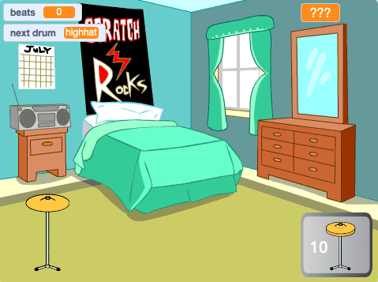

## ماذا بعد؟

إذا كنت تتبع مسار [Scratch أكثر](https://projects.raspberrypi.org/ar-SA/raspberrypi/more-scratch)، يمكنك الانتقال إلى مشروع [طبل نجم](https://projects.raspberrypi.org/ar-SA/projects/drum-star). في هذا المشروع، سوف تصنع لعبة نقر حيث تربح إيقاعات لعزف طبول جديدة في أماكن أكبر.

--- print-only ---

--- /print-only ---

--- no-print ---

  <iframe allowtransparency="true" width="485" height="402" src="https://scratch.mit.edu/projects/embed/522323676/?autostart=false" frameborder="0"></iframe>

--- /no-print ---

إذا كنت ترغب في الحصول على مزيد من المتعة في استكشاف Scratch، فيمكنك تجربة أي من [هذه المشاريع](https://projects.raspberrypi.org/ar-SA/projects?software%5B%5D=scratch&curriculum%5B%5D=%201).

***
تمت ترجمة هذا المشروع بواسطة متطوعين:

نادية علي قاسم
Mustafa Ahmed

بفضل المتطوعين ، يمكننا إعطاء الناس في جميع أنحاء العالم فرصة للتعلم بلغتهم الخاصة. يمكنك مساعدتنا في الوصول إلى المزيد من الأشخاص من خلال التطوع للترجمة - مزيد من المعلومات على [rpf.io/translate](https://rpf.io/translate).
