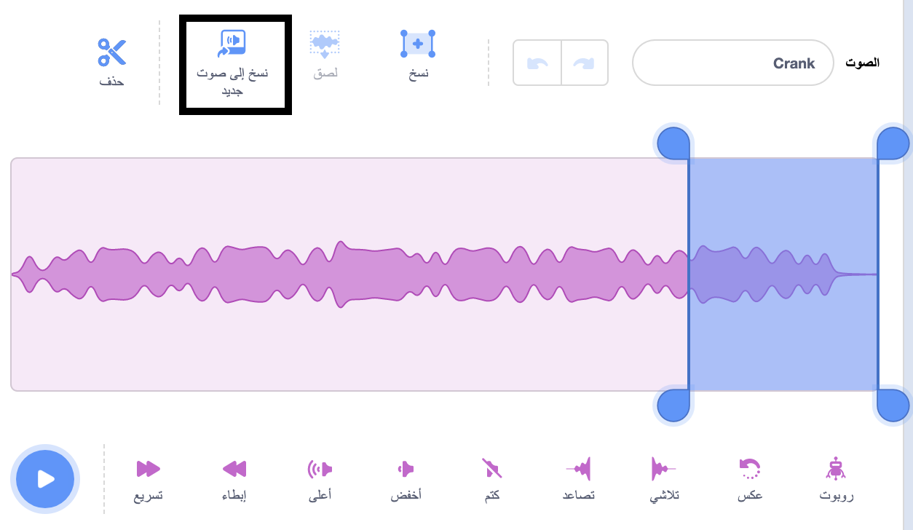
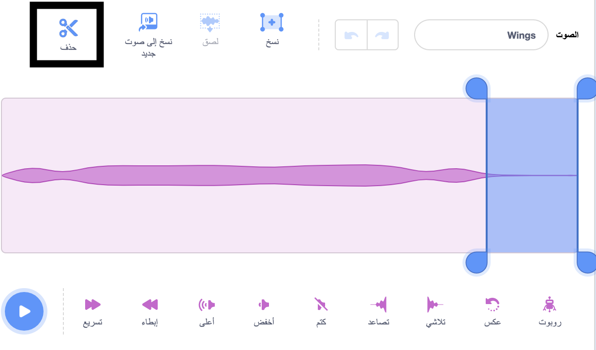

## جهز المشهد

<div style="display: flex; flex-wrap: wrap">
<div style="flex-basis: 200px; flex-grow: 1; margin-right: 15px;">
سوف تقوم بإعداد المشهد. اختر الخلفية الخاصة بك وأضف اليعسوب الذي يتبع مؤشر الماوس حول المنصة.
</div>
<div>
{:width="300px"}
</div>
</div>

--- task ---

افتح [مشروع البداية كبّر اليعسوب](https://scratch.mit.edu/projects/535695413/editor){:target="_blank"}. سيتم فتح Scratch في علامة تبويب متصفح أخرى.

--- /task ---

--- task ---

استخدمنا خلفية **Jurassic**. استخدمنا خلفية **Jurassic**.


--- /task ---

--- task ---

انقر فوق **اختيار كائن** وابحث عن كلمة `dragonfly`، ثم أضف كائن **Dragonfly**.


--- /task ---

--- task ---

أضف نصًّا لجعل الكائن **Dragonfly** يتبع مؤشر الماوس (أو إصبعك):


```blocks3
when flag clicked
set size to [25] % // to start small
forever
point towards (mouse-pointer v)
move [5] steps
end
```
--- /task ---

--- task ---

**اختبار:** انقر فوق العلم الأخضر واجعل الكائن **Dragonfly** يتحرك حول المنصة. هل اليعسوب يتحرك كما تتوقع؟

--- /task ---

لا يتجه مظهر اليعسوب إلى اليمين، لذا فإن رأس الكائن **Dragonfly** لا يشير إلى مؤشر الماوس.

--- task ---

انقر فوق علامة التبويب **المظاهر** واستخدم أداة **حدد** (السهم) لتحديد الزي.

استخدم أداة **دوّر** في الجزء السفلي من الزي المحدد لقلب شكل الكائن **Dragonfly** لمواجهة اليمين.


--- /task ---

--- task ---

**اختبار:** انقر على العلم الأخضر وشاهد كيف يتحرك اليعسوب.

--- /task ---

تُصدر أجنحة اليعسوب صوت رفرفة أثناء اهتزازها. يمكنك تحرير الصوت في Scratch لإنشاء الصوت الخاص بك.

--- task ---

أضف صوت **Crank** إلى كائن **Dragonfly**.

[[[generic-scratch3-sound-from-library]]]


--- /task ---

--- task ---

انقر فوق الزر **تشغيل** حتى تتمكن من سماع الصوت.

--- /task ---

صوت ** Crank ** طويل جدًّا وبطيء جدًّا بالنسبة لأجنحة اليعسوب.

--- task ---

حدد نهاية الصوت باستخدام المؤشر أو الإصبع.

انقر فوق **نسخ إلى صوت جديد** لإنشاء صوت جديد بالجزء المحدد فقط:



--- /task ---

--- task ---

أعد تسمية صوتك الجديد من **Crank2** إلى `أجنحة`. 

--- /task ---

--- task ---

قم بتشغيل الصوت الجديد. انقر فوق الزر **تسريع** عدة مرات إلى أن تعجبك النتيجة:


--- /task ---

--- task ---

إذا أردت، يمكنك تحديد نهاية الصوت **أجنحة**، ثم النقر فوق **حذف** لإزالته:



--- /task ---

--- task ---

أضف الآن كتلة لتشغيل صوت **أجنحة** عندما يتحرك اليعسوب:


```blocks3
when flag clicked
set size to [25] %
forever
+start sound [Wings v]
point towards (mouse-pointer v)
move [5] steps
end
```
--- /task ---

--- task ---

**اختبار:** جرب حركة اليعسوب وتأثير الصوت.

--- /task ---

--- save ---
