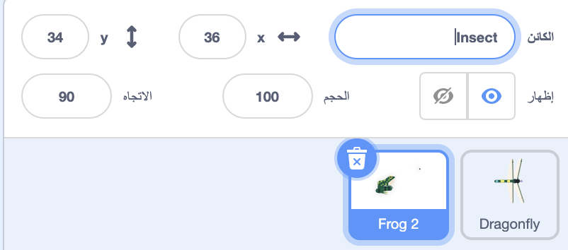
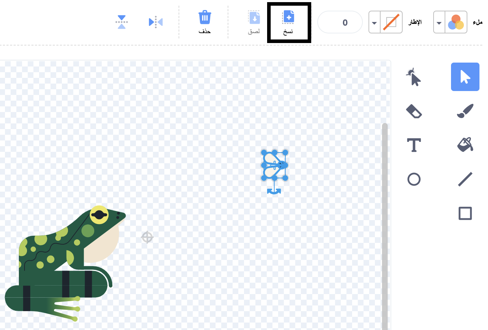
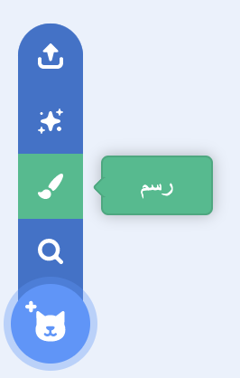
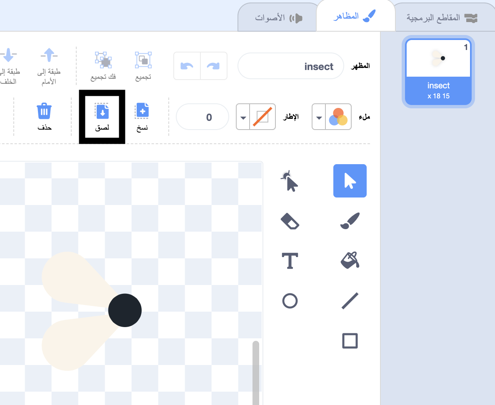
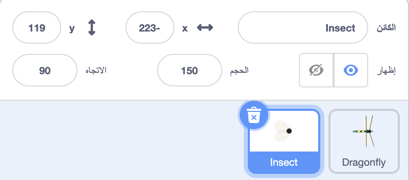

## ذبابة للأكل

<div style="display: flex; flex-wrap: wrap">
<div style="flex-basis: 200px; flex-grow: 1; margin-right: 15px;">
سوف تضيف حشرة ليأكلها اليعسوب. 
</div>
<div>
{:width="300px"}
</div>
</div>

<p style="border-left: solid; border-width:10px; border-color: #0faeb0; background-color: aliceblue; padding: 10px;">
يطلق على الشخصيات التي تتحرك من تلقاء نفسها في الألعاب أحيانًا اسم <span style="color: #0faeb0">**موب**</span>، وهي اختصار لكلمة موبايل (الهاتف المحمول). هل يمكنك التفكير في لعبة بها كائنات متحركة (موب)؟</p>

هناك ذبابة في كائن **Frog 2** يمكنك استخدامها.

--- task ---

أضف الكائن **Frog 2** إلى مشروعك. أعد تسمية الكائن إلى `Insect`:




--- /task ---

تحتاج فقط الذبابة، وليس الضفدع.

--- task ---

انقر فوق علامة التبويب **الأزياء**. انقر فوق الحشرة لتحديدها وانقر على أيقونة **نسخ**.



--- /task ---

--- task ---

أضف زيًّا جديدًّا للكائن باستخدام خيار **رسم**:



--- /task ---

--- task ---

انقر على أيقونة **لصق** للصق الكائن في الزي الجديد. اسحب الذبابة إلى **المركز** بحيث تصطف مع الخطوط المتعامدة.

يمكنك إعادة تسمية الزي الخاص بك `Insect` وحذف الأزياء الأخرى، لأنك لن تحتاج إليها:



--- /task ---

--- task ---

قم بزيادة حجم الذبابة بحيث يسهل رؤيتها والتقاطها:



--- /task ---

--- task ---

انقر فوق علامة التبويب **المقاطع البرمجية** وأضف نصًّا لجعل كائن الحشرة **Insect** يرتد:


```blocks3
when flag clicked
forever
move [3] steps
if on edge, bounce
end
```

تتحقق كتلة `ارتد إذا كنت عند الحافة`{:class="block3motion"} مما إذا كان الكائن قد وصل إلى حافة المنصة ويجعل الكائن يتحرك في اتجاه مختلف إذا وصل عند الحافة.

--- /task ---

تريد أن تقول لكائن الحشرة **Insect** `اختف`{:class="block3looks"} `إذا`{:class="block3control"} تم أكلها بواسطة كائن اليعسوب **Dragonfly**.

--- task ---

أضف كتلة `إذا`{:class="block3control"} إلى النص البرمجي لحركة كائن الحشرة **Insect**:


```blocks3
when flag clicked
forever
move [3] steps
if on edge, bounce
+if < > then 
end
```
--- /task ---

تحتوي كتلة `إذا`{:class="block3control"} على إدخال على شكل سداسي. هذا يعني أنه يمكنك وضع **شرط** هنا.

عند تشغيل كتلة `إذا`{:class="block3control"}، سيتحقق برنامج Scratch من الشرط. إذا كان الشرط "صحيحًا" `، فسيتم تشغيل`{:class="block3control"} الكود داخل الكتلة `إذا`{:class="block3control"}.

تريد من الحشرة أن `تختفي`{:class="block3looks"} `إذا`{:class="block3control"} كانت بشكل `ملامس`{:class="block3sensing"} لكائن اليعسوب **Dragonfly**.

--- task ---

اسحب كتلة `ملامس لـ [Dragonfly v]`{:class="block3sensing"} في داخل كتلة `إذا`{:class="block3control"}. أضف كتلة `اختفِ`{:class="block3looks"} داخل كتلة `إذا`{:class="block3control"}.


```blocks3
when flag clicked
forever
move [3] steps
if on edge, bounce
+if <touching [Dragonfly v] ?> then // تغيير من "مؤشر الماوس"
+hide // يؤكل (يختفي)
end
```

--- /task ---

--- task ---

**اختبار:** اختبر الكود الخاص بك وتحكم في اليعسوب لأكل الذبابة. يجب أن تختفي الذبابة.

--- /task ---

اليعسوب لن يكبر إذا أكل ذبابة واحدة فقط!

--- task ---

أضف الكتلة `اذهب إلى موضع عشوائي`{:class="block3control"} على المنصة، واجعل الكائن الخاص بك `ينتظر`{:class="block3control"} لمدة ثانية واحدة ثم `يظهر`{:class="block3looks"}:


```blocks3
when flag clicked
+show // تظهر في البداية
forever
move [3] steps
if on edge, bounce
if <touching [Dragonfly v] ?> then
hide
+go to (random position v)
+wait [1] seconds
+show // لتبدو وكأنها ذبابة جديدة
end
end
```

--- /task ---

--- task ---

**اختبار:** اختبر أن اليعسوب يمكنه الآن أكل الكثير من الذباب.

تأكد من إضافة كتلة `اظهر`{:class="block3looks"} لتظهر في البداية.

--- /task ---

**نصيحة:** يمكنك النقر فوق الزر الأحمر **توقف** فوق المنصة إذا كنت تريد أن يكون اليعسوب هادئًا أثناء إضافة المزيد من التعليمات البرمجية.

--- save ---
