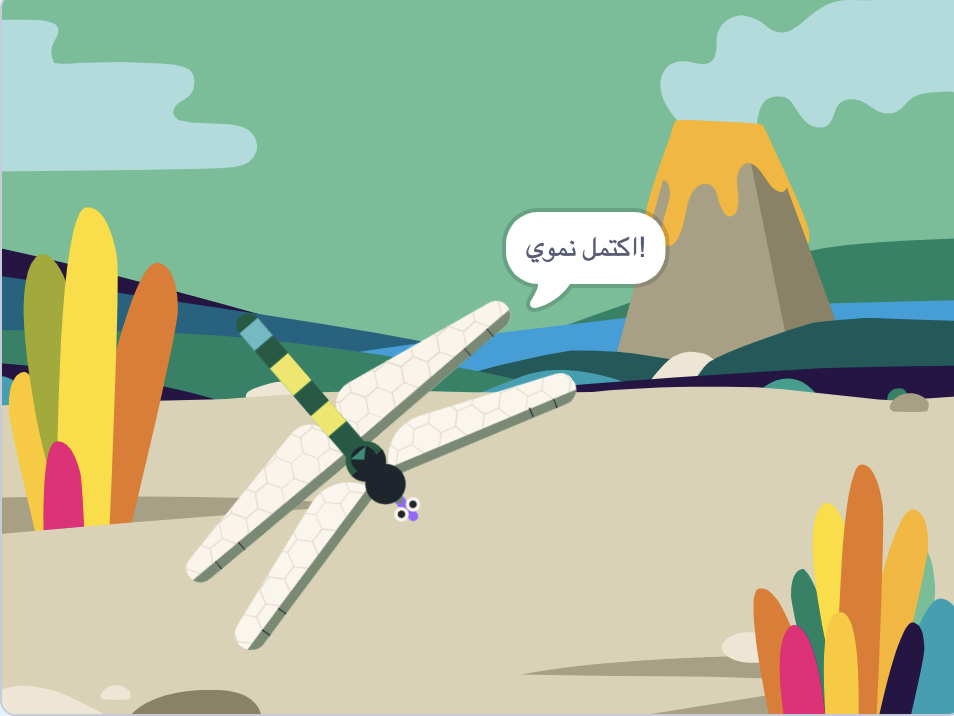

## تنمو إلى الحجم الكامل

<div style="display: flex; flex-wrap: wrap">
<div style="flex-basis: 200px; flex-grow: 1; margin-right: 15px;">
ستجعل اليعسوب ينمو كلما أكل ذبابة، ويتوقف عن النمو إذا وصل إلى الحجم الكامل.
</div>
<div>
{:width="300px"}
</div>
</div>

<p style="border-left: solid; border-width:10px; border-color: #0faeb0; background-color: aliceblue; padding: 10px;">
يمكن العثور على أكبر حشرات اليعسوب الحية في أمريكا الوسطى ويبلغ طول جناحيها 19 سم (أكبر قليلاً من يدك). كانت أكبر حشرة معروفة على الإطلاق هي حشرة <span style="color: #0faeb0">**Meganeuropsis permiana**</span>، وهي حشرة يعسوب يبلغ طول جناحيها حوالي 75 سم (بحجم خطوة كبيرة).</p>

تعرف الذبابة أنه تم أكلها، والآن يحتاج اليعسوب إلى معرفة ذلك حتى ينمو.

عندما تريد السماح لكائن آخر بمعرفة حدوث شيء ما، يمكنك استخدام كتلة `بث`{:class="block3events"} كما فعلت في [بث التعويذات](https://projects.raspberrypi.org/ar-SA/projects/broadcasting-spells){:target="_blank"}.

--- task ---

أضف كتلة `بث`{:class="block3events"} إلى كائن الحشرة **Insect** مع الرسالة الجديدة `طعام`{:class="block3events"}:


```blocks3
when flag clicked
show // تظهر في البداية
forever
move [3] steps
if on edge, bounce
if <touching [Dragonfly v] ?> then
+broadcast [طعام v]
hide
go to (random position v)
wait [1] seconds
show
end
end
```
--- /task ---

يحتاج كائن اليعسوب **Dragonfly** إلى النمو عندما يتلقى الرسالة `طعام`{:class="block3events"}.

--- task ---

حدد الكائن **Dragonfly** وأضف هذا النص:


```blocks3 
when I receive [طعام v]
change size by [5]
```

--- /task ---

--- task ---

أضف صوت **Chomp** إلى اليعسوب و`ابدأ الصوت`{:class="block3sound"} عندما تؤكل الحشرة:


```blocks3 
when I receive [طعام v]
+start sound [Chomp v]
change size by [5]
```
--- /task ---

--- task ---

**اختبار:** قم بتشغيل مشروعك لاختبار نمو اليعسوب وإصدار صوت القضم عندما يأكل ذبابة.

--- /task ---

عندما يصل اليعسوب إلى حجمه الكامل، ستهنئك اللعبة وتتوقف.

--- task ---

أضف كتلة `إذا`{:class="block3control"}.

يصبح اليعسوب بالحجم الكامل عندما يكون `الحجم`{:class="block3looks"} `=`{:class="block3operators"} `100%`. أولًا، أضف العملية `=`{:class="block3operators"} إلى الإدخال على الشكل السداسي:


```blocks3
when I receive [طعام v]
start sound [Chomp v]
change size by [5]
+if <[ ] = [ ]> then
end
```
--- /task ---

--- task ---

قم بإنهاء بناء الشرط بإضافة متغير `الحجم`{:class="block3looks"} واكتب القيمة `100`:


```blocks3
when I receive [طعام v]
start sound [Chomp v]
change size by [5]
+if <(size) = [100]> then
end
```
--- /task ---

--- task ---

أضف الكتل بحيث يكون الشرط داخل كتلة `إذا`{:class="block3control"} صحيحًا، `ثم`{:class="block3control"} يقوم اليعسوب بـ `بث`{:class="block3events"} رسالة "النهاية" و`يقول`{:class="block3looks"} `اكتمل نموي!`

وأخيرًا، قم باضافة كتلة `إيقاف الكل`{:class="block3control"} لإيقاف باقي النصوص البرمجية لليعسوب:


```blocks3
when I receive [طعام v]
start sound [Chomp v]
change size by [5]
if <(size) = [100]> then
+broadcast [النهاية v]
+say [اكتمل نموي!]
+stop [other scripts in sprite v] // تغيير من "الكل"
end
```
--- /task ---

--- task ---

في الوقت الحالي، لا زالت الذبابة تتحرك حتى بعد انتهاء تنفيذ المشروع. أضف هذا البرنامج النصي إلى كائن الحشرة **Insect**.


```blocks3
when I receive [النهاية v]
stop [other scripts in sprite v]
```

--- /task ---

--- task ---

**اختبار:** انقر فوق العلم الأخضر واستمر في أكل الذباب حتى يصل اليعسوب إلى حجمه الكامل.

--- /task ---

--- save ---
