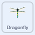

## تحسين الحركة

<div style="display: flex; flex-wrap: wrap">
<div style="flex-basis: 200px; flex-grow: 1; margin-right: 15px;">
اليعسوب "فيه خطأ" ويغير اتجاهه بسرعة كبيرة إذا كان مؤشر الماوس يلامس اليعسوب. سوف تتحقق من شرط آخر لإصلاح هذا الخطأ.
</div>
<div>
{:width="300px"}
</div>
</div>

--- task ---

اختر كائن **Dragonfly** وابحث عن النص الذي يبدأ بالكتلة `عند نقر العلم`{:class="block3events"}.

اسحب كتلة `إذا`{:class="block3control"} داخل الكتلة `كرر باستمرار`{:class="block3control"} وستتحرك الكتل الموجودة داخل حلقة `كرر باستمرار`{:class="block3control"} في داخل كتلة `إذا`{:class="block3control"}.

تحقق بعناية من أن الكود الخاص بك يبدو كما يلي:



```blocks3
when flag clicked
set size to [25] %
forever
+if < > then
start sound [أجنحة v]
point towards (mouse-pointer v)
move [5] steps
end
end
```
--- /task ---

--- task ---

ثم اسحب كتلة `ليس`{:class="block3operators"} إلى كتلة `إذا`{:class="block3control"} وضع كتلة `ملامس لـ(مؤشر الفأرة)`{:class="block3sensing"} داخلها.

تحقق من أن الكود الخاص بك يبدو كالتالي:


```blocks3
when flag clicked
set size to [25] %
forever
+if <not <touching [mouse-pointer v] ?> > then
start sound [أجنحة v]
point towards (mouse-pointer v)
move [5] steps
end
end
```

تحول الكتلة `ليس`{:class="block3operators"} الشرط إلى عكسه، تمامًا كما هو الحال في الجملة.

--- /task ---

--- task ---

**اختبار:** تحقق من أن الخلل قد تم إصلاحه، وأن كائن اليعسوب Dragonfly يتحرك فقط عندما `لا`{:class="block3operators"} يكون في حالة `ملامس لـ(مؤشر الفأرة)`{:class="block3sensing"}.

من الممكن تجربة شرط مختلف وهو:

```blocks3
<(distance to [mouse-pointer v]) > [50]>
```

هذا يجعل اليعسوب يتحرك عندما يكون بعيدًا بما فيه الكفاية عن مؤشر الماوس.

**نصيحة:** يمكنك سحب الكتل في أي مكان في منطقة الكود البرمجي وتركها هناك أثناء تجربة أشياء مختلفة.

--- /task ---

--- save ---
