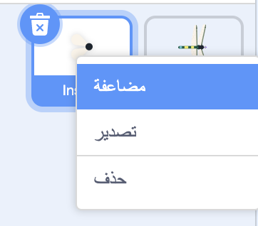
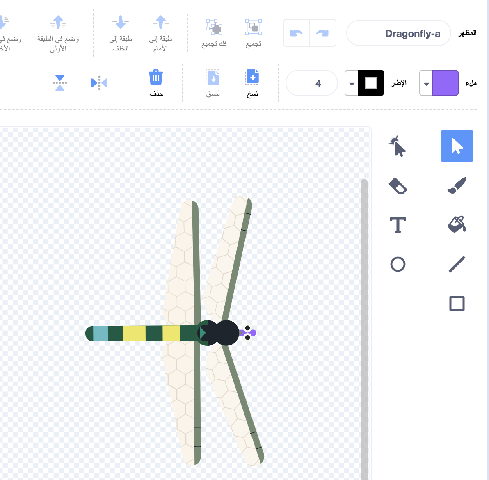
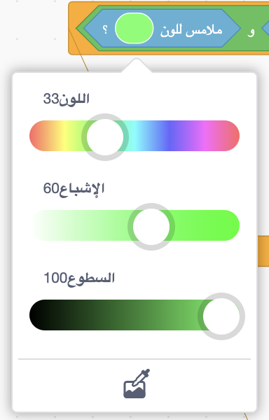
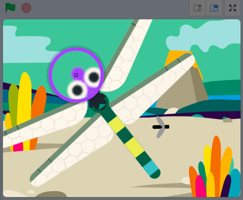

## المزيد من الطعام

<div style="display: flex; flex-wrap: wrap">
<div style="flex-basis: 200px; flex-grow: 1; margin-right: 15px;">
يحتاج اليعسوب إلى مجموعة من الحشرات ليختار منها.
</div>
<div>
{:width="300px"}
</div>
</div>

--- task ---

انقر بزر الماوس الأيمن فوق الكائن **Insect** في قائمة الكائنات أسفل المنصة و اختر **مضاعفة**.



--- /task ---

من المفيد أن تبدو هذه الحشرة مختلفة عن الذبابة.

--- task ---

انقر فوق علامة التبويب **الأزياء**.

+ يمكنك استخدام **ملء** لتغيير لون هذه الحشرة
+ **ارسم** الحشرات الخاص بك
+ **أضف** مظهر حشرة آخر من Scratch

--- /task ---

يأكل اليعسوب الحشرة حتى لو لامست جناحه أو ذيله.

لنجعل تطبيقنا أكثر واقعية، أصلح هذا الأمر بحيث يتم أكل الحشرة فقط من فم اليعسوب. يمكنك استخدام كتلة `ملامس للون`{:class="block3sensing"} حتى لا تؤكل الحشرة إلا إذا كانت تلامس لونًا معينًا على كائن **Dragonfly**.

--- task ---

حدد كائن ** Dragonfly ** وانقر فوق علامة التبويب **المظاهر**.

استخدم أداة التعبئة لملء فم كائن اليعسوب **Dragonfly**. استخدمنا اللون الأرجواني (البنفسجي):



--- /task ---

تحتاج إلى التحقق من أن كائن الحشرة **Insect2** يلامس كائن اليعسوب **Dragonfly** `و`{:class="block3operators"} يلامس لون فم اليعسوب.

--- task ---

حدد كائن **Insect2** وانقر فوق علامة التبويب **المقاطع البرمجية**.

اسحب كتلة `و`{:class="block3operators"} إلى الكتلة `إذا`{:class="block3control"}.

اسحب كتلة `و`{:class="block3operators"} إلى الكتلة `إذا`{:class="block3control"}.


```blocks3
when flag clicked
show
forever
move [3] steps 
if on edge, bounce
+if <<touching [Dragonfly v] ?> and <>> then
broadcast [food v]
hide
go to (random position v)
show
end
end
```

--- /task ---

--- task ---

ستظهر الكتلة `<touching [Dragonfly v] ?>`{:class="block3sensing"}، اسحبها إلى يسار كتلة `و`{:class="block3operators"}:

```blocks3
when flag clicked
show
forever
move [3] steps
if on edge, bounce
+if <<touching [Dragonfly v] ?> and <touching color (#9966ff) ?>> then
broadcast [food v]
hide
go to (random position v)
show
end
end
```

إذا لم يتم تحديد لون فم اليعسوب، فانقر فوق دائرة اللون ثم انقر فوق أداة **القطارة** لتحديد اللون.



انقر على فم اليعسوب على المنصة لضبط اللون المناسب:



**نصيحة:** إذا كان هذا صعبًا، فقم بتغيير حجم كائن اليعسوب **Dragonfly** حتى يكون كبيرًا جدًّا.

--- /task ---

--- task ---

**اختبار:** الآن اختبر أن اليعسوب لا يمكنه أكل الحشرة الثانية إلا بفمه.

--- /task ---

--- save ---

