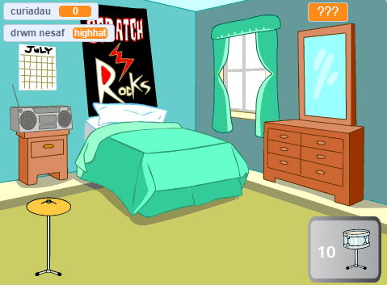

## Beth nesaf?

Os wyt ti'n dilyn y llwybr [Mwy o scratch](https://projects.raspberrypi.org/cy-GB/raspberrypi/more-scratch), galli di symud ymlaen i'r prosiect [Seren Ddrymiau](https://projects.raspberrypi.org/cy-GB/projects/drum-star). Yn y prosiect hwn, byddi di'n creu gêm clicio lle byddi di'n ennill curiadau er mwyn chwarae drymiau newydd mewn lleoliadau mwy.

--- print-only ---

--- /print-only ---

--- no-print ---

  <iframe allowtransparency="true" width="485" height="402" src="https://scratch.mit.edu/projects/embed/522323676/?autostart=false" frameborder="0"></iframe>

--- /no-print ---

Os wyt ti am gael mwy o hwyl wrth ddysgu Scratch, gallet ti roi cynnig ar unrhyw un o'r [prosiectau hyn](https://projects.raspberrypi.org/cy-GB/projects?software%5B%5D=scratch&curriculum%5B%5D=%201).
