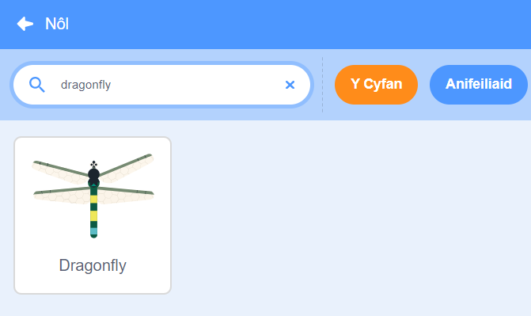
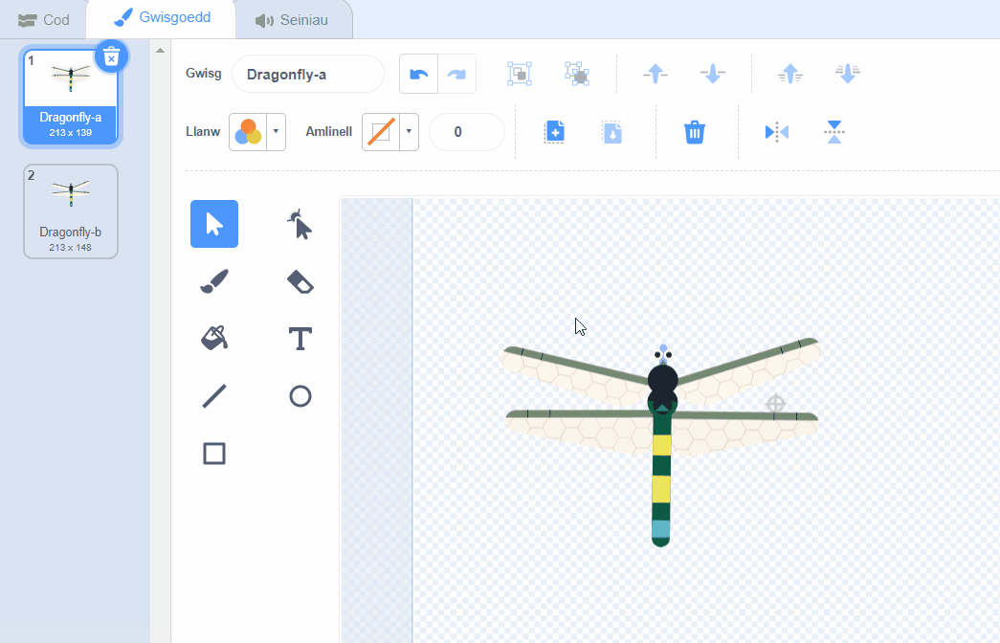
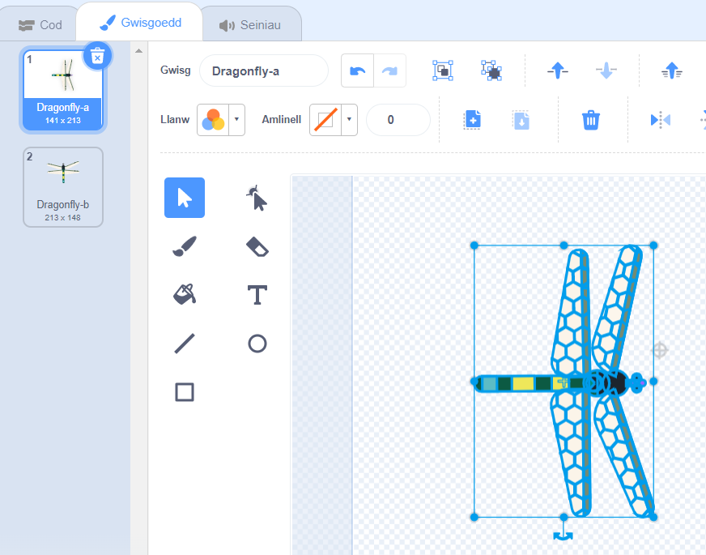
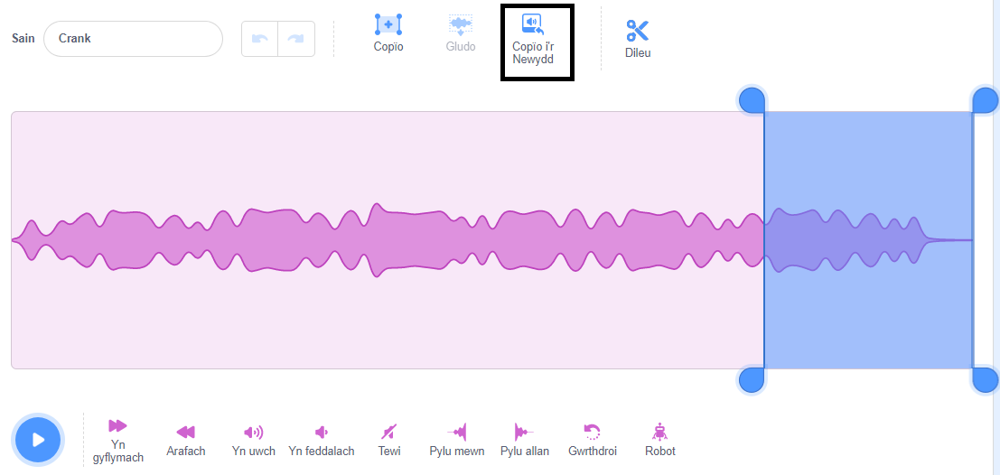
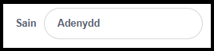
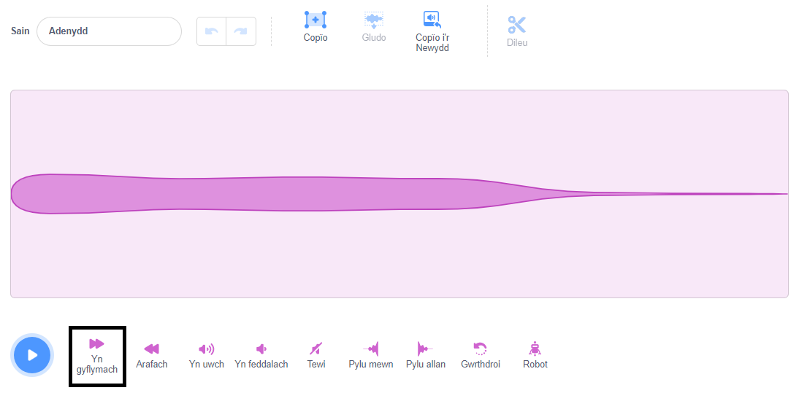
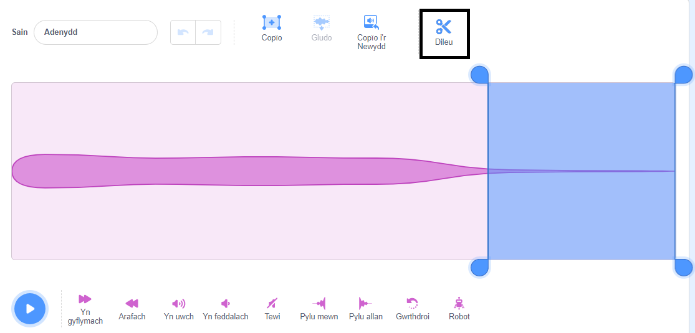

## Gosod yr olygfa

<div style="display: flex; flex-wrap: wrap">
<div style="flex-basis: 200px; flex-grow: 1; margin-right: 15px;">
Byddi di'n gosod y cyd-destun. Dewisa dy gefnlen ac ychwanegu gwas-y-neidr sy'n dilyn pwyntydd y llygoden o amgylch y Llwyfan.
</div>
<div>
{:width="300px"}
</div>
</div>

--- task ---

Agora'r prosiect cychwynnol [Tyfu gwas-y-neidr](https://scratch.mit.edu/projects/535695413/editor){:target="_blank"}. Bydd Scratch yn agor mewn tab arall ar y porwr.

[[[working-offline]]]

--- /task ---

<p style="border-left: solid; border-width:10px; border-color: #0faeb0; background-color: aliceblue; padding: 10px;">
Mae modd gweld <span style="color: #0faeb0">**Gweision y neidr**</span> ym mhedwar ban byd ac mae nhw wedi bodoli ers dros 300 miliwn o flynyddoedd!</p>

--- task ---

**Dewisa:** Clicia **Dewiswch Gefnlen** ac ychwanegu cefnlen o dy ddewis. Rydyn ni wedi defnyddio'r gefnlen **Jurassic**.


--- /task ---

--- task ---

Clicia **Dewiswch Gorlun** a chwilia am `dragonfly`, wedyn ychwanegu'r corlun **Dragonfly**.




--- /task ---

--- task ---

Ychwanega sgript i wneud i'r corlun **Dragonfly** ddilyn pwyntydd y llygoden (neu dy fys):


```blocks3
when flag clicked
set size to [25] % // to start small
forever
point towards (mouse-pointer v)
move [5] steps
end
```
--- /task ---

--- task ---

**Profi:** Clicia'r faner werdd a gwnud i'r corlun **Dragonfly** symud o amgylch y Llwyfan. Ydy'r gwas-y-neidr yn symud fel y byddet ti'n ei ddisgwyl?

--- /task ---

Dydy'r wisg Dragonfly ddim yn wynebu i'r dde, felly dydy pen y corlun **Dragonfly** ddim yn pwyntio at bwyntydd y llygoden.

--- task ---

Cliciwch ar y tab **Gwisgoedd** a defnyddia'r offeryn **Dewis** (saeth) i ddewis y wisg. Defnyddia'r offeryn **Cylchdroi** ar waelod y wisg a ddewiswyd i droi'r wisg **Dragonfly** i wynebu'r dde.





--- /task ---

--- task ---

**Profi:** Clicia'r faner werdd ac edrycha sut mae'r gwas-y-neidr yn symud nawr.

--- /task ---

Mae adenydd gwas-y-neidr yn gwneud sŵn siffrwd wrth iddynt ddirgrynu. Galli di olygu sain yn Scratch i greu dy sain dy hun.

--- task ---

Ychwanega'r sain **Crank** at y corlun **Dragonfly**.

[[[generic-scratch3-sound-from-library]]]


Clicia'r botwm **Chwarae** er mwyn i ti allu clywed y sain.

--- /task ---

Mae'r sain **Crank** yn rhy hir ac yn rhy araf ar gyfer adenydd gwas-y-neidr.

--- task ---

Dewisa ddiwedd y sain gan ddefnyddio'ch cyrchwr neu dy fys.

Clicia **Copïo i'r Newydd** i greu sain newydd gyda'r rhan a ddewiswyd yn unig:



Newidia enw dy sain newydd o **Crank2** i `Adenydd`.



--- /task ---

--- task ---

Chwaraea'r sain newydd. Clicia'r botwm **Yn gyflymach** ychydig o weithiau nes dy fod ti'n hoffi'r canlyniad:



--- /task ---

--- task ---

Os wyt ti'n dymuno, galli di ddewis diwedd y sain **Adenydd**, ac wedyn clicio ar **Dileu** i'w dynnu:



--- /task ---

--- task ---

Nawr ychwanega floc i chwarae'r sain **Adenydd** pan fydd y gwas-y-neidr yn symud:


```blocks3
when flag clicked
set size to [25] %
forever
+start sound [Wings v]
point towards (mouse-pointer v)
move [5] steps
end
```
--- /task ---

--- task ---

**Profi:** Rho gynnig ar gael y gwas-y-neidr i symud a chwarae'r effaith sain.

--- /task ---

--- save ---
