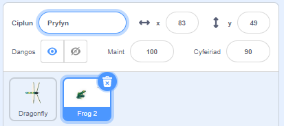
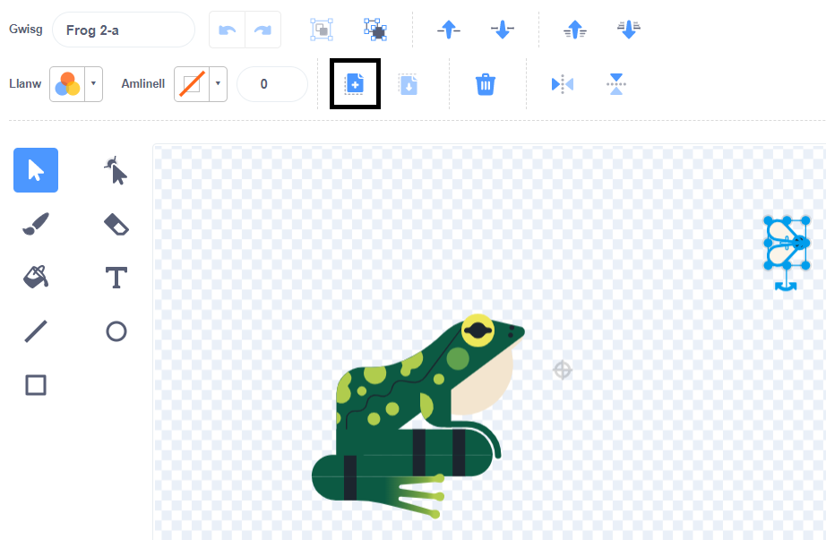
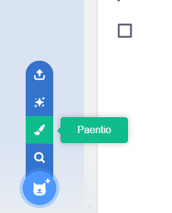
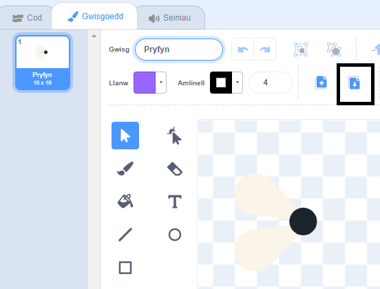
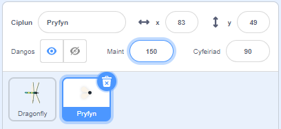
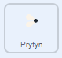

## Pryfyn i'w fwyta

<div style="display: flex; flex-wrap: wrap">
<div style="flex-basis: 200px; flex-grow: 1; margin-right: 15px;">
Byddi di'n ychwanegu pryfyn i'r gwas-y-neidr gael ei fwyta. 
</div>
<div>
{:width="300px"}
</div>
</div>

<p style="border-left: solid; border-width:10px; border-color: #0faeb0; background-color: aliceblue; padding: 10px;">
Weithiau mae cymeriadau sy'n symud o gwmpas ar eu pen eu hunain mewn gemau yn cael eu galw'n <span style="color: #0faeb0">**mobs**</span>, sy'n ffordd gyflym o ddweud "mobiles". Alli di feddwl am gêm sydd â mobs?</p>

Mae pry yn y corlun **Frog 2** y galli di ei ddefnyddio.

--- task ---

Ychwanega'r corlun **Frog 2** at dy brosiect. Ail-enwa'r corlun yn `Insect`:




--- /task ---

Dim ond y pry sydd ei angen arnat ti, nid y broga.

--- task ---

Clicia'r tab **Gwisgoedd**. Clicia'r pry i'w ddewis a chlicio ar yr eicon **Copïo**.



--- /task ---

--- task ---

Ychwanega wisg newydd i'r corlun drwy ddefnyddio'r opsiwn **Paentio**:



--- /task ---

--- task ---

Clicia ar yr eicon **Gludo** i ludo'r corlun i mewn i'r wisg newydd. Llusga'r pry i'r **canol** fel ei fod wedi'i alinio a'r groes.

Galli di ailenwi dy wisg yn `Insect` a dileu'r gwisgoedd eraill, gan na fydd angen y rhain arnat ti:



--- /task ---

--- task ---

Cynydda faint y pry fel ei fod yn haws ei weld a'i ddal:



--- /task ---

--- task ---

Clicia'r tab **Cod** ac ychwanegu sgript i wneud i'r corlun **Insect** fownsio o gwmpas:



```blocks3
when flag clicked
forever
move [3] steps
if on edge, bounce
end
```

Mae'r bloc `os ar ymyl, bowndio`{:class="block3motion"} yn gwirio bloc i weld a yw'r corlun wedi cyrraedd ymyl y Llwyfan ac yn troi'r corlun i wynebu i gyfeiriad gwahanol os ydyw.

--- /task ---

Rwyt ti eisiau i'r corlun **Insect** `guddio`{:class="block3looks"} `os`{:class="block3control"} mae'n cael ei fwyta gan y corlun **Dragonfly**.

--- task ---

Ychwanega floc `os`{:class="block3control"} i sgript symud y corlun **Insect**:


```blocks3
when flag clicked
forever
move [3] steps
if on edge, bounce
+if < > then 
end
```
--- /task ---

Mae gan `os`{:class="block3control"} fewnbwn siâp hecsagon. Mae hyn yn golygu y galli di roi **amod** yma.

Pan fydd y bloc `os`{:class="block3control"} yn rhedeg, bydd Scratch yn gwirio'r amod. Os ydy'r cyflwr yn 'wir' `yna`{:class="block3control"} bydd y cod y tu mewn i'r bloc `os`{:class="block3control"} yn rhedeg.

Rwyt ti eisiau i'r pryfyn `guddio`{:class="block3looks"} `os`{:class="block3control"} mae'n `cyffwrdd`{:class="block3sensing"} y corlun **Dragonfly**.

--- task ---

Llusga `cyffwrdd [Dragonfly v]`{:class="block3sensing"} i mewn i'r bloc `os`{:class="block3control"}. Ychwanega floc `cuddio`{:class="block3looks"} y tu mewn i'r bloc `os`{:class="block3control"}.


```blocks3
when flag clicked
forever
move [3] steps
if on edge, bounce
+if <touching [Dragonfly v] ?> then // newid o 'bwyntydd llygoden'
+hide // wedi'i fwyta
end
```

--- /task ---

--- task ---

**Profi:** Profa'r cod a rheola'r gwas-y-neidr i fwyta'r pry. Dylai'r pry ddiflannu.

--- /task ---

Fydd y gwas-y-neidr ddim yn tyfu'n fawr iawn os mai dim ond un pry mae'n gallu ei fwyta!

--- task ---

Ychwanega flociau i `fynd i safle ar hap`{:class="block3motion"} ar y Llwyfan, a gwneud i dy gorlun `aros`{:class="block3control"} am eiliad yna `dangos`{:class="block3looks"}:


```blocks3
when flag clicked
+show // dangos ar y dechrau
forever
move [3] steps
if on edge, bounce
if <touching [Dragonfly v] ?> then
hide
+go to (random position v)
+wait [1] seconds
+show // i edrych fel pry newydd
end
end
```

--- /task ---

--- task ---

**Profi:** Profa fod dy was-y-neidr yn gallu bwyta llawer o bryfed bellach.

Gwna'n siŵr dy fod wedi ychwanegu'r bloc `dangos`{:class="block3looks"} er mwyn ei ddangos ar y dechrau.

--- /task ---

**Awgrym:** Galli di glicio ar y botwm **Aros** coch uwchben y Llwyfan os wyt ti am i'r gwas-y-neidr fod yn dawel wrth i ti ychwanegu mwy o god.

--- save ---
