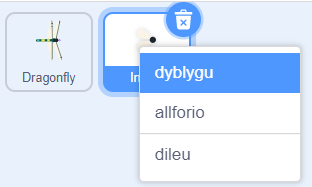
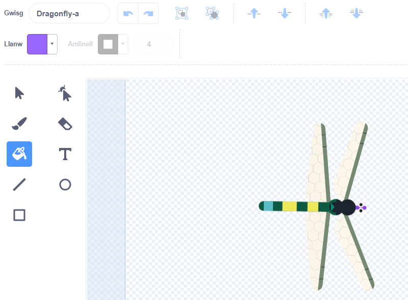
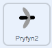
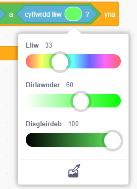
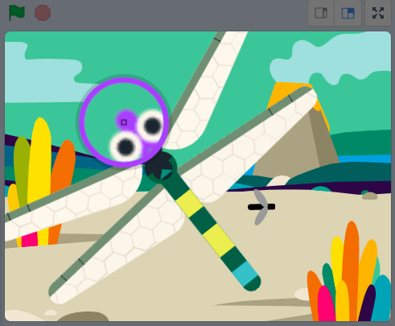

## Mwy o fwyd

<div style="display: flex; flex-wrap: wrap">
<div style="flex-basis: 200px; flex-grow: 1; margin-right: 15px;">
Mae angen detholiad o bryfed ar y gwas-y-neidr.
</div>
<div>
{:width="300px"}
</div>
</div>

--- task ---

De-glicia'r corlun **Insect** yn y rhestr Corluniau o dan y Llwyfan a'i **ddyblygu**.



--- /task ---

Mae'n ddefnyddiol os ydy'r pryfyn yma yn edrych yn wahanol i'r pry.

--- task ---

Clicia'r tab **Gwisgoedd**.

**Dewis:** Galli di greu pryfyn ehedog gwahanol.
+ Defnyddia'r offeryn **Llanw** i newid lliw'r pryfyn yma
+ **Paentia** dy wisg pryfyn dy hun
+ **Ychwanega** wisg chwilen gwahanol o Scratch

--- /task ---

Mae'r pryfyn yn cael ei fwyta hyd yn oed os mae'n cyffwrdd ag adain neu gynffon y gwas-y-neidr.

I wneud dy ap yn fwy realistig, newidia hyn fel bod y pryfyn yn cael ei fwyta gan geg y gwas-y-neidr. Galli di ddefnyddio'r bloc `lliw cyffwrdd`{:class="block3sensing"} fel bod y pryfyn ddim ond yn cael ei fwyta os yw'n cyffwrdd â lliw penodol ar y **Gwas y Neidr**.

--- task ---

Dewisa'r corlun **Dragonfly** a chlicio'r tab **Gwisgoedd**.

Defnyddia'r offeryn llenwi i lenwi ceg y **Gwas-y-neidr**. Fe wnaethon ni ddefnyddio porffor:



--- /task ---

Mae angen i ti wneud yn siŵr bod y corlun **Insect2** yn cyffwrdd â'r corlun **Dragonfly** `ac`{:class="block3operators"} ei fod yn cyffwrdd â lliw ceg y gwas-y-neidr.

--- task ---

Dewisa'r corlun **Insect2** a chlicio'r tab **Cod**.

Llusga floc `a`{:class="block3operators"} i mewn i'r bloc `os`{:class="block3control"}.

Bydd y bloc `<touching [Dragonfly v] ?>`{:class="block3sensing"} yn neidio allan, nawr galli di ei lusgo i'r chwith o'r bloc `a`{:class="block3operators"}:



```blocks3
when flag clicked
show
forever
move [3] steps 
if on edge, bounce
+if <<touching [Dragonfly v] ?> and <>> then
broadcast [food v]
hide
go to (random position v)
show
end
end
```

--- /task ---

--- task ---

Llusga floc `lliw cyffwrdd`{:class="block3sensing"} i'r dde o'r bloc `a`{:class="block3operators"}:


```blocks3
when flag clicked
show
forever
move [3] steps
if on edge, bounce
+if <<touching [Dragonfly v] ?> and <touching color (#9966ff) ?>> then
broadcast [food v]
hide
go to (random position v)
show
end
end
```

Os nad ydy lliw ceg y gwas-y-neidr wedi'i ddewis, clicia ar y cylch lliwiau ac yna clicia'r offeryn **Diferydd** i ddewis lliw.



Clicia ar geg y gwas-y-neidr ar y Llwyfan i osod y lliw i gyd-fynd:



**Awgrym:** Os ydy hyn yn anodd i'w wneud, newidia faint y corlun **Dragonfly** fel ei fod yn fawr iawn.

--- /task ---

--- task ---

**Profi:** Nawr galli di brofi mai dim ond yr ail bryfyn all y gwas-y-neidr ei fwyta gyda'i geg.

Os dymuni di, galli di newid yr **Insect** cyntaf fel mai dim ond ceg y gwas-y-neidr sy'n gallu ei fwyta.

--- /task ---

--- save ---

