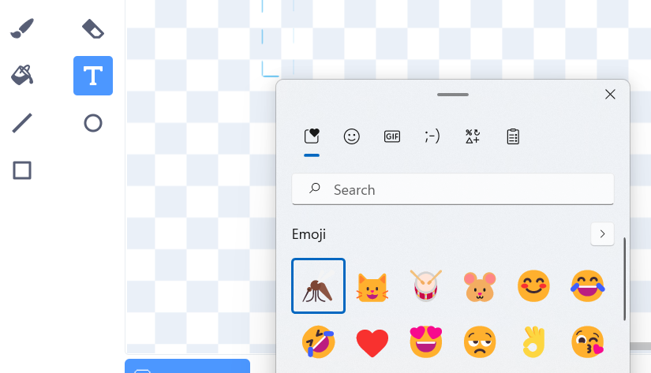

## Symudiad pryfyn ar hap

<div style="display: flex; flex-wrap: wrap">
<div style="flex-basis: 200px; flex-grow: 1; margin-right: 15px;">
Mae'r pryfed yn dy ap yn symud mewn patrwm cyson iawn, ond mewn bywyd go iawn maen nhw'n anodd eu dal. 

Byddi di'n defnyddio'r bloc `dewis ar hap`{:class="block3operators"} i wneud i'r pryfyn symud mewn ffordd fwy naturiol.
</div>
<div>
{:width="300px"}
</div>
</div>

--- task ---

Ychwanega sgript at **Insect 2** i wneud iddo bwyntio i gyfeiriad ar hap bob 1–3 eiliad.

--- /task ---

--- task ---

**Profi:** Rheda dy brosiect a gwylia sut mae'r pry yn symud. Rho gynnig ar newid y rhifau i gael yr effaith rwyt ti ei heisiau.

--- /task ---

--- task ---

Change the first **Insect** so that it can only be eaten with the dragonfly's mouth.

--- /task ---

### Add more insects

Gallet ti newid nifer y camau maen nhw'n eu `symud`{:class="block3motion"} i'w gwneud yn gyflymach neu'n arafach.

--- task ---

Use the emoji keyboard to add a **Mosquito emoji** sprite.

Duplicate an existing **insect** sprite then click on the **Costumes** tab. **Paint** a new costume and select the **Text** tool. Instead of typing text, use the emoji keyboard shortcut for your Operating System:

- Windows - <kbd>⊞ Win</kbd> + <kbd>.</kbd>
- MacOS - <kbd>control</kbd> + <kbd>command</kbd> + <kbd>space</kbd>
- Linux - <kbd>ctrl</kbd> + <kbd>.</kbd>



Select the **Mosquito** emoji to insert it into the Paint editor. Use the **Select** (arrow) tool to centre, resize, and rotate your mosquito until you are happy with it.


**Tip:** Emojis can look different on different computers, so they might not look the same on a tablet and a desktop computer. Some emojis aren't available on some computers, but most modern computers will support them.

--- /task ---

### Create random movement

Use the `pick random`{:class="block3operators"} block to make the insect move in a more natural way.

{:width="300px"}

--- task ---

Ychwanega sgript at **Insect 2** i wneud iddo bwyntio i gyfeiriad ar hap bob 1–3 eiliad.


```blocks3
when flag clicked
forever // Keep changing direction
point in direction (pick random [0] to [259])
wait (pick random [1] to [3]) seconds
end
```

--- /task ---

--- task ---

**Test:** Run your project and watch how the sprite moves.

--- /task ---

--- task ---

Drag this script to the other **Insect** sprite to make it move randomly.

--- /task ---

### Share you insects

--- task ---

Use your Backpack to trade insects with your friends from their 'Grow a Dragonfly' projects.

Send the link of your project to your friend who can go inside the project, click on Backpack (the one under the code space) and drag and drop the sprite.

[[[scratch-backpack]]]

--- /task ---

--- task ---

Check each sprite and costume has a name that describes the image. This makes your project easier to understand if you come back to it later.

--- /task ---

--- task ---

Right-click on the Code area and choose **Clean up Blocks** to get Scratch to tidy your code.

--- /task ---

--- save ---
