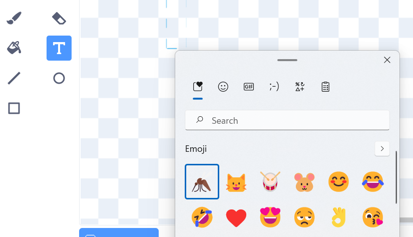

## Uwchraddio dy brosiect

Yn y cam yma, byddi di'n rhoi cynnig ar ychwanegu mwy o bryfed, gan newid y ffordd mae dy brosiect yn edrych ac yn ymddwyn.

{:width="300px"}

### Ychwanegu mwy o bryfed

Ychwanega rhagor o bryfed. Efallai bydd angen i ti wneud iddyn nhw symud yn gyflymach, fel eu bod nhw'n anoddach i'r gwas-y-neidr eu dal.

Galli di beintio dy bryfed dy hun neu geisio ychwanegu mosgito emoji!

--- task ---

Defnyddia'r bysellfwrdd emojis i ychwanegu corlun **emoji Mosquito**.

Dyblyga gorlun **insect** sy'n bodoli ac wedyn clicio ar y tab **Gwisgoedd**. **Paentia** wisg newydd a dewis yr offeryn **Testun**. Yn lle teipio testun, defnyddia'r llwybr byr ar gyfer y bysellfwrdd emojis sydd ar dy System Weithredu di:

Windows - Windows key + '.' MacOS - ctrl + cmd + space Linux - ctrl + '.'

Dewisa'r emoji **Mosquito** i'w fewnosod yn y golygydd Paent. Defnyddia'r offeryn **Dewis** (saeth) i ganoli, newid maint, a chylchdroi dy fosgito nes dy fod yn hapus ag ef.

**Awgrym:** Gall emojis edrych yn wahanol ar wahanol gyfrifiaduron, felly efallai fyddan nhw ddim yn edrych yr un peth ar dabled a chyfrifiadur bwrdd gwaith. Dydy rhai emojis ddim ar gael ar rai cyfrifiaduron, ond bydd y mwyafrif o gyfrifiaduron modern yn gallu delio â nhw.

--- /task ---

--- task ---

Defnyddia dy Backpack i gyfnewid pryfed gyda dy ffrindiau o'u prosiectau 'Tyfu Gwas-y-neidr'.

[[[scratch-backpack]]]

--- /task ---

--- task ---

**Awgrym:** Gwna'n siŵr bod gan dy holl gorluniau a gwisgoedd enwau synhwyrol. Mae'n gwneud dy brosiect yn haws i'w ddeall os byddi di'n dod yn ôl ato yn nes ymlaen.

**Awgrym:** Gwna'n siŵr fod dy god wedi'i osod allan yn daclus yn ardal y Cod. De-glicia ar ardal y Cod a dewis **Clean up Blocks** i gael Scratch i dacluso dy god.

--- /task ---

--- collapse ---
---
teitl: Prosiect gorffenedig
---

Galli di weld y [prosiect wedi'i gwblhau yma](https://scratch.mit.edu/projects/521688740/){:target="_blank"}.

--- /collapse ---

--- save ---
