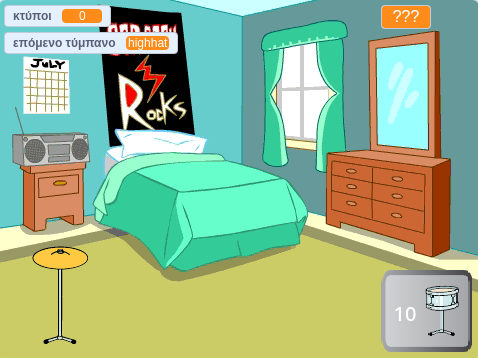

## Τι υπάρχει στη συνέχεια;

Εάν ακολουθείς το μονοπάτι [Περισσότερο Scratch](https://projects.raspberrypi.org/el-GR/raspberrypi/more-scratch), μπορείς να προχωρήσεις στο έργο [Αστέρι στα Τύμπανα](https://projects.raspberrypi.org/el-GR/projects/drum-star). Σε αυτό το έργο, θα δημιουργήσεις ένα παιχνίδι με κλικ όπου κερδίζεις κτύπους για να παίξεις νέα ντραμς σε μεγαλύτερους χώρους.

--- print-only ---

--- /print-only ---

--- no-print ---

  <iframe allowtransparency="true" width="485" height="402" src="https://scratch.mit.edu/projects/embed/522323676/?autostart=false" frameborder="0"></iframe>

--- /no-print ---

Αν θέλεις να διασκεδάσεις περισσότερο εξερευνώντας το Scratch, τότε μπορείς να δοκιμάσεις οποιοδήποτε από [αυτά τα έργα](https://projects.raspberrypi.org/el-GR/projects?software%5B%5D=scratch&curriculum%5B%5D=%201).

***
Το έργο αυτό μεταφράστηκε από τους εθελοντές:

Ευστάθιος Ιωσηφίδης
Μάνος Ζεάκης
Σταυρούλα Μισθού

Χάρη στους εθελοντές, μπορούμε να δώσουμε σε ανθρώπους σε όλο τον κόσμο την ευκαιρία να μάθουν στη γλώσσα τους. Μπορείτε να μας βοηθήσετε να προσεγγίσουμε περισσότερους ανθρώπους μεταφράζοντας εθελοντικά - περισσότερες πληροφορίες στο [rpf.io/translate](https://rpf.io/translate).
