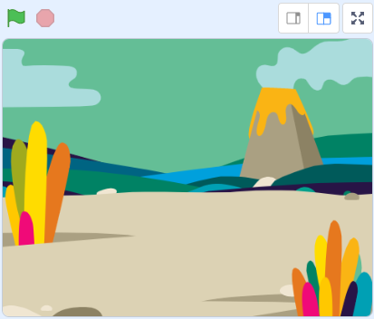

## Στήνοντας τη σκηνή

<div style="display: flex; flex-wrap: wrap">
<div style="flex-basis: 200px; flex-grow: 1; margin-right: 15px;">
Θα στήσεις τη σκηνή. Επίλεξε το σκηνικό σου και πρόσθεσε μια λιβελούλα που ακολουθεί τον δείκτη του ποντικιού γύρω από τη Σκηνή.
</div>
<div>
{:width="300px"}
</div>
</div>

--- task ---

Άνοιξε [το αρχικό έργο Μεγαλώνοντας μια λιβελούλα](https://scratch.mit.edu/projects/535695413/editor){:target="_blank"}. Το Scratch θα ανοίξει σε νέα καρτέλα του φυλλομετρητή.

[[[working-offline]]]

--- /task ---

<p style="border-left: solid; border-width:10px; border-color: #0faeb0; background-color: aliceblue; padding: 10px;">
Οι <span style="color: #0faeb0">**Λιβελούλες**</span> μπορούν να βρεθούν σε όλο τον κόσμο, ενώ υπάρχουν για πάνω από 300 εκατομμύρια χρόνια!</p>

--- task ---

**Επιλογή:** Κάνε κλικ στο **Επίλεξε ένα Υπόβαθρο** και πρόσθεσε ένα υπόβαθρο της επιλογής σου. Χρησιμοποιήσαμε το υπόβαθρο **Jurassic**.




--- /task ---

--- task ---

Κάνε κλικ στο **Επίλεξε ένα αντικείμενο** και αναζήτησε την `dragonfly` (λιβελούλα), στη συνέχεια πρόσθεσε το αντικείμενο **Dragonfly**.


--- /task ---

--- task ---

Πρόσθεσε ένα script για να κάνεις το αντικείμενο **Λιβελούλα** να ακολουθεί τον δείκτη του ποντικιού (ή το δάχτυλό σου):


```blocks3
when flag clicked
set size to [25] % // να εκκινήσει από μικρό
forever
point towards (mouse-pointer v)
move [5] steps
end
```
--- /task ---

--- task ---

**Δοκιμή:** Κάνε κλικ στην πράσινη σημαία και κάνε το αντικείμενο **Λιβελούλα** να κινηθεί στην Σκηνή. Μετακινείται η λιβελούλα όπως θα περίμενες;

--- /task ---

Η ενδυμασία της Λιβελούλας δεν είναι στραμμένη προς τα δεξιά, επομένως το κεφάλι του αντικειμένου **Λιβελούλα** δεν δείχνει προς το δείκτη του ποντικιού.

--- task ---

Κάνε κλικ στην καρτέλα **Κοστούμια** και χρησιμοίησε το εργαλείο **Επιλογή** (βέλος) για να επιλέξεις το κοστούμι. Χρησιμοποίησε το εργαλείο **Περιστροφή** στο κάτω μέρος του επιλεγμένου κοστουμιού για να γυρίσεις το κοστούμι **Λιβελούλα** προς τα δεξιά.


--- /task ---

--- task ---

**Δοκιμή:** Κάνε κλικ στην πράσινη σημαία και δες πώς κινείται τώρα η λιβελούλα.

--- /task ---

Τα φτερά της λιβελούλας κάνουν έναν ήχο κυματισμού καθώς δονούνται. Μπορείς να επεξεργαστείς έναν ήχο στο Scratch για να δημιουργήσεις τον δικό σου ήχο.

--- task ---

Πρόσθεσε τον ήχο **Crank** (μανιβέλα) στο αντικείμενο **Λιβελούλα**.

[[[generic-scratch3-sound-from-library]]]


Κάνε κλικ στο κουμπί **Αναπαραγωγή** για να μπορείς να ακούσεις τον ήχο.

--- /task ---

Ο ήχος **Crank** είναι πολύ μακρύς και πολύ αργός για φτερά της λιβελούλας.

--- task ---

Επίλεξε το τέλος του ήχου χρησιμοποιώντας τον δείκτη του ποντικιού ή το δάχτυλό σου.

Κάνε κλικ στο **Αντιγραφή σε Νέο** για να δημιουργήσεις έναν νέο ήχο μόνο με το επιλεγμένο τμήμα:


Μετονόμασε το νέο σου ήχο από **Crank2** σε `Φτερά`.


--- /task ---

--- task ---

Αναπαραγωγή του νέου ήχου. Κάνε κλικ στο κουμπί **Γρηγορότερα** μερικές φορές μέχρι να σου αρέσει το αποτέλεσμα:


--- /task ---

--- task ---

Εάν θέλεις, μπορείς να επιλέξεις το τέλος του ήχου **Φτερά**, και στη συνέχεια κάνε κλικ στο **Διαγραφή** για να τον αφαιρέσεις:


--- /task ---

--- task ---

Τώρα πρόσθεσε ένα μπλοκ για να αναπαράγεις τον ήχο **Φτερά** όταν η λιβελούλα κινείται:


```blocks3
when flag clicked
set size to [25] %
forever
+start sound [Φτερά v]
point towards (mouse-pointer v)
move [5] steps
end
```
--- /task ---

--- task ---

**Δοκιμή:** Δοκίμασε την κίνηση της λιβελούλας και το ηχητικό εφέ.

--- /task ---

--- save ---
