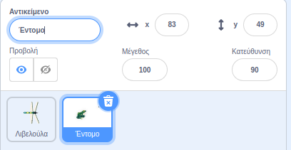
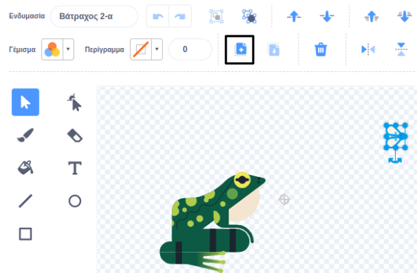
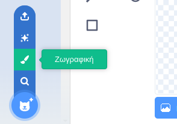
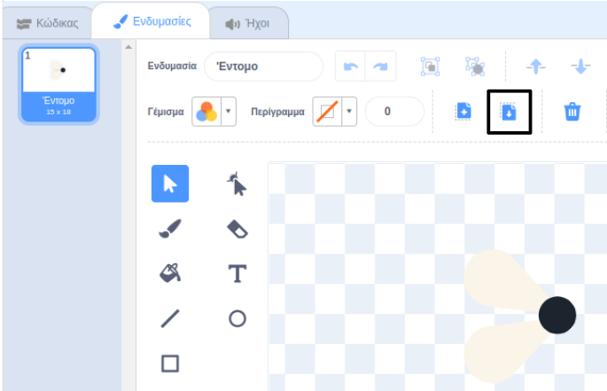
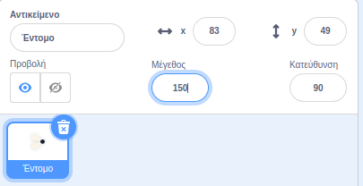

## Μια μύγα για φαγητό

<div style="display: flex; flex-wrap: wrap">
<div style="flex-basis: 200px; flex-grow: 1; margin-right: 15px;">
Θα προσθέσεις ένα έντομο για να φάει η λιβελούλα. 
</div>
<div>
{:width="300px"}
</div>
</div>

Υπάρχει μια μύγα στο αντικείμενο **Frog 2** που μπορείς να χρησιμοποιήσεις.

--- task ---

Πρόσθεσε το αντικείμενο **Frog 2** στο έργο σου. Μετονόμασε το αντικείμενο σε `Έντομο`:




--- /task ---

Χρειάζεσαι μόνο τη μύγα, όχι τον βάτραχο.

--- task ---

Κάνε κλικ στην καρτέλα **Ενδυμασίες**. Κάνε κλικ στη μύγα για να την επιλέξεις και κάνε κλικ στο εικονίδιο **Αντιγραφή**.



--- /task ---

--- task ---

Πρόσθεσε μία νέα ενδυμασία στο αντικείμενο χρησιμοποιώντας την επιλογή **Ζωγραφική**:



--- /task ---

--- task ---

Κάνε κλικ στο εικονίδιο **Επικόλληση** για να επικολλήσεις το αντικείμενο στη νέα ενδυμασία. Σύρε τη μύγα στο **κέντρο** ώστε να ευθυγραμμιστεί με το σταυρόνημα.

Rename your costume `Insect` and delete the other costumes, as you won't need those:



--- /task ---

--- task ---

Αύξησε το μέγεθος της μύγας ώστε να είναι ευκολότερο να την δεις και να την πιάσεις:



--- /task ---

--- task ---

Κάνε κλικ στην καρτέλα **Κώδικας** και πρόσθεσε ένα script για να αναπηδήσει το αντικείμενο **Έντομο**:


```blocks3
όταν γίνει κλικ στη σημαία
για πάντα
κινήσου [3] βήματα
εάν σε όριο, αναπήδησε
τέλος
```

Το μπλοκ `εάν σε όριο, αναπήδησε`{:class="block3motion"} ελέγχει αν το αντικείμενο έχει φτάσει στην άκρη της σκηνής και στρέφει το αντικείμενο σε διαφορετική κατεύθυνση, αν έχει φτάσει.

--- /task ---

Θέλεις το αντικείμενο **Έντομο** να `εξαφανίζεται`{:class="block3looks"} `εάν`{:class="block3control"} φαγωθεί από το αντικείμενο **Λιβελούλα**.

--- task ---

Πρόσθεσε ένα μπλοκ `εάν`{:class="block3control"} στο script κίνησης του αντικειμένου **Έντομο**:

```blocks3
όταν γίνει κλικ στη σημαία
για πάντα
κινήσου [3] βήματα
εάν σε όριο, αναπήδησε
+εάν < > τότε 
τέλος
```
--- /task ---

Το `εάν`{:class="block3control"} έχει είσοδο σε σχήμα εξάγωνου. Αυτό σημαίνει ότι μπορείς να βάλεις μια **συνθήκη** εδώ.

Όταν εκτελείται το μπλοκ `εάν`{:class="block3control"}, το Scratch θα ελέγξει την συνθήκη. Εάν η συνθήκη είναι "αληθής" `τότε`{:class="block3control"} θα εκτελεστεί ο κώδικας μέσα στο μπλοκ `εάν`{:class="block3control"}.

Θέλεις το έντομο να `εξαφανιστεί`{:class="block3looks"} `εάν`{:class="block3control"} `αγγίζει`{:class="block3sensing"} το αντικείμενο **Λιβελούλα**.

--- task ---

Σύρε ένα μπλοκ `αγγίζει [Λιβελούλα v]`{:class="block3sensing"} στο μπλοκ `εάν`{:class="block3control"}. Πρόσθεσε ένα μπλοκ `εξαφανίσου`{:class="block3looks"} μέσα στο μπλοκ `εάν`{:class="block3control"}.

```blocks3
όταν γίνει κλικ στη σημαία
για πάντα
κινήσου [3] βήματα
εάν σε όριο, αναπήδησε
+αν <touching [Dragonfly v] ?> τότε // αλλαγή από 'δείκτης του ποντικιού'
+εξαφανίσου // φαγώθηκε
τέλος
```

--- /task ---

--- task ---

**Δοκιμή:** Δοκίμασε τον κώδικά σου και έλεγξε την λιβελούλα ώστε να φάει τη μύγα. Η μύγα πρέπει να εξαφανιστεί.

--- /task ---

Η λιβελούλα δεν θα γίνει πολύ μεγάλη αν μπορεί να φάει μόνο μια μύγα!

--- task ---

Add blocks to make the hidden insect sprite `go to a random position`{:class="block3motion"} on the Stage, `wait`{:class="block3control"} for one second then `show`{:class="block3looks"}:

```blocks3
όταν γίνει κλικ στη σημαία
+εμφανίσου // εμφάνιση στην εκκίνηση
για πάντα
κινήσου [3] βήματα
εάν σε όριο, αναπήδησε
εάν <touching [Dragonfly v] ?> τότε
εξαφανίσου
+πήγαινε σε (τυχαία θέση v)
+περίμενε [1] δευτερόλεπτα
+εμφανίσου // να μοιάζει με νέα μύγα
τέλος
τέλος
```

--- /task ---

--- task ---

**Δοκιμή:** Δοκίμασε ότι η λιβελούλα σου μπορεί πλέον να φάει πολλές μύγες.

Make sure you have added the `show`{:class="block3looks"} block at the start.

--- /task ---

**Συμβουλή:** Μπορείς να κάνεις κλικ στο κόκκινο κουμπί **Σταμάτα** πάνω από τη Σκηνή εάν θέλεις η λιβελούλα να είναι ήσυχη ενώ προσθέτεις περισσότερο κώδικα.

--- save ---
