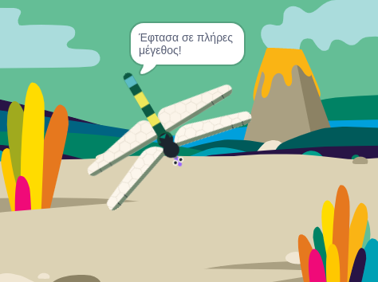
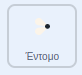

## Μεγάλωσέ την σε πλήρες μέγεθος

<div style="display: flex; flex-wrap: wrap">
<div style="flex-basis: 200px; flex-grow: 1; margin-right: 15px;">
Θα κάνεις τη λιβελούλα να μεγαλώσει όταν φάει μια μύγα και να σταματήσει αν φτάσει σε πλήρες μέγεθος.
</div>
<div>
{:width="300px"}
</div>
</div>

<p style="border-left: solid; border-width:10px; border-color: #0faeb0; background-color: aliceblue; padding: 10px;">
Οι μεγαλύτερες ζωντανές λιβελούλες βρίσκονται στην Κεντρική Αμερική και έχουν άνοιγμα φτερών 19 cm (λίγο μεγαλύτερο από το χέρι σου). Το μεγαλύτερο γνωστό έντομο ήταν το <span style="color: #0faeb0">**Meganeuropsis permiana**</span>, μια λιβελούλα με άνοιγμα φτερών περίπου 75 cm (το μέγεθος ενός μεγάλου βήματος).</p>

Η μύγα ξέρει ότι έχει φαγωθεί, και τώρα η Λιβελούλα πρέπει να μάθει ότι την έφαγε για να μεγαλώσει.

Όταν χρειάζεται να ενημερώσεις ένα άλλο αντικείμενο ότι κάτι έχει συμβεί, μπορείς να χρησιμοποιήσεις ένα μπλοκ `μετάδωσε`{:class="block3events"} όπως έκανες στα [Ξόρκια μετάδοσης](https://projects.raspberrypi.org/en/projects/broadcasting-spells){:target="_blank"}.

--- task ---

Πρόσθεσε ένα μπλοκ `μετάδωσε`{:class="block3events"} στο αντικείμενο **Έντομο** με νέο μήνυμα `φαγητό`{:class="block3events"}:



```blocks3
when flag clicked
show // show at the start
forever
move [3] steps
if on edge, bounce
if <touching [Dragonfly v] ?> then
+broadcast [food v]
hide
go to (random position v)
wait [1] seconds
show
end
end
```
--- /task ---

Το αντικείμενο **Λιβελούλα** πρέπει να μεγαλώσει όταν λάβει το μήνυμα `φαγητό`{:class="block3events"}.

--- task ---

Επίλεξε το αντικείμενο **Λιβελούλα** και πρόσθεσε αυτό το script:


```blocks3 
when I receive [food v]
change size by [5]
```

--- /task ---

--- task ---

Πρόσθεσε τον ήχο **Chomp** στην λιβελούλα και `ξεκίνησέ`{:class="block3sound"} τον όταν φαγωθεί ένα έντομο:


```blocks3 
when I receive [food v]
+start sound [Chomp v]
change size by [5]
```
--- /task ---

--- task ---

**Δοκιμή:** Εκτέλεσε το έργο σου για να δοκιμάσεις ότι η λιβελούλα μεγαλώνει και κάνει έναν ήχο chomp όταν τρώει μια μύγα.

--- /task ---

Όταν η λιβελούλα φτάσει στο πλήρες μέγεθός της, το παιχνίδι θα σε συγχαρεί και θα σταματήσει.

--- task ---

Πρόσθεσε ένα μπλοκ `εάν`{:class="block3control"}.

Η λιβελούλα είναι σε πλήρες μέγεθος όταν το `μέγεθος`{:class="block3looks"} `=`{:class="block3operators"} `100%`. Αρχικά, πρόσθεσε έναν τελεστή `=`{:class="block3operators"} στην είσοδο σε σχήμα εξάγωνου:


```blocks3
when I receive [food v]
start sound [Chomp v]
change size by [5]
+if <[ ] = [ ]> then
end
```
--- /task ---

--- task ---

Ολοκλήρωσε τη δημιουργία της συνθήκης προσθέτοντας μια ενσωματωμένη μεταβλητή `μέγεθος`{class="block3looks"} και πληκτρολόγησε την τιμή `100`:


```blocks3
when I receive [food v]
start sound [Chomp v]
change size by [5]
+if <(size) = [100]> then
end
```
--- /task ---

--- task ---

Πρόσθεσε μπλοκ έτσι ώστε `εάν`{:class="block3control"} η συνθήκη είναι αληθής `τότε`{:class="block3control"} η λιβελούλα θα `μεταδώσει`{:class="block3events"} ένα μήνυμα 'τέλος' και θα `λέει`{:class="block3looks"} `Έφτασα σε πλήρες μέγεθος!`

Τέλος, πρόσθεσε ένα μπλοκ `σταμάτησε όλα`{:class="block3control"} για να σταματήσεις τα άλλα script της λιβελούλας:


```blocks3
when I receive [food v]
start sound [Chomp v]
change size by [5]
if <(size) = [100]> then
+broadcast [end v]
+say [I got to full size!]
+stop [other scripts in sprite v] // change from 'all'
end
```
--- /task ---

--- task ---

Προς το παρόν, η μύγα εξακολουθεί να κινείται μετά το τέλος του έργου. Προσθέστε αυτό το script στο αντικείμενο **Έντομο**.


```blocks3
when I receive [end v]
stop [other scripts in sprite v]
```

--- /task ---

--- task ---

**Δοκιμή:** Κάνε κλικ στην πράσινη σημαία και συνέχισε να τρως μύγες μέχρι η λιβελούλα σου να φτάσει σε πλήρες μέγεθος.

--- /task ---

--- save ---
