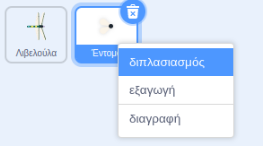
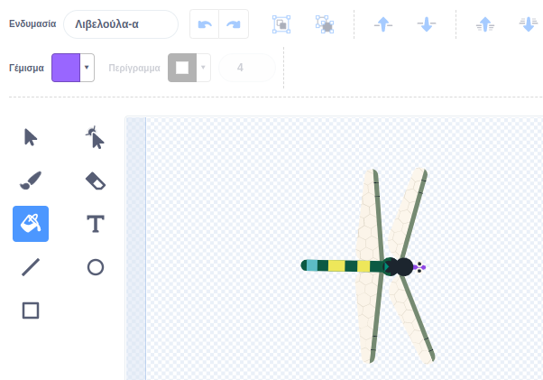
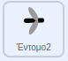
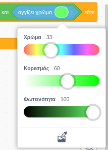

## Περισσότερο φαγητό

<div style="display: flex; flex-wrap: wrap">
<div style="flex-basis: 200px; flex-grow: 1; margin-right: 15px;">
Η λιβελούλα χρειάζεται μια επιλογή από έντομα.
</div>
<div>
{:width="300px"}
</div>
</div>

--- task ---

Κάνε δεξί κλικ στο αντικείμενο **Έντομο** στη λίστα Αντικειμένων κάτω από τη Σκηνή και **διπλασίασέ** το.



--- /task ---

Είναι χρήσιμο αν αυτό το έντομο φαίνεται διαφορετικό από τη μύγα.

--- task ---

Κάνε κλικ στην καρτέλα **Ενδυμασίες**.

**Επίλεξε:** Δημιουργία ενός διαφορετικού ιπτάμενου εντόμου.
+ Χρησιμοποίησε το εργαλείο **Γέμισμα** για να αλλάξεις το χρώμα αυτού του εντόμου
+ **Ζωγράφισε** τη δική σου ενδυμασία εντόμου
+ **Πρόσθεσε** άλλο κοστούμι εντόμου από το Scratch

--- /task ---

Το έντομο θα φαγωθεί ακόμα κι αν αγγίξει το φτερό ή την ουρά της λιβελούλας.

Για να κάνεις την εφαρμογή σου πιο ρεαλιστική, διόρθωσε την έτσι ώστε το έντομο να φαγωθεί από το στόμα της λιβελούλας. Μπορείς να χρησιμοποιήσεις το μπλοκ `αγγίζει χρώμα`{:class="block3sensing"}, ώστε το έντομο να φαγωθεί μόνο εάν αγγίζει ένα συγκεκριμένο χρώμα στην **Λιβελούλα**.

--- task ---

Επίλεξε το αντικείμενο **Λιβελούλα** και κάνε κλικ στην καρτέλα **Ενδυμασίες**.

Χρησιμοποίησε το εργαλείο γεμίσματος για να γεμίσεις το στόμα της **Λιβελούλας**. Χρησιμοποιήσαμε μωβ:



--- /task ---

Πρέπει να ελέγξεις ότι το αντικείμενο **Έντομο2** αγγίζει το αντικείμενο **Λιβελούλα** `και`{:class="block3operators"} αγγίζει το χρώμα του στόματος της λιβελούλας.

--- task ---

Επίλεξε το αντικείμενο **Έντομο2** και κάνε κλικ στην καρτέλα **Κώδικας**.

Σύρε ένα μπλοκ `και`{:class="block3operators"} στο μπλοκ `εάν`{:class="block3control"}.

Το μπλοκ `<touching [Dragonfly v] ?>`{:class="block3sensing"} θα αναδυθεί, σύρε το στα αριστερά του μπλοκ `και`{:class="block3operators"}:



```blocks3
when flag clicked
show
forever
move [3] steps 
if on edge, bounce
+if <<touching [Dragonfly v] ?> and <>> then
broadcast [food v]
hide
go to (random position v)
show
end
end
```

--- /task ---

--- task ---

Σύρε ένα μπλοκ `αγγίζει χρώμα`{:class="block3sensing"} στα δεξιά του μπλοκ `και`{:class="block3operators"}:


```blocks3
when flag clicked
show
forever
move [3] steps
if on edge, bounce
+if <<touching [Dragonfly v] ?> and <touching color (#9966ff) ?>> then
broadcast [food v]
hide
go to (random position v)
show
end
end
```

Εάν δεν έχει επιλεγεί το χρώμα του στόματος της λιβελούλας, κάνε κλικ στον κύκλο χρώματος και στη συνέχεια κάνε κλικ στο εργαλείο **Σταγονόμετρο** για να επιλέξεις ένα χρώμα.



Κάνε κλικ στο στόμα της λιβελούλας στην Σκηνή για να ορίσεις το χρώμα που ταιριάζει:


**Συμβουλή:** Εάν είναι δύσκολο να το κάνεις, άλλαξε το μέγεθος του αντικειμένου **Λιβελούλα** ώστε να είναι πραγματικά μεγάλο.

--- /task ---

--- task ---

**Δοκιμή:** Τώρα δοκίμασε ότι η λιβελούλα μπορεί να φάει το δεύτερο έντομο μόνο με το στόμα της.

Αν θέλεις, μπορείς να αλλάξεις το πρώτο **Έντομο** ώστε να μπορεί να φαγωθεί μόνο με το στόμα της λιβελούλας.

--- /task ---

--- save ---

