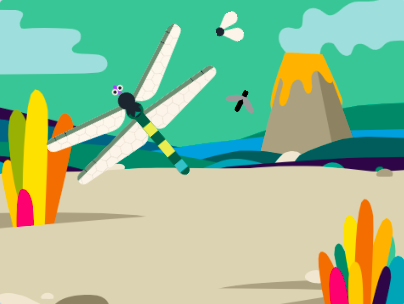

## Τυχαία κίνηση εντόμων

<div style="display: flex; flex-wrap: wrap">
<div style="flex-basis: 200px; flex-grow: 1; margin-right: 15px;">
Τα έντομα στην εφαρμογή σου κινούνται σε πολύ προβλέψιμο μοτίβο, αλλά στην πραγματικότητα είναι δύσκολο να τα πιάσεις. 

Θα χρησιμοποιήσεις το μπλοκ `επίλεξε τυχαία`{:class="block3operators"} για να κάνεις το έντομο να κινείται με πιο φυσικό τρόπο.
</div>
<div>
{:width="300px"}
</div>
</div>

--- task ---

Πρόσθεσε ένα script στο **Έντομο 2** για να δείχνει σε τυχαία κατεύθυνση κάθε 1–3 δευτερόλεπτα.

```blocks3
when flag clicked
forever // Συνέχισε να αλλάζεις κατεύθυνση
point in direction (pick random [0] to [259])
wait (pick random [1] to [3]) seconds
end
```

--- /task ---

--- task ---

**Δοκιμή:** Εκτέλεσε το έργο σου και παρακολούθησε πώς κινείται η μύγα. Δοκίμασε να αλλάξεις τους αριθμούς για να έχεις το εφέ που θέλεις.

Μπορείς επίσης να σύρεις αυτό το script στο αντικείμενο **Έντομο** έτσι ώστε να μετακινείται επίσης τυχαία.

--- /task ---

--- task ---

Άλλαξε τα έντομα μέχρι να συμπεριφέρονται όπως τα θέλεις.

Θα μπορούσες να αλλάξεις τον αριθμό των βημάτων που `κινούνται`{:class="block3motion"} για να τα κάνεις πιο γρήγορα ή πιο αργά.

Μπορείς επίσης να αλλάξεις την ταχύτητα της λιβελούλας.

--- /task ---

--- task ---

Θα μπορούσες επίσης να αλλάξεις το μέγεθος που χρειάζεται η λιβελούλα για να μεγαλώσει ώστε να φτάσει στο πλήρες μέγεθος.

Κάνε αλλαγές μέχρι να είσαι ευχαριστημένος με το έργο σου.

--- /task ---

--- save ---
