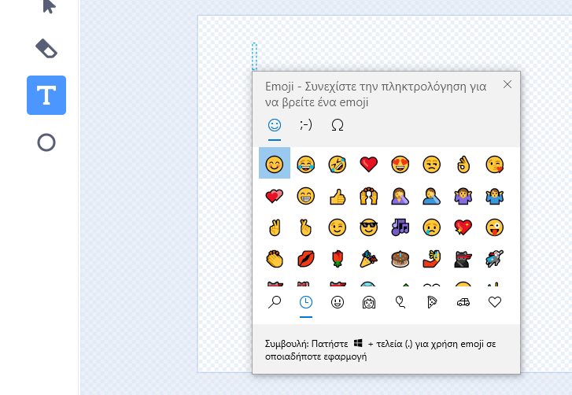
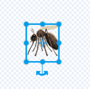

## Αναβάθμισε το έργο σου

Σε αυτό το βήμα, δοκίμασε να προσθέσεις περισσότερα έντομα, αλλάζοντας τον τρόπο εμφάνισης και συμπεριφοράς του έργου σου.

{:width="300px"}

### Πρόσθεσε περισσότερα έντομα

Πρόσθεσε περισσότερα έντομα. Ίσως χρειαστεί να τα κάνεις να κινούνται πιο γρήγορα, ώστε να είναι πιο δύσκολο να τα πιάσει η λιβελούλα.

Μπορείς να βάψεις τα δικά σου έντομα ή να προσπαθήσεις να προσθέσεις ένα emoji κουνούπι!

--- task ---

Χρησιμοποίησε το πληκτρολόγιο των emoji για να προσθέσεις ένα αντικείμενο **Emoji κουνούπι**.

Αντέγραψε ένα υπάρχον αντικείμενο **έντομο** και μετά κάνε κλικ στην καρτέλα **Ενδυμασίες**. **Ζωγράφισε** μια νέα ενδυμασία και επίλεξε το εργαλείο **Κείμενο**. Αντί να πληκτρολογήσεις κείμενο, χρησιμοποίησε τη συντόμευση πληκτρολογίου emoji για το λειτουργικό σου σύστημα:

Windows - Windows key + '.' MacOS - ctrl + cmd + space Linux - ctrl + '.'

Επίλεξε το emoji **Κουνούπι** για να το εισαγάγεις στο πρόγραμμα επεξεργασίας Ζωγραφικής. Χρησιμοποίησε το εργαλείο **Επιλογή** (βέλος) για να κεντράρεις, να αλλάξεις το μέγεθος και να περιστρέψεις το κουνούπι σου μέχρι να είσαι ευχαριστημένος με αυτό.

**Συμβουλή:** Τα Emojis μπορεί να φαίνονται διαφορετικά σε διαφορετικούς υπολογιστές, επομένως ενδέχεται να μην φαίνονται ίδια σε tablet και επιτραπέζιο υπολογιστή. Ορισμένα emoji δεν είναι διαθέσιμα σε ορισμένους υπολογιστές, αλλά οι περισσότεροι σύγχρονοι υπολογιστές τα υποστηρίζουν.

--- /task ---

--- task ---

Χρησιμοποίησε το σακίδιό σου για να ανταλλάξεις έντομα με τους φίλους σου από τα έργα τους «Μεγαλώνοντας μια Λιβελούλα».

[[[scratch-backpack]]]

--- /task ---

--- task ---

**Συμβουλή:** Έλεγξε ότι όλα τα αντικείμενα και οι ενδυμασίες σου έχουν λογικά ονόματα. Κάνει το έργο σου πιο κατανοητό εάν επιστρέψεις σε αυτό αργότερα.

**Συμβουλή:** Βεβαιώσου ότι ο κώδικάς σου είναι τοποθετημένος σωστά στην περιοχή Κώδικας. Κάνε δεξί κλικ στην περιοχή Κώδικας και επέλεξε **Εκκαθάριση των Μπλόκ** ώστε το Scratch να τακτοποιήσει τον κώδικά σου.

--- /task ---

--- collapse ---
---
title: Ολοκληρωμένο έργο
---

Μπορείς να δεις [ολοκληρωμένο έργο εδώ](https://scratch.mit.edu/projects/521688740/){:target="_blank"}.

--- /collapse ---

--- save ---
