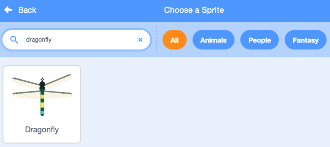
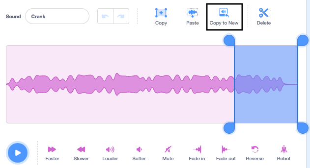
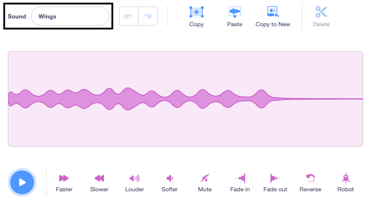
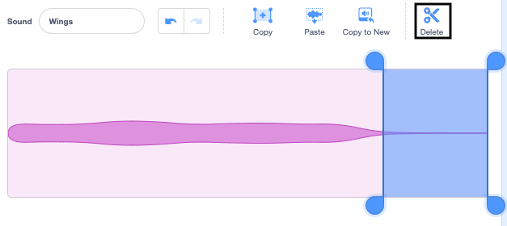

## Set the scene

<div style="display: flex; flex-wrap: wrap">
<div style="flex-basis: 200px; flex-grow: 1; margin-right: 15px;">
You will set the scene by choosing your backdrop and adding a dragonfly that follows the mouse-pointer around the Stage.
</div>
<div>
{:width="300px"}
</div>
</div>

--- task ---

Open the [Grow a dragonfly starter project](https://scratch.mit.edu/projects/535695413/editor){:target="_blank"}. Scratch will open in another browser tab.

[[[working-offline]]]

--- /task ---

<p style="border-left: solid; border-width:10px; border-color: #0faeb0; background-color: aliceblue; padding: 10px;">
<span style="color: #0faeb0">**Dragonflies**</span> can be found all over the world and have been around for over 300 million years!</p>

--- task ---

**Choose:** Click **Choose a Backdrop** and add a backdrop of your choice. We used the 'Jurassic' backdrop.


--- /task ---

--- task ---

Click **Choose a Sprite** and search for 'dragonfly' then add the **Dragonfly** sprite.




--- /task ---

--- task ---

Add a script to make the **Dragonfly** sprite follow the mouse-pointer (or your finger):


```blocks3
when flag clicked
set size to [25] % // to start small
forever
point towards (mouse-pointer v)
move [5] steps
end
```
--- /task ---

--- task ---

**Test:** Click the green flag and make the **Dragonfly** sprite move around the Stage. Is the Dragonfly moving as you would expect?

--- /task ---

The Dragonfly costume is not facing to the right so the head of the **Dragonfly** sprite is not pointing towards the mouse-pointer.

--- task ---

Click on the **Costumes** tab and use the **Select** (arrow) tool to select the costume. Use the rotation arrows at bottom of the selected costume to turn the Dragonfly costume to face the right.


--- /task ---

--- task ---

**Test:** Click the green flag and look at how the dragonfly moves now.

--- /task ---

Dragonfly wings make a fluttering sound as they vibrate. You can edit a sound in Scratch to create a new one.

--- task ---

Add the 'Crank' sound to the Dragonfly sprite.

[[[generic-scratch3-sound-from-library]]]


Click the 'play' button so you can hear the sound.

--- /task ---

The 'Crank' sound is too long and too slow for Dragonfly wings.

--- task ---

Select the end of the sound using your mouse or finger.

Click 'Copy to New' to make a new sound with just the selected part:



Rename your new sound from 'Crank2' to 'Wings'.

 

--- /task ---

--- task ---

Play the new sound. Click the 'Faster' button a few times until you like the result:


--- /task ---

--- task ---

If you like, you can select the very end of the Wings sound and then click 'Delete' to remove it:



--- /task ---

--- task ---

Now add a block to play the 'Wings' sound when the Dragonfly moves:


```blocks3
when flag clicked
set size to [25] %
forever
+start sound [Wings v]
point towards (mouse-pointer v)
move [5] steps
end
```
--- /task ---

--- task ---

**Test:** Try out your Dragonfly movement and sound effect.

--- /task ---

--- save ---