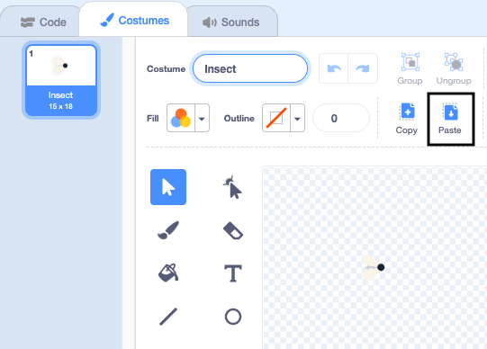
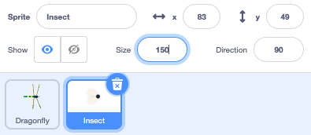

## A fly to eat

Now you will add a fly for the Dragonfly to eat.

There's a fly in the 'Frog 2' sprite that you can use.

--- task ---

Add the 'Frog 2' sprite to your project.

Rename the sprite to 'Fly':


--- /task ---

You only need the fly, not the Frog.

--- task ---
Click on the 'Costumes' tab.

Click on the fly to select it and click 'Copy'.


--- /task ---

--- task ---
Add a new costume to the sprite using the 'Paint' option:


--- /task ---

--- task ---
Click 'Paste' to past the sprite into the new costume. Drag the fly to the center so it lines up with the crosshair:



You can rename your costume 'Fly' and delete the other costumes as you won't need those.

--- /task ---

--- task ---

Increase the size of the fly so that it's easier to see and catch:



--- /task ---

--- task ---
Click on the 'Code' tab and add a script to make the Fly bounce around:


```blocks3
when flag clicked
forever
move [3] steps
if on edge, bounce
end
```

The `if on edge, bounce`{:class="block3control"} block checks to see if the sprite has reached the edge of the Stage and points the sprite in a different direction if it has. 

--- /task ---

You want the Fly to `hide`{:class="block3looks"} `if`{:class="block3control"} it gets eaten by the Dragonfly. 

To do this you can use the `touching`{:class="block3sensing"} condition from the `Sensing`{:class="block3sensing"} blocks menu.

--- task ---

Add an `if`{:class="block3control"} block to the Fly's movement script:


```blocks3
when flag clicked
forever
move [3] steps
if on edge, bounce
+if < > then 
end
```
--- /task ---

The `if`{:class="block3control"} has a hexagon-shaped input. This means you can put a **condition** here. When the `if`{:class="block3control"} block runs, Scratch will check the condition, `if`{:class="block3control"} the condition is 'true' `then`{:class="block3control"} the code inside the `if`{:class="block3control"} block will run.

You want the Fly to `hide`{:class="block3looks"} if it is touching the Dragonfly.

--- task ---

Drag a `touching [Dragonfly v]`{:class="block3sensing"} into the `if`{:class="block3control"} block. Add a `hide`{:class="block3looks"} block inside the `if`{:class="block3control"} block.


```blocks3
when flag clicked
forever
move [3] steps
if on edge, bounce
+if <touching [Dragonfly v] ?>
+hide 
end
```

--- /task ---

--- task ---

**Test:** Test your code and control the Dragonfly to eat the fly. The fly should disappear.

--- /task ---

The Dragonfly won't get very big if it can only eat one fly! 

--- task ---

Add blocks to go to a random position on the Stage and make your sprite `wait`{:class="block3control"} for one second then show:


```blocks3
when flag clicked
+show // show at the start
forever
move [3] steps
if on edge, bounce
if <touching [Dragonfly v] ?> then
hide
+go to (random position v)
+wait [1] seconds
+show
end
end
```

--- /task ---

--- task ---

**Test:** Test that your Dragonfly can now eat lots of flies.

Make sure you have added the 'show' block to show at the start.

--- /task ---

--- save ---