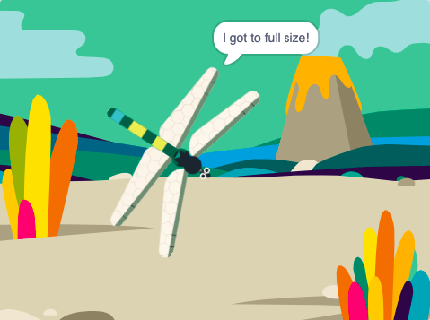
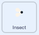

## Grow to fullsize

<div style="display: flex; flex-wrap: wrap">
<div style="flex-basis: 200px; flex-grow: 1; margin-right: 15px;">
You will make the Dragonfly grow when it eats a fly and stop if it reaches full size.
</div>
<div>
{:width="300px"}
</div>
</div>

<p style="border-left: solid; border-width:10px; border-color: #0faeb0; background-color: aliceblue; padding: 10px;">
The biggest living dragonflies can be found in Central America and have a wingspan of 19cm (a bit bigger than your hand). The largest insect ever known was <span style="color: #0faeb0">**Meganeuropsis permiana**</span> a dragonfly with a wingspan of about 75cm (the size of a big footstep).</p>

The fly knows that it has been eaten and now the Dragonfly needs to know. 

When you need to let another sprite know that something has happened you can use a `broadcast`{:class="block3events"} block as you did in [Broadcasting spells](https://projects.raspberrypi.org/en/projects/broadcasting-spells){:target="_blank"}. 

--- task ---

Add a `broadcast`{:class="block3events"} block to the **Insect** sprite with new message 'food':



```blocks3
when flag clicked
show // show at the start
forever
move [3] steps
if on edge, bounce
if <touching [Dragonfly v] ?> then
+broadcast [food v]
hide
go to (random position v)
wait [1] seconds
show
end
end
```
--- /task ---

The Dragonfly sprite needs to grow when it receives the 'food' message.

--- task ---
Select the **Dragonfly** sprite and add this script:


```blocks3 
when I receive [food v]
change size by [5]
```

--- /task ---

--- task ---
Add the 'Chomp' sound to the Dragonfly and `start`{:class="block3sound"} it when an insect gets eaten:


```blocks3 
when I receive [food v]
+start sound [Chomp v]
change size by [5]
```
--- /task ---

--- task ---

**Test:** Run your project to test the Dragonfly grows and makes a chomp sound when it eats a fly. 

--- /task ---

When the Dragonfly reaches its full size, the game will congratulate you and stop.

--- task ---

Add an `if`{:class="block3control"} block. 

The dragonfly is full size when the `size`{:class="block3looks"} `=`{:class="block3operators"} `100%`. First, add an `=`{:class="block3operators"} operator into the hexagon-shaped input:


```blocks3
when I receive [food v]
start sound [Chomp v]
change size by [5]
+if <[ ] = [ ]> then
end
```
--- /task ---

--- task ---

Finish building the condition by adding a built-in `size`{:class="block3looks"} variable and type the value `100`:


```blocks3
when I receive [food v]
start sound [Chomp v]
change size by [5]
+if <(size) = [100]> then
end
```
--- /task ---

--- task ---

Add blocks so that `if`{:class="block3control"} the condition is true `then`{:class="block3control"} the dragonfly will `broadcast`{:class="block3events"} an 'end' message and `say`{:class="block3looks"} `I got to full size!`

Finally, add a `stop all`{:class="block3control"} block to stop the other Dragonfly scripts:


```blocks3
when I receive [food v]
start sound [Chomp v]
change size by [5]
if <(size) = [100]> then
+broadcast [end v]
+say [I got to full size!]
+stop [other scripts in sprite v] // change from 'all'
end
```
--- /task ---

--- task ---

At the moment, the fly still moves after the project has ended. Add this script to the **Insect** sprite. 


```blocks3
when I receive [end v]
stop [other scripts in sprite v]
```

--- /task ---

--- task ---

**Test:** Click the green flag and keep eating flies until your Dragonfly reaches full size.

--- /task ---

--- save ---