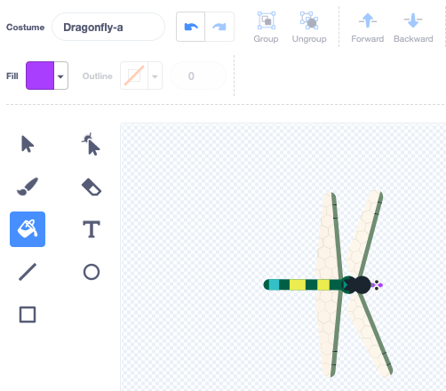
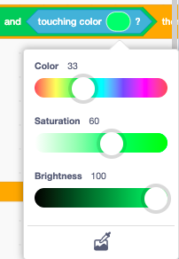

## More food

<div style="display: flex; flex-wrap: wrap">
<div style="flex-basis: 200px; flex-grow: 1; margin-right: 15px;">
The dragonfly needs a choice of insects.
</div>
<div>
{:width="300px"}
</div>
</div>

--- task ---
Right-click on the **Insect** sprite in the Sprite list under the Stage and duplicate it. 


--- /task ---

It's helpful if this insect looks different to the fly.

--- task ---

Click on the **Costumes** tab. 

**Choose:** You can either:
+ Use the **Fill** tool to change the colour of this insect
+ 'Paint' your own insect costume, or
+ Add another bug costume from Scratch.

--- /task ---

The Insect gets eaten even if it touches the Dragonfly's wing or tail. 

To fix this you can use the `touching color`{:class="block3sensing"} block so the insect only gets eaten if it is touches a particular colour on the **Dragonfly**.

--- task ---

Select the **Dragonfly** sprite and click on the **Costumes** tab.

Use the fill tool to fill in the **Dragonfly**'s mouth. We used purple:



--- /task ---

You need to check that the **Insect2** sprite is touching the **Dragonfly** sprite `and`{:class="block3operators"} touching the colour of the Dragonfly's mouth.

--- task ---
Select the **Insect2** sprite and click on the **Code** tab.

Drag a `and`{:class="block3operators"} block into the `if`{:class="block3control"} block. 

The `<touching [Dragonfly v] ?>`{:class="block3sensing"} block will pop out, drag it into the left of the `and`{:class="block3operators"} block:


```blocks3
when flag clicked
show
forever
move [3] steps 
if on edge, bounce
+if <<touching [Dragonfly v] ?> and <>> then
broadcast [food v]
hide
go to (random position v)
show
end
end
```

--- /task ---

--- task ---

Drag a `touching color`{:class="block3sensing"} block into the right of the `and`{:class="block3operators"} block:


```blocks3
when flag clicked
show
forever
move [3] steps
if on edge, bounce
+if <<touching [Dragonfly v] ?> and <touching color (#9966ff) ?>> then
broadcast [food v]
hide
go to (random position v)
show
end
end
```

If it doesn't have the colour of the Dragonfly's mouth selected, click on the colour circle and then click on the **Eyedropper** tool to select a colour.



Click on the Dragonfly's mouth on the Stage to set the colour to match:


**Tip:** If this is tricky to do, change the size of the **Dragonfly** sprite so it's really big.

--- /task ---

--- task ---
**Test:** Now test that the Dragonfly can only eat the second insect with its mouth. 

If you like, you can change the first **Insect** so that it can only be eaten with the Dragonfly's mouth.

--- /task ---

--- save ---

