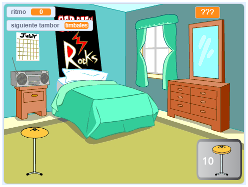

## ¿Qué sigue?

Si estás siguiendo el camino [Más scratch](https://projects.raspberrypi.org/en/raspberrypi/more-scratch), puedes continuar con el proyecto [Drum star](https://projects.raspberrypi.org/en/projects/drum-star). En este proyecto, harás un juego interactivo en el que ganarás ritmos para tocar nuevos tambores en lugares más grandes.

--- print-only ---

--- /print-only ---

--- no-print ---

  <iframe allowtransparency="true" width="485" height="402" src="https://scratch.mit.edu/projects/embed/522323676/?autostart=false" frameborder="0"></iframe>

--- /no-print ---

Si quieres divertirte más explorando Scratch, puedes probar cualquiera de [estos proyectos](https://projects.raspberrypi.org/en/projects?software%5B%5D=scratch&curriculum%5B%5D=%201).
