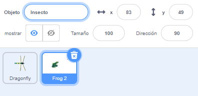
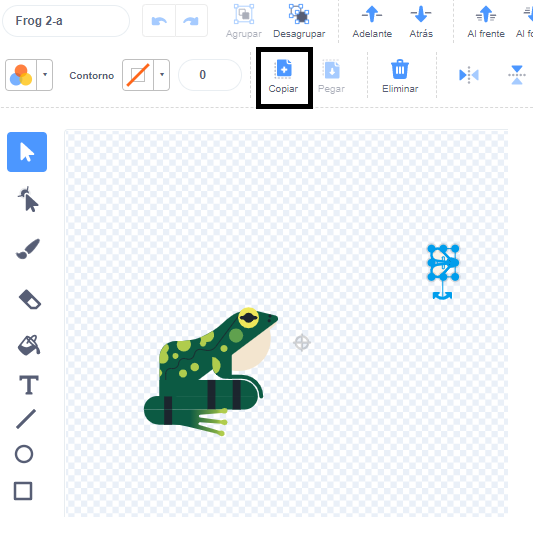
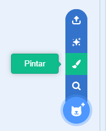
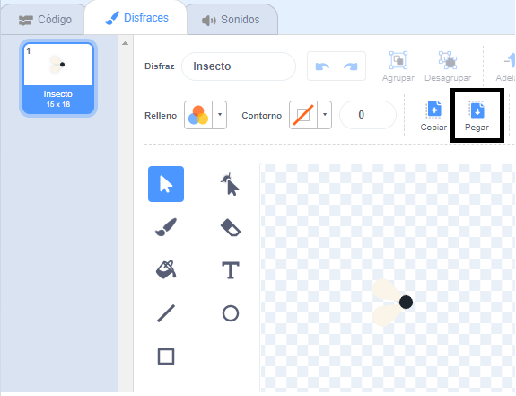
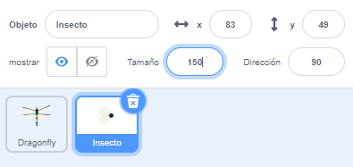

## Una mosca para comer

<div style="display: flex; flex-wrap: wrap">
<div style="flex-basis: 200px; flex-grow: 1; margin-right: 15px;">
Agregarás un insecto para que la libélula lo coma. 
</div>
<div>
{:width="300px"}
</div>
</div>

Hay una mosca en el objeto **Frog 2** que puedes usar.

--- task ---

Agrega **Frog 2** a tu proyecto. Cambia el nombre del objeto a `Insecto`:




--- /task ---

Solo necesitas a la mosca, no a la rana.

--- task ---

Pulsa en la pestaña **Disfraces**. Pulsa sobre la mosca para seleccionarla y en el ícono **Copiar**.



--- /task ---

--- task ---

Agrega un nuevo disfraz al objeto usando la opción **Pintar**:



--- /task ---

--- task ---

Pulsa en el icono **Pegar** para pegar el objeto en el nuevo disfraz. Arrastra la mosca al **centro** para que se alinee con la cruz.

Rename your costume `Insect` and delete the other costumes, as you won't need those:



--- /task ---

--- task ---

Aumenta el tamaño de la mosca para que sea más fácil de ver y atrapar:



--- /task ---

--- task ---

Pulsa en la pestaña **Código** y agrega un script para hacer que el objeto **Insecto** rebote alrededor:


```blocks3
when flag clicked
forever
move [3] steps
if on edge, bounce
end
```

El bloque `si toca un borde, rebota`{:class="block3motion"} comprueba si el objeto ha llegado al borde del Escenario y lo apunta hacia una dirección diferente si la tiene.

--- /task ---

Quieres que el **Insecto** se `esconda`{:class="block3looks"} `si`{:class="block3control"} es comido por el objeto **Dragonfly**.

--- task ---

Agrega un bloque `si`{:class="block3control"} al script de movimiento del **Insecto**:

```blocks3
when flag clicked
forever
move [3] steps
if on edge, bounce
+if < > then 
end
```
--- /task ---

El `si`{:class="block3control"} tiene una entrada en forma de hexágono. Esto significa que puedes poner una **condición** aquí.

Cuando se ejecuta el bloque `si`{:class="block3control"}, Scratch verificará la condición. Si la condición es 'cierta' `entonces`{:class="block3control"} se ejecutará el código dentro del bloque `si`{:class="block3control"}.

Quieres que el insecto se `esconda`{:class="block3looks"} `si`{:class="block3control"} está `tocando`{:class="block3sensing"} el objeto **Dragonfly**.

--- task ---

Arrastra un `tocando [Dragonfly v]`{:class="block3sensing"} al bloque `si`{:class="block3control"}. Agrega un bloque `esconder`{:class="block3looks"} dentro del bloque `si`{:class="block3control"}.

```blocks3
when flag clicked
forever
move [3] steps
if on edge, bounce
+if <touching [Dragonfly v] ?> then // change from 'mouse-pointer'
+hide // eaten
end
```

--- /task ---

--- task ---

**Prueba:** Prueba tu código y controla la libélula para que se coma la mosca. La mosca debería desaparecer.

--- /task ---

¡La libélula no crecerá mucho si solo puede comer una mosca!

--- task ---

Add blocks to make the hidden insect sprite `go to a random position`{:class="block3motion"} on the Stage, `wait`{:class="block3control"} for one second then `show`{:class="block3looks"}:

```blocks3
when flag clicked
+show // show at the start
forever
move [3] steps
if on edge, bounce
if <touching [Dragonfly v] ?> then
hide
+go to (random position v)
+wait [1] seconds
+show // to look like a new fly
end
end
```

--- /task ---

--- task ---

**Prueba:** Prueba que tu libélula ahora puede comer muchas moscas.

Make sure you have added the `show`{:class="block3looks"} block at the start.

--- /task ---

**Consejo:** Puedes pulsar en el botón rojo **Detener** sobre el escenario si deseas que la libélula permanezca parada mientras agregas más código.

--- save ---
