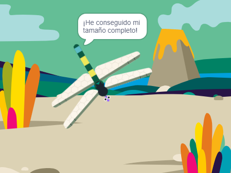

## Crecer a tamaño completo

<div style="display: flex; flex-wrap: wrap">
<div style="flex-basis: 200px; flex-grow: 1; margin-right: 15px;">
Harás que la libélula crezca cuando se coma una mosca, y se detendrá si alcanza su tamaño completo.
</div>
<div>
{:width="300px"}
</div>
</div>

<p style="border-left: solid; border-width:10px; border-color: #0faeb0; background-color: aliceblue; padding: 10px;">
Las libélulas vivas más grandes se pueden encontrar en América Central y tienen una envergadura de 19 cm (un poco más grande que tu mano). El insecto más grande jamás conocido fue <span style="color: #0faeb0">**Meganeuropsis permiana**</span>, una libélula con una envergadura de unos 75 cm (el tamaño de una pisada grande).</p>

La mosca sabe que ha sido comida, y ahora la Libélula necesita saberlo para crecer.

Cuando necesites que otro objeto sepa que algo sucedió, puedes usar un bloque `enviar`{:class="block3events"} como lo hiciste en [Enviando hechizos](https://projects.raspberrypi.org/en/projects/broadcasting-spells){:target="_blank"}.

--- task ---

Agrega un bloque `enviar`{:class="block3events"} al objeto **Insecto** con el nuevo mensaje `comida`{:class="block3events"}:


```blocks3
when flag clicked
show // show at the start
forever
move [3] steps
if on edge, bounce
if <touching [Dragonfly v] ?> then
+broadcast [food v]
hide
go to (random position v)
wait [1] seconds
show
end
end
```
--- /task ---

El objeto **Dragonfly** necesita crecer cuando recibe el mensaje `comida`{:class="block3events"}.

--- task ---

Selecciona el objeto **Dragonfly** y agrega este script:


```blocks3 
when I receive [food v]
change size by [5]
```

--- /task ---

--- task ---

Agrega el sonido **Chomp** a la libélula e `inicia sonido`{:class="block3sound"} cuando un insecto es comido:


```blocks3 
when I receive [food v]
+start sound [Chomp v]
change size by [5]
```
--- /task ---

--- task ---

**Prueba:** Ejecuta tu proyecto para probar que la libélula crece y hace un sonido de mordisco cuando come una mosca.

--- /task ---

Cuando la libélula alcance su tamaño completo, el juego te felicitará y se detendrá.

--- task ---

Agrega un bloque `si`{:class="block3control"}.

La libélula es de tamaño completo cuando el `tamaño`{:class="block3looks"} `=`{:class="block3operators"} `100%`. Primero, agrega un operador `=`{:class="block3operators"} en la entrada en forma de hexágono:


```blocks3
when I receive [food v]
start sound [Chomp v]
change size by [5]
+if <[ ] = [ ]> then
end
```
--- /task ---

--- task ---

Termina de crear la condición agregando una variable personalizada para el `tamaño`{:class="block3looks"} y escribe el valor `100`:


```blocks3
when I receive [food v]
start sound [Chomp v]
change size by [5]
+if <(size) = [100]> then
end
```
--- /task ---

--- task ---

Agregue bloques de modo que `si`{:class="block3control"} la condición es verdadera `entonces`{:class="block3control"} la libélula va a `enviar`{:class="block3events"} un mensaje de 'fin' y va a `decir`{:class="block3looks"} `¡He conseguido mi tamaño completo!`

Finalmente, agrega un bloque `detener todos`{:class="block3control"} para detener los otros scripts de la libélula:


```blocks3
when I receive [food v]
start sound [Chomp v]
change size by [5]
if <(size) = [100]> then
+broadcast [end v]
+say [I got to full size!]
+stop [other scripts in sprite v] // change from 'all'
end
```
--- /task ---

--- task ---

En este momento, la mosca sigue moviéndose una vez finalizado el proyecto. Agrega este script al objeto **Insecto**.


```blocks3
when I receive [end v]
stop [other scripts in sprite v]
```

--- /task ---

--- task ---

**Prueba:** Pulsa en la bandera verde y sigue comiendo moscas hasta que tu libélula alcance su tamaño completo.

--- /task ---

--- save ---
