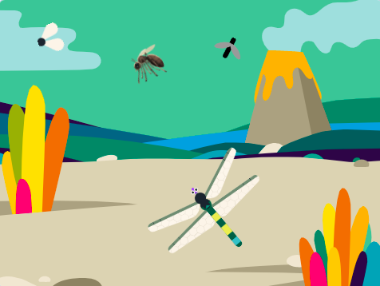
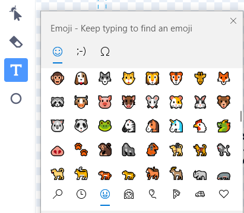

## Mejora tu proyecto

En este paso, intenta agregar más insectos, cambiando la apariencia y el comportamiento de tu proyecto.

{:width="300px"}

### Añade más insectos

Añade más insectos. Es posible que debas hacer que se muevan más rápido, para que sean más difíciles de atrapar por la libélula.

¡Puedes pintar los tuyos propios o intentar agregar un emoticón de mosquito!

--- task ---

Usa el teclado de emoticón para agregar un objeto **Mosquito emoji**.

Duplica un objeto **insect** ya existente y luego pulsa en la pestaña **Disfraces**. **Pinta** un disfraz nuevo y selecciona la herramienta **Texto**. En lugar de escribir texto, usa el atajo de teclado de emoticón para tu sistema operativo:

Windows: tecla de Windows + '.' MacOS - ctrl + cmd + espacio Linux - ctrl + '.'

Selecciona el emoticón de **Mosquito** para insertarlo en el editor de Pintura. Usa la herramienta **Seleccionar** (flecha) para centrar, cambiar el tamaño y rotarlo hasta que estés conforme con el resultado.

**Consejo:** Los emoticones pueden verse de manera distinta en diferentes computadoras, por lo que es posible que no se vean igual en una tableta y una computadora de escritorio. Algunos no están disponibles en algunas computadoras, pero la mayoría de las computadoras modernas los admiten.

--- /task ---

--- task ---

Usa tu Mochila para intercambiar insectos con tus amigos desde sus proyectos 'Haz Crecer una Libélula'.

[[[scratch-backpack]]]

--- /task ---

--- task ---

**Consejo:** Comprueba que todos tus objetos y disfraces tengan nombres adecuados. Esto hará que tu proyecto sea más fácil de entender si vuelves a él más tarde.

**Consejo:** Asegúrate de que tu código está bien organizado en el área Código. Haz clic con el botón derecho en el área Código y elige **Ordenar bloques** para que Scratch ordene tu código.

--- /task ---

--- collapse ---
---
title: Proyecto terminado
---

Puedes ver el [proyecto terminado aquí](https://scratch.mit.edu/projects/521688740/){:target ="_blank"}.

--- /collapse ---

--- save ---
