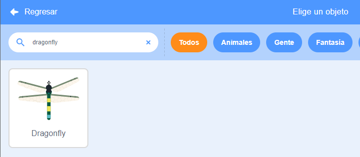
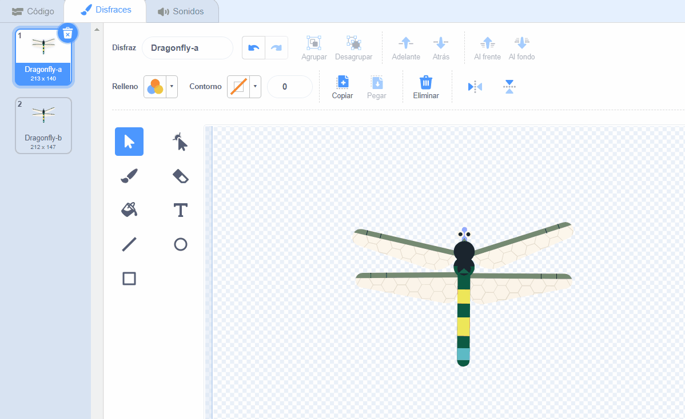
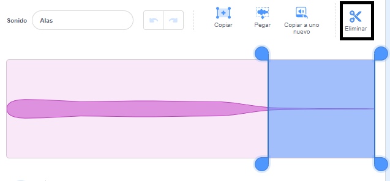

## Prepara la escena

<div style="display: flex; flex-wrap: wrap">
<div style="flex-basis: 200px; flex-grow: 1; margin-right: 15px;">
Prepararás la escena. Elige tu fondo y agrega una libélula que siga el puntero del ratón alrededor del escenario.
</div>
<div>
{:width="300px"}
</div>
</div>

--- task ---

Abre el [Proyecto de Iniciación Haz crecer una libélula](https://scratch.mit.edu/projects/535695413/editor){:target="_blank"}. Scratch se abrirá en otra pestaña del navegador.

[[[working-offline]]]

--- /task ---

<p style="border-left: solid; border-width:10px; border-color: #0faeb0; background-color: aliceblue; padding: 10px;">
¡Las <span style="color: #0faeb0">**Libélulas**</span> se pueden encontrar en todo el mundo y han existido por más de 300 millones de años!</p>

--- task ---

**Elige:** Pulsa sobre **Elige un Fondo** y agrega un fondo de tu elección. Nosotros hemos usado el fondo **Jurassic**.


--- /task ---

--- task ---

Pulsa sobre **Elegir un Objeto** y busca `dragonfly`, luego agrega el objeto **Dragonfly**.




--- /task ---

--- task ---

Agrega un script para hacer que el objeto **Dragonfly** siga el puntero del ratón (o tu dedo):


```blocks3
when flag clicked
set size to [25] % // empezar con tamaño pequeño
forever
point towards (mouse-pointer v)
move [5] steps
end
```
--- /task ---

--- task ---

**Prueba:** Presiona la bandera verde y haz que el objeto **Dragonfly** se mueva por el Escenario. ¿Se está moviendo la libélula como era de esperar?

--- /task ---

El disfraz de Libélula no mira hacia la derecha, por lo que la cabeza del objeto **Dragonfly** no apunta hacia el puntero del ratón.

--- task ---

Pulsa en la pestaña **Disfraces** y usa la herramienta **Seleccionar** (flecha) para seleccionar el disfraz. Utiliza la herramienta **Rotar** en la parte inferior del disfraz seleccionado para girar el disfraz **Dragonfly** y que mire hacia la derecha.




--- /task ---

--- task ---

**Prueba:** Presiona la bandera verde y observa cómo se mueve ahora la libélula.

--- /task ---

Las alas de la libélula hacen un sonido de aleteo mientras vibran. Puedes editar un sonido en Scratch para crear tu propio sonido.

--- task ---

Agrega el sonido **Crank** al objeto **Dragonfly**.

[[[generic-scratch3-sound-from-library]]]


Pulsa en el botón **Reproducir** para que puedas escuchar el sonido.

--- /task ---

El sonido **Crank** es demasiado largo y demasiado lento para las alas de la libélula.

--- task ---

Selecciona el final del sonido con tu puntero del ratón o dedo.

Pulsa en **Copiar a uno nuevo** para crear un sonido nuevo sólo con la parte seleccionada:


Cambia el nombre de tu nuevo sonido de **Crank2** a `Alas`.


--- /task ---

--- task ---

Reproduce el nuevo sonido. Pulsa en el botón **Más rápido** varias veces hasta que te guste el resultado:


--- /task ---

--- task ---

Si quieres, puedes seleccionar el final del sonido **Alas**, y luego pulsar **Eliminar** para quitarlo:



--- /task ---

--- task ---

Ahora agrega un bloque para reproducir el sonido **Alas** cuando la libélula se mueva:


```blocks3
when flag clicked
set size to [25] %
forever
+start sound [Alas v]
point towards (mouse-pointer v)
move [5] steps
end
```
--- /task ---

--- task ---

**Prueba:** Ensaya el movimiento y efecto de sonido de tu libélula.

--- /task ---

--- save ---
