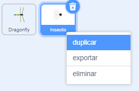
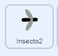

## Más comida

<div style="display: flex; flex-wrap: wrap">
<div style="flex-basis: 200px; flex-grow: 1; margin-right: 15px;">
La libélula necesita una selección de insectos.
</div>
<div>
{:width="300px"}
</div>
</div>

--- task ---

Pulsa con el botón derecho en el objeto **Insecto** en la lista de Objetos debajo del Escenario y selecciona **duplicar**.



--- /task ---

Es útil si este insecto se ve diferente a la mosca.

--- task ---

Pulsa en la pestaña **Disfraces**.

**Elige:** Crear un insecto volador diferente.
+ Usa la herramienta **Relleno** para cambiar el color de este insecto
+ **Pinta** tu propio disfraz de insecto
+ **Agrega** otro disfraz de bicho de Scratch

--- /task ---

El insecto será comido incluso si toca el ala o la cola de la libélula.

Para que tu app sea más realista, arregla esto para que el insecto sea comido por la boca de la libélula. Puedes usar el bloque `tocando el color`{:class="block3sensing"} para que el insecto solo sea comido si toca un color en particular en el **Dragonfly**.

--- task ---

Selecciona el objeto **Dragonfly** y pulsa en la pestaña **Disfraces**.

Utiliza la herramienta de relleno para rellenar la boca del **Dragonfly**. Nosotros hemos usado morado:


--- /task ---

Debes comprobar que el objeto **Insect2** esté tocando el objeto **Dragonfly** `y`{:class="block3operators"} tocando el color de la boca de la libélula.

--- task ---

Selecciona el objeto **Insect2** y pulsa en la pestaña **Código**.

Arrastra un bloque `y`{:class="block3operators"} dentro del bloque `si`{:class="block3control"}.

Aparecerá el bloque `<touching [Dragonfly v] ?>`{:class="block3sensing"}, arrástrelo a la izquierda del bloque `y`{:class="block3operators"}:



```blocks3
when flag clicked
show
forever
move [3] steps 
if on edge, bounce
+if <<touching [Dragonfly v] ?> and <>> then
broadcast [comida v]
hide
go to (random position v)
show
end
end
```

--- /task ---

--- task ---

Arrastra un bloque `tocando el color`{:class="block3sensing"} a la derecha del bloque `y`{:class="block3operators"}:


```blocks3
when flag clicked
show
forever
move [3] steps
if on edge, bounce
+if <<touching [Dragonfly v] ?> and <touching color (#9966ff) ?>> then
broadcast [comida v]
hide
go to (random position v)
show
end
end
```

Si no tienes seleccionado el color de la boca de la libélula, pulsa en el círculo de color y luego pulsa en la herramienta **Cuentagotas** para seleccionar un color.


Pulsa en la boca de la libélula en el Escenario para establecer el color para que coincida:


**Sugerencia:** Si esto es difícil de hacer, cambia el tamaño del objeto **Dragonfly** para que sea realmente grande.

--- /task ---

--- task ---

**Prueba:** Ahora prueba que la libélula solo puede comer el segundo insecto con su boca.

Si quieres, puedes cambiar el primer **Insecto** para que solo pueda ser comido con la boca de la libélula.

--- /task ---

--- save ---

