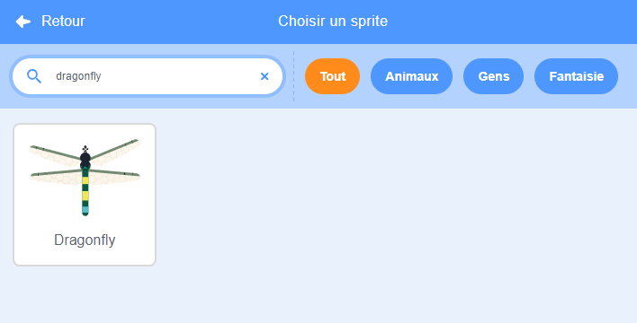

## Créer la scène

<div style="display: flex; flex-wrap: wrap">
<div style="flex-basis: 200px; flex-grow: 1; margin-right: 15px;">
Tu vas créer la scène. Choisis ton arrière-plan et ajoute une libellule qui suit le pointeur de la souris autour de la scène.
</div>
<div>
{:width="300px"}
</div>
</div>

--- task ---

Ouvre le projet de démarrage [Faire grandir une libellule](https://scratch.mit.edu/projects/535695413/editor){:target="_blank"}. Scratch s'ouvrira dans un autre onglet du navigateur.

[[[working-offline]]]

--- /task ---

<p style="border-left: solid; border-width:10px; border-color: #0faeb0; background-color: aliceblue; padding: 10px;">
<span style="color: #0faeb0">**Les libellules**</span> peuvent être trouvées partout dans le monde et existent depuis plus de 300 millions d'années !</p>

--- task ---

**Choisir :** Clique sur **Choisir un arrière-plan** et ajoute un arrière-plan de ton choix. Nous avons utilisé l'arrière-plan **Jurassic**.


--- /task ---

--- task ---

Clique sur **Choisir un sprite** et recherche `dragonfly`, puis ajoute le sprite **Dragonfly** (Libellule).




--- /task ---

--- task ---

Ajoute un script pour que le sprite **Libellule** suive le pointeur de la souris (ou ton doigt) :


```blocks3
when flag clicked
set size to [25] % // pour démarrer petit
forever
point towards (mouse-pointer v)
move [5] steps
end
```
--- /task ---

--- task ---

**Test :** Clique sur le drapeau vert et fais bouger le sprite **Libellule** autour de la scène. La libellule se déplace-t-elle comme prévu ?

--- /task ---

Le costume Libellule n'est pas tourné vers la droite, donc la tête du sprite **Libellule** n'est pas pointée vers le pointeur de la souris.

--- task ---

Clique sur l'onglet **Costumes** et utilise l'outil **Sélectionner** (flèche) pour sélectionner le costume. Utilise l'outil **Rotation** en bas du costume sélectionné pour tourner le costume **Libellule** vers la droite.


--- /task ---

--- task ---

**Test :** Clique sur le drapeau vert et regarde comment la libellule se déplace maintenant.

--- /task ---

Les ailes de libellule émettent un son de battement lorsqu'elles vibrent. Tu peux éditer un son dans Scratch pour créer ton propre son.

--- task ---

Ajoute le son **Crank** au sprite **Libellule**.

[[[generic-scratch3-sound-from-library]]]


Clique sur le bouton **Jouer** pour entendre le son.

--- /task ---

Le son **Crank** est trop long et trop lent pour les ailes de libellule.

--- task ---

Sélectionne la fin du son à l'aide de ton curseur ou de ton doigt.

Clique sur **Copier dans un nouveau** pour créer un nouveau son avec uniquement la partie sélectionnée :


Renomme ton nouveau son de **Crank2** à `Ailes`.


--- /task ---

--- task ---

Joue le nouveau son. Clique plusieurs fois sur le bouton **Plus vite** jusqu'à ce que le résultat te plaise :


--- /task ---

--- task ---

Si tu le souhaite, tu peux sélectionner la toute fin du son **Ailes** , puis clique sur **Supprimer** pour le supprimer :


--- /task ---

--- task ---

Ajoute maintenant un bloc pour jouer le son **Ailes** lorsque la libellule se déplace :


```blocks3
when flag clicked
set size to [25] %
forever
+start sound [Ailes v]
point towards (mouse-pointer v)
move [5] steps
end
```
--- /task ---

--- task ---

**Test :** Essaie le mouvement et l'effet sonore de ta libellule.

--- /task ---

--- save ---
