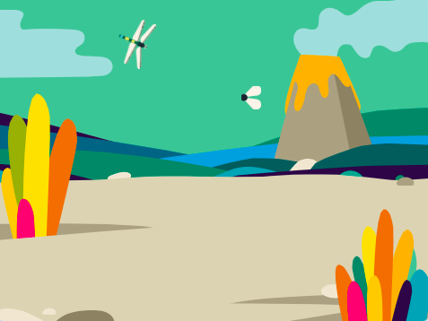

## Une mouche à manger

<div style="display: flex; flex-wrap: wrap">
<div style="flex-basis: 200px; flex-grow: 1; margin-right: 15px;">
Tu ajouteras un insecte que la libellule mangera. 
</div>
<div>
{:width="300px"}
</div>
</div>

Il y a une mouche dans le sprite **Frog 2** que tu peux utiliser.

--- task ---

Ajoute le sprite **Frog 2** à ton projet. Renomme le sprite par `Insecte` :


--- /task ---

Tu n'as besoin que de la mouche, pas de la grenouille.

--- task ---

Clique sur l'onglet **Costumes**. Clique à la volée pour le sélectionner et clique sur l'icône **Copier**.


--- /task ---

--- task ---

Ajoute un nouveau costume au sprite en utilisant l'option **Peindre** :


--- /task ---

--- task ---

Clique sur l'icône **Coller** pour coller le sprite dans le nouveau costume. Fais glisser la mouche vers le **centre** afin qu'elle s'aligne avec le réticule.

Tu peux renommer ton costume `Insecte` et supprimer les autres costumes, car tu n'en auras pas besoin :


--- /task ---

--- task ---

Augmente la taille de la mouche pour qu'elle soit plus facile à voir et à attraper :


--- /task ---

--- task ---

Clique sur l'onglet **Code** et ajoute un script pour faire rebondir le sprite **Insecte** :


```blocks3
when flag clicked
forever
move [3] steps
if on edge, bounce
end
```

Le bloc `rebondir si le bord est atteint`{:class="block3motion"} vérifie si le sprite a atteint le bord de la scène et pointe le sprite dans une direction différente si c'est le cas.

--- /task ---

Tu veux que le sprite **Insecte** se `cache`{:class="block3looks"} `si`{:class="block3control"} il est mangé par le sprite **Libellule**.

--- task ---

Ajoute un bloc `si`{:class="block3control"} au script de mouvement du sprite **Insecte** :

```blocks3
when flag clicked
forever
move [3] steps
if on edge, bounce
+if < > then 
end
```
--- /task ---

Le `si`{:class="block3control"} a une entrée de forme hexagonale. Cela signifie que tu peux mettre une **condition** ici.

Lorsque le bloc `si`{:class="block3control"} s'exécute, Scratch vérifie la condition. Si la condition est "vraie" `alors`{:class="block3control"} le code à l'intérieur du bloc `si`{:class="block3control"} s'exécutera.

Tu veux que l'insecte se `cache`{:class="block3looks"} `si`{:class="block3control"} il `touche`{:class="block3sensing"} le sprite **Libellule**.

--- task ---

Fais glisser un `touche le [Libellule v]`{:class="block3sensing"} dans le bloc `si`{:class="block3control"}. Ajoute un bloc `cacher`{:class="block3looks"} à l'intérieur du bloc `si`{:class="block3control"}.

```blocks3
when flag clicked
forever
move [3] steps
if on edge, bounce
+if <touching [Dragonfly v] ?> then // change from 'mouse-pointer'
+hide // eaten
end
```

--- /task ---

--- task ---

**Test :** Teste ton code et contrôle la libellule pour manger la mouche. La mouche devrait disparaître.

--- /task ---

La libellule ne deviendra pas très grande si elle ne peut manger qu'une seule mouche !

--- task ---

Ajoute des blocs pour `aller à position aléatoire`{:class="block3motion"} sur la scène, et fais ton sprite `attendre`{:class="block3control"} pendant une seconde puis `montrer`{:class="block3looks"} :

```blocks3
when flag clicked
+show // show at the start
forever
move [3] steps
if on edge, bounce
if <touching [Dragonfly v] ?> then
hide
+go to (random position v)
+wait [1] seconds
+show // to look like a new fly
end
end
```

--- /task ---

--- task ---

**Test :** Teste que ta libellule peut maintenant manger beaucoup de mouches.

Assure-toi d'avoir ajouté le bloc `montrer`{:class="block3looks"} pour montrer au début.

--- /task ---

**Astuce :** Tu peux cliquer sur le bouton rouge **Stop** au-dessus de la scène si tu veux que la libellule s'arrête pendant que tu ajoutes plus de code.

--- save ---
