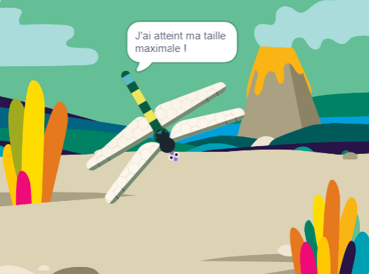

## Faire grandir jusqu'à sa taille maximale

<div style="display: flex; flex-wrap: wrap">
<div style="flex-basis: 200px; flex-grow: 1; margin-right: 15px;">
Tu feras grandir la libellule lorsqu'elle mange une mouche, et tu t'arrêteras si elle atteint sa taille maximale.
</div>
<div>
{:width="300px"}
</div>
</div>

La libellule doit grandir lorsqu'elle mange une mouche.

Lorsque tu dois faire savoir à un autre sprite que quelque chose s'est passé, tu peux utiliser un bloc `envoyer à tous`{:class="block3events"} comme tu l'as fait dans [Lancer des sorts](https://projects.raspberrypi.org/fr-FR/projects/broadcasting-spells){:target="_blank"}.

--- task ---

Ajoute un bloc `envoyer à tous`{:class="block3events"} au sprite **Insecte** avec un nouveau message `nourriture`{:class="block3events"} :


```blocks3
when flag clicked
show // montrer au début
forever
move [3] steps
if on edge, bounce
if <touching [Dragonfly v] ?> then
+broadcast [nourriture v]
hide
go to (position aléatoire v)
wait [1] seconds
show
end
end
```
--- /task ---

Le sprite **Libellule** doit grandir lorsqu'il reçoit le message `nourriture`{:class="block3events"}.

--- task ---

Sélectionne le sprite **Libellule** et ajoute ce script :


```blocks3 
when I receive [nourriture v]
change size by [5]
```

--- /task ---

--- task ---

Ajoute le son **Chomp** à la libellule et `joue-le`{:class="block3sound"} lorsqu'un insecte se fait manger :

```blocks3 
when I receive [nourriture v]
+start sound [Chomp v]
change size by [5]
```
--- /task ---

--- task ---

**Test :** exécute ton projet pour tester que la libellule grandit et fait un bruit de mastication lorsqu'elle mange une mouche.

--- /task ---

Lorsque la libellule atteint sa taille maximale, le jeu te félicite et s'arrête.

--- task ---

Ajoute un bloc `si`{:class="block3control"}.

```blocks3
when I receive [nourriture v]
start sound [Chomp v]
change size by [5]
+if < > then
end
```

--- /task ---

La libellule a atteint sa taille maximale lorsque la `taille`{:class="block3looks"} `=`{:class="block3operators"} `100%`.

--- task ---

Ajoute d'abord un opérateur `=`{:class="block3operators"} dans l'entrée en forme hexagonale :

```blocks3
when I receive [nourriture v]
start sound [Chomp v]
change size by [5]
+if <[ ] = [ ]> then
end
```
--- /task ---

--- task ---

Termine la construction de la condition en ajoutant une variable intégrée `taille`{:class="block3looks"} et saisis la valeur `100` :

```blocks3
when I receive [nourriture v]
start sound [Chomp v]
change size by [5]
+if <(size) = [100]> then
end
```
--- /task ---

--- task ---

Ajoute des blocs de sorte que `si`{:class="block3control"} la condition est vraie `alors`{:class="block3control"} la libellule `enverra à tous`{:class="block3events"} un message de fin et `dira`{:class="block3looks"} `J'ai atteint ma taille maximale !`

Enfin, ajoute un bloc `arrêter tout`{:class="block3control"} pour arrêter les autres scripts libellule :

```blocks3
when I receive [nourriture v]
start sound [Chomp v]
change size by [5]
if <(size) = [100]> then
+broadcast [fin v]
+say [J'ai atteint ma taille maximale !]
+stop [autres scripts dans sprite v] // changer à partir de "tout"
end
```
--- /task ---

--- task ---

Pour le moment, la mouche bouge toujours après la fin du projet. Ajoute ce script au sprite **Insecte**.


```blocks3
when I receive [fin v]
stop [autres scripts dans sprite v]
```

--- /task ---

--- task ---

**Test :** clique sur le drapeau vert et continue à manger des mouches jusqu'à ce que ta libellule atteigne sa taille maximale.

--- /task ---

--- save ---
