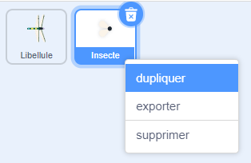
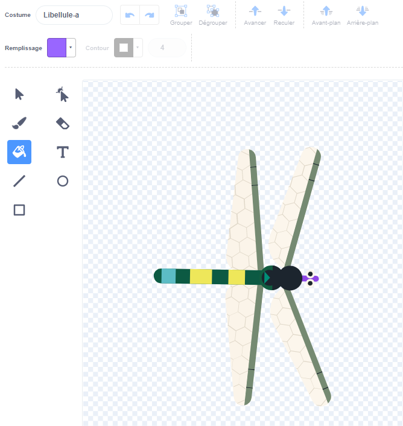
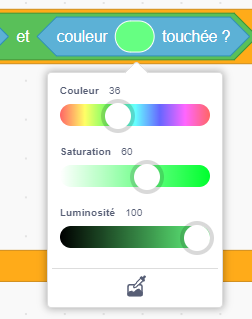

## Plus de nourriture

<div style="display: flex; flex-wrap: wrap">
<div style="flex-basis: 200px; flex-grow: 1; margin-right: 15px;">
La libellule a besoin d'une variété d'insectes.
</div>
<div>
{:width="300px"}
</div>
</div>

--- task ---

Fais un clic droit sur le sprite **Insecte** dans la liste Sprite sous la scène et **duplique-le**.



--- /task ---

Il est utile que cet insecte soit différent de la mouche.

--- task ---

Clique sur l'onglet **Costumes** et crée un insecte volant différent.

+ Utilise l'outil **Remplissage** pour changer la couleur de cet insecte
+ **Peins** ton propre costume d'insecte
+ **Ajoute** un autre costume d'insecte de Scratch

--- /task ---

L'insecte se fait manger même s'il touche l'aile ou la queue de la libellule.

Pour rendre ton application plus réaliste, corrige ceci afin que l'insecte soit mangé par la bouche de la libellule. Tu peux utiliser le bloc `couleur touchée`{:class="block3sensing"} pour que l'insecte ne soit mangé que s'il touche une couleur particulière sur la **Libellule**.

--- task ---

Sélectionne le sprite **Libellule** et clique sur l'onglet **Costumes**.

Utilise l'outil remplissage pour remplir la bouche de la **Libellule**. Nous avons utilisé du violet :



--- /task ---

Tu dois vérifier que le nouveau sprite touche le sprite **Libellule ** `et`{:class="block3operators"} touche la couleur de la bouche de la libellule.

--- task ---

Sélectionne ton nouveau sprite et clique sur l'onglet **Code** .

Fais glisser un bloc `et`{:class="block3operators"} dans le bloc `si`{:class="block3control"}.

Le bloc `<touching [Dragonfly v] ?>`{:class="block3sensing"} apparaîtra, fais-le glisser dans un espace du bloc `et`{:class="block3operators"} :


```blocks3
when flag clicked
show
forever
move [3] steps 
if on edge, bounce
+if <<touching [Dragonfly v] ?> and <>> then
broadcast [food v]
hide
go to (random position v)
show
end
end
```

--- /task ---

--- task ---

Fais glisser un bloc `couleur touchée`{:class="block3sensing"} dans l'autre espace du bloc `et`{:class="block3operators"} :

```blocks3
when flag clicked
show
forever
move [3] steps
if on edge, bounce
+if <<touching [Dragonfly v] ?> and <touching color (#9966ff) ?>> then
broadcast [food v]
hide
go to (random position v)
show
end
end
```

Si la couleur de la bouche de la libellule n'est pas sélectionnée, clique sur le cercle de couleur, puis clique sur l'outil **Pipette** en bas pour sélectionner une couleur.



Clique sur la bouche de la libellule sur la scène pour définir la couleur :


**Astuce :** si la petite bouche est difficile à sélectionner, agrandis le sprite **Libellule** .

--- /task ---

--- task ---

**Test :** teste maintenant que la libellule ne peut manger le deuxième insecte qu'avec sa bouche.

--- /task ---

--- save ---

