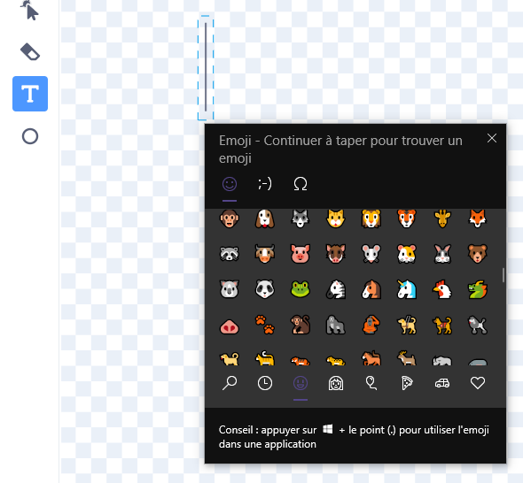
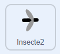

## Défi

<div style="display: flex; flex-wrap: wrap">
<div style="flex-basis: 200px; flex-grow: 1; margin-right: 15px;">
Modifie le comportement de tes insectes et ajoutes-en davantage.
</div>
<div>
{:width="300px"}
</div>
</div>

--- task ---

Modifie la vitesse de la libellule.

--- /task ---

--- task ---

Modifie la taille que la libellule doit atteindre pour atteindre sa taille adulte.

--- /task ---

--- task ---

Modifie le premier **Insecte** afin qu'il ne puisse être mangé qu'avec la bouche de la libellule.

--- /task ---

### Ajouter plus d'insectes

Tu peux peindre tes propres insectes ou essayer d'ajouter un emoji moustique !

--- task ---

Utilise le clavier emoji pour ajouter un sprite **Emoji moustique**.

Duplique un sprite **insecte** existant puis clique sur l'onglet **Costumes**. **Peins** un nouveau costume et sélectionne l'outil **Texte**. Au lieu de saisir du texte, utilise le raccourci clavier emoji pour ton système d'exploitation :

- Windows - <kbd>⊞ Win</kbd> + <kbd>.</kbd>
- MacOS - <kbd>contrôle</kbd> + <kbd>commande</kbd> + <kbd>espace</kbd>
- Linux - <kbd>ctrl</kbd> + <kbd>.</kbd>



Sélectionne l'emoji **Moustique** pour l'insérer dans l'éditeur de peinture. Utilise l'outil **Sélectionner** (flèche) pour centrer, redimensionner et faire pivoter ton moustique jusqu'à ce que tu en sois satisfait.


**Astuce :** les emojis peuvent avoir un aspect différent sur différents ordinateurs, ils peuvent donc ne pas être identiques sur une tablette et sur un ordinateur de bureau. Certains emojis ne sont pas disponibles sur certains ordinateurs, mais la plupart des ordinateurs modernes les prendront en charge.

--- /task ---

### Create random movement

Tu utiliseras le bloc « nombre aléatoire »{:class="block3operators"} pour faire bouger l'insecte de manière plus naturelle.

{:width="300px"}

--- task ---

Ajoute un script à **Insecte2** pour le faire pointer dans une direction aléatoire toutes les 1 à 3 secondes.



```blocks3
when flag clicked
forever // Keep changing direction
point in direction (pick random [0] to [259])
wait (pick random [1] to [3]) seconds
end
```

--- /task ---

--- task ---

**Test :** Exécute ton projet et observe le mouvement de la mouche.

--- /task ---

--- task ---

Tu peux également faire glisser ce script vers le sprite **Insecte** afin qu'il se déplace également de manière aléatoire.

--- /task ---

### Share you insects

--- task ---

Use your Backpack to trade insects with your friends from their 'Grow a Dragonfly' projects.

Send the link of your project to your friend who can go inside the project, click on Backpack (the one under the code space) and drag and drop the sprite.

[[[scratch-backpack]]]

--- /task ---

--- task ---

Check each sprite and costume has a name that describes the image. This makes your project easier to understand if you come back to it later.

--- /task ---

--- task ---

Right-click on the Code area and choose **Clean up Blocks** to get Scratch to tidy your code.

--- /task ---

--- save ---
