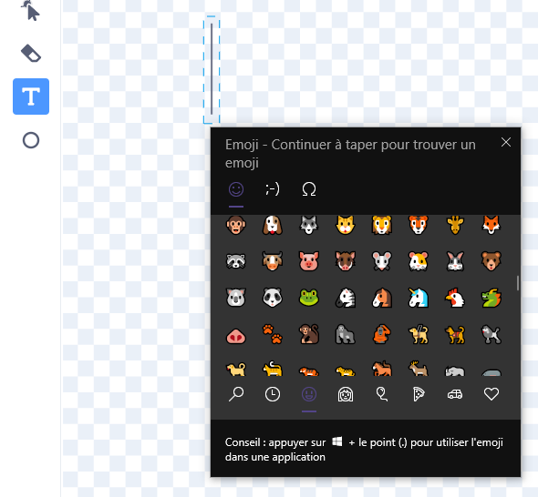

## Améliorer ton projet

Dans cette étape, essaie d'ajouter plus d'insectes, en modifiant l'apparence et le comportement de ton projet.

{:width="300px"}

### Ajouter plus d'insectes

Ajoute plus d'insectes. Tu devras peut-être les faire bouger plus rapidement, afin qu'ils soient plus difficiles à attraper pour la libellule.

Tu peux peindre tes propres insectes ou essayer d'ajouter un emoji moustique !

--- task ---

Utilise le clavier emoji pour ajouter un sprite **Emoji moustique**.

Duplique un sprite **insecte** existant puis clique sur l'onglet **Costumes**. **Peins** un nouveau costume et sélectionne l'outil **Texte**. Au lieu de saisir du texte, utilise le raccourci clavier emoji pour ton système d'exploitation :

Windows - Touche Windows + '.' MacOS - ctrl + cmd + espace Linux - ctrl + '.'

Sélectionne l'emoji **Moustique** pour l'insérer dans l'éditeur de peinture. Utilise l'outil **Sélectionner** (flèche) pour centrer, redimensionner et faire pivoter ton moustique jusqu'à ce que tu en sois satisfait.

**Astuce :** Les emojis peuvent avoir un aspect différent sur différents ordinateurs, ils peuvent donc ne pas être identiques sur une tablette et sur un ordinateur de bureau. Certains emojis ne sont pas disponibles sur certains ordinateurs, mais la plupart des ordinateurs modernes les prendront en charge.

--- /task ---

--- task ---

Utilise ton sac à dos pour échanger des insectes avec tes amis grâce à leurs projets « Faire grandir une libellule ».

[[[scratch-backpack]]]

--- /task ---

--- task ---

**Astuce :** Vérifie que tous tes sprites et costumes ont des noms adéquats. Cela rend ton projet plus facile à comprendre si tu y reviens plus tard.

**Astuce :** Assure-toi que ton code est bien présenté dans la zone Code. Fais un clic droit sur la zone Code et choisis **Nettoyer les blocs** pour que Scratch nettoie ton code.

--- /task ---

--- collapse ---
---
title: Le projet terminé
---

Tu peux voir le [projet terminé ici](https://scratch.mit.edu/projects/521688740/){:target="_blank"}.

--- /collapse ---

--- save ---
