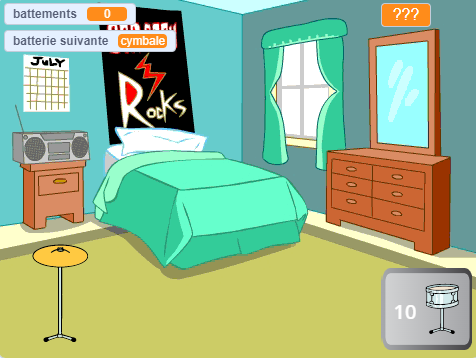

## Que peux-tu faire maintenant ?

Si tu suis le parcours [Plus de Scratch](https://projects.raspberrypi.org/fr-FR/raspberrypi/more-scratch), tu peux passer au projet [Star du tambour](https://projects.raspberrypi.org/fr-FR/projects/drum-star). Dans ce projet, tu créeras un jeu de clicker dans lequel tu gagneras des battements pour jouer de nouveaux tambours dans de plus grandes salles.

--- print-only ---

--- /print-only ---

--- no-print ---

  <iframe allowtransparency="true" width="485" height="402" src="https://scratch.mit.edu/projects/embed/522323676/?autostart=false" frameborder="0"></iframe>

--- /no-print ---

Si tu veux t'amuser davantage en explorant Scratch, tu peux essayer l'un de [ces projets](https://projects.raspberrypi.org/fr-FR/projects?software%5B%5D=scratch&curriculum%5B%5D=%201).
