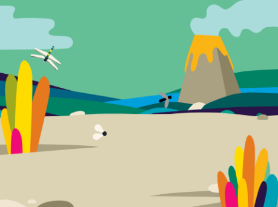

## परिचय

ड्रैगनफ्लाई के साथ एक प्रकृति ऐप बनाएं जो कीड़ों को खाते ही बड़ा हो जाता है।

आप:
+ **conditions** के आधार पर निर्णय लेने के लिए जो की `operators`{:class="block3operators"} और `sensing`{:class="block3sensing"} ब्लॉक के साथ बनाया गया है `if`{:class="block3control"} का उपयोग करें
+ स्प्राइट की गति को नियंत्रित करने के लिए `random`{:class="block3operators"}संख्याओं का उपयोग करें
+ ध्वनि संपादित करने के लिए `Sounds`{:class="block3sound"} संपादक का उपयोग करें

हम निर्णय लेने के लिए हर समय **कंडीशन्स** का उपयोग करते हैं। हम कह सकते हैं "यदि पेंसिल कुंद है, तो उसे तेज करें"। `if`{:class="block3control"} ब्लॉक और कंडीशन हमें कोड लिखने देती हैं जो यह कुछ अलग करता है जो इस बात पर निर्भर करता है कि कोई कंडीशन सही है या गलत।

--- no-print --- --- task ---

### इसे आजमाएँ!

  
कीड़ों को खाने के लिए माउस (या अपनी उंगली) को Stage के चारों ओर घुमाएँ। कीड़े कैसे चलते हैं?

ड्रैगनफ्लाई के किस भाग को उन्हें खाने के लिए कीड़ों को छूना पड़ता है? जब ड्रैगनफ्लाई किसी कीट को खाता है तो ड्रैगनफ्लाई का क्या होता है?

  <iframe allowtransparency="true" width="485" height="402" src="https://scratch.mit.edu/projects/embed/660051744/?autostart=false" frameborder="0"></iframe>

--- /task --- --- /no-print ---

--- print-only ---

--- /print-only ---
