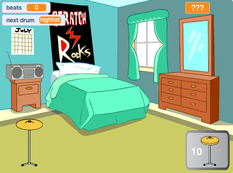

## आगे क्या?

अगर आप [More scratch](https://projects.raspberrypi.org/hi-IN/raspberrypi/more-scratch)मार्ग का अनुसरण कर रहे हैं, तो आप [ड्रम स्टार](https://projects.raspberrypi.org/hi-IN/projects/drum-star) प्रोजेक्ट पर आगे बढ़ सकते हैं। इस प्रोजेक्ट में, आप एक क्लिकर गेम बनाएंगे जहां आप बड़े स्थानों पर नए ड्रम बजाने के लिए बीट्स कमाते हैं।

--- print-only ---

--- /print-only ---

--- no-print ---

  <iframe allowtransparency="true" width="485" height="402" src="https://scratch.mit.edu/projects/embed/522323676/?autostart=false" frameborder="0"></iframe>

--- /no-print ---

यदि आप Scratch को एक्सप्लोर करने में और अधिक मज़ा लेना चाहते हैं, तो आप [इन प्रोजेक्टस](https://projects.raspberrypi.org/hi-IN/projects?software%5B%5D=scratch&curriculum%5B%5D=%201) को आज़मा सकते हैं।
