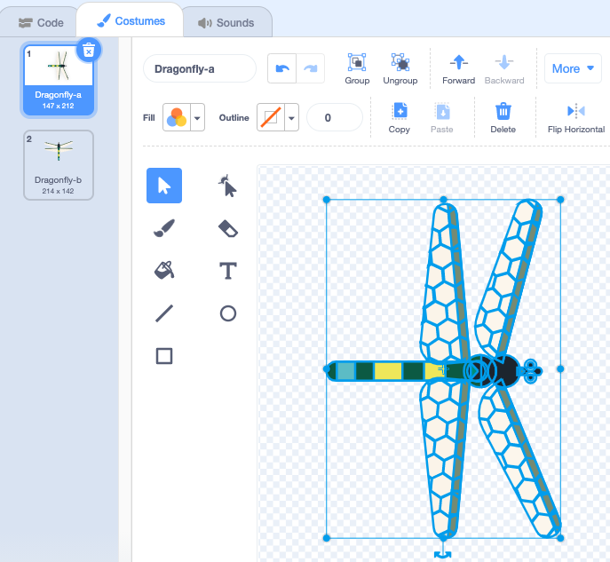

## दृश्य को स्थापित करें

<div style="display: flex; flex-wrap: wrap">
<div style="flex-basis: 200px; flex-grow: 1; margin-right: 15px;">
आप सीन सेट कर देंगे। अपनी पृष्ठभूमि चुनें और एक ड्रैगनफ्लाई जोड़ें जो Stage के चारों ओर माउस-पॉइंटर का अनुसरण करे।
</div>
<div>
{:width="300px"}
</div>
</div>

--- task ---

[Grow a dragonfly स्टार्टर प्रोजेक्ट](https://scratch.mit.edu/projects/535695413/editor){:target="_blank"} खोलें। Scratch दूसरे ब्राउज़र टैब में खुलेगा।

[[[working-offline]]]

--- /task ---

<p style="border-left: solid; border-width:10px; border-color: #0faeb0; background-color: aliceblue; padding: 10px;">
<span style="color: #0faeb0">**ड्रैगनफ्लाइज़**</span> पूरी दुनिया में पाई जाती हैं और लगभग 300 मिलियन से अधिक वर्षों से अस्तित्व में हैं!</p>

--- task ---

**चुनें:** क्लिक Click **Choose a Backdrop** और अपनी पसंद की पृष्ठभूमि जोड़ें। हमने **Jurassic** बैकड्रॉप का इस्तेमाल किया।


--- /task ---

--- task ---

**Choose a Sprite** पर क्लिक करें, और `dragonfly` खोजें, फिर **Dragonfly** स्प्राइट जोड़ें।


--- /task ---

--- task ---

**Dragonfly** स्प्राइट को माउस-पॉइंटर (या अपनी उंगली) का अनुसरण करने के लिए एक स्क्रिप्ट जोड़ें:


```blocks3
when flag clicked
set size to [25] % // to start small
forever
point towards (mouse-pointer v)
move [5] steps
end
```
--- /task ---

--- task ---

**परीक्षण:** हरी झंडी पर क्लिक करें और **Dragonfly** स्प्राइट को Stage के चारों ओर घुमाएँ। क्या ड्रैगनफ्लाई आपकी अपेक्षा के अनुरूप हिल रही है?

--- /task ---

ड्रैगनफ्लाई पोशाक दाईं ओर के मुख नहीं है, इसलिए **Dragonfly** स्प्राइट का सिर माउस-पॉइंटर की दिशा की ओर नहीं है।

--- task ---

**Costumes** टैब पर क्लिक करें और पोशाक का चयन करने के लिए **Select** (तीर) उपकरण का उपयोग करें। **Dragonfly** पोशाक का मूह दाईं ओर मोड़ने के लिए चयनित पोशाक के नीचे **Rotate** उपकरण का उपयोग करें।




--- /task ---

--- task ---

**परीक्षण:** हरे झंडे पर क्लिक करें और देखें कि ड्रैगनफ्लाई अब कैसे चलती है।

--- /task ---

ड्रैगनफ्लाई पंख कंपन करते समय एक फड़फड़ाहट की आवाज करते हैं। आप अपनी खुद की ध्वनि बनाने के लिए Scratch में ध्वनि संपादित कर सकते हैं।

--- task ---

**Dragonfly** स्प्राइट में **Crank** ध्वनि जोड़ें।

[[[generic-scratch3-sound-from-library]]]


**Play** बटन क्लिक करें ताकि आप ध्वनि सुन सकें।

--- /task ---

**Crank** ध्वनि ड्रैगनफ्लाई पंखों के लिए बहुत लंबी और बहुत धीमी है।

--- task ---

अपने कर्सर या उंगली का उपयोग करके ध्वनि के अंत का चयन करें।

केवल चयनित भाग के साथ एक नई ध्वनि बनाने के लिए **Copy to New** पर क्लिक करें:


अपनी नई ध्वनि का नाम **Crank2** से `Wings` में बदलें।


--- /task ---

--- task ---

नई ध्वनि बजाएं। परिणाम पसंद आने तक **Faster** बटन को कुछ बार क्लिक करें:


--- /task ---

--- task ---

यदि आप चाहें, तो आप **Wings** ध्वनि के एकदम अंत का चयन कर सकते हैं, और फिर इसे हटाने के लिए **Delete** पर क्लिक करें:


--- /task ---

--- task ---

अब जब ड्रैगनफ्लाई चलती है तो **Wings** ध्वनि चलाने के लिए एक ब्लॉक जोड़ें:


```blocks3
when flag clicked
set size to [25] %
forever
+start sound [Wings v]
point towards (mouse-pointer v)
move [5] steps
end
```
--- /task ---

--- task ---

**परीक्षण:** अपने ड्रैगनफ्लाई के हिलने और ध्वनि प्रभाव को आज़माइए ।

--- /task ---

--- save ---
