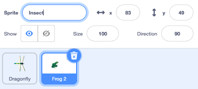

## खाने के लिए एक मक्खी

<div style="display: flex; flex-wrap: wrap">
<div style="flex-basis: 200px; flex-grow: 1; margin-right: 15px;">
आप ड्रैगनफ्लाई के खाने के लिए एक कीट जोड़ देंगे। 
</div>
<div>
{:width="300px"}
</div>
</div>

<p style="border-left: solid; border-width:10px; border-color: #0faeb0; background-color: aliceblue; padding: 10px;">
गेम में अपने आप घूमने वाले चरित्रों को कभी-कभी <span style="color: #0faeb0">**mobs**</span> कहा जाता है, जो मोबाइल का संक्षिप्त रूप होता है। क्या आप ऐसे खेल के बारे में सोच सकते हैं जिसमें mobs हो?</p>

**Frog 2** स्प्राइट में एक मक्खी है जिसका आप उपयोग कर सकते हैं।

--- task ---

अपने प्रोजेक्ट में **Frog 2** स्प्राइट जोड़ें स्प्राइट का नाम बदलकर `Insect` करें:




--- /task ---

आपको केवल मक्खी की जरूरत है, मेंढक की नहीं।

--- task ---

**Costumes** टैब पर क्लिक करें। इसे चुनने के लिए मक्खी पर क्लिक करें और **Copy** आइकन पर क्लिक करें।


--- /task ---

--- task ---

**Paint** विकल्प का उपयोग करके स्प्राइट में एक नई पोशाक जोड़ें:


--- /task ---

--- task ---

स्प्राइट को नई पोशाक में पेस्ट के लिए **Paste** आइकन पर क्लिक करें। मक्खी को **centre** तक खींचें ताकि वह क्रॉसहेयर के साथ संरेखित हो जाए।

आप अपनी पोशाक का नाम बदलकर `Insect` कर सकते हैं और अन्य पोशाक हटा सकते हैं, क्योंकि आपको उनकी आवश्यकता नहीं होगी:


--- /task ---

--- task ---

मक्खी का आकार बढ़ाएं ताकि उसे देखना और पकड़ना आसान हो:


--- /task ---

--- task ---

**Code** टैब पर क्लिक करें और **Insect** स्प्राइट को चारों ओर उछालने के लिए एक स्क्रिप्ट जोड़ें:


```blocks3
when flag clicked
forever
move [3] steps
if on edge, bounce
end
```

`if on edge, bounce`{:class="block3motion"} ब्लॉक यह जाँचता है कि क्या स्प्राइट Stage के किनारे तक पहुंच गया है और अगर ऐसा है तो यह स्प्राइट को एक अलग दिशा में जाने का इशारा करता है।

--- /task ---

आप चाहते हैं कि अगर **Insect** स्प्राइट **Dragonfly** स्प्राइट द्वारा खाया जाता है तो वह `hide`{:class="block3looks"} `if`{:class="block3control"}।

--- task ---

**Insect** स्प्राइट को हिलाने वाली स्क्रिप्ट में `if`{:class="block3control"} ब्लॉक जोड़ें:


```blocks3
when flag clicked
forever
move [3] steps
if on edge, bounce
+if < > then 
end
```
--- /task ---

`if`{:class="block3control"} में षट्भुज के आकार का इनपुट है। इसका मतलब है कि आप यहां **कंडीशन** लगा सकते हैं।

जब `if`{:class="block3control"} ब्लॉक चलता है, तो Scratch कंडीशन की जांच करेगा। अगर कंडीशन 'सही' है `then`{:class="block3control"} तो ब्लॉक `if`{:class="block3control"} के अंदर का कोड चलेगा।

अगर यह `if`{:class="block3control"} **Dragonfly** स्प्राइट को `touching`{:class="block3sensing"} कर रहा है तो आप चाहते हैं कि कीट `hide`{:class="block3looks"} जाए।

--- task ---

`touching [Dragonfly v]`{:class="block3sensing"} को `if`{:class="block3control"} ब्लॉक में खींचें। `if`{:class="block3control"} ब्लॉक के अंदर `hide`{:class="block3looks"} ब्लॉक जोड़ें।


```blocks3
when flag clicked
forever
move [3] steps
if on edge, bounce
+if <touching [Dragonfly v] ?> then // change from 'mouse-pointer'
+hide // eaten
end
```

--- /task ---

--- task ---

**परीक्षण:** अपने कोड का परीक्षण करें और मक्खी को खाने के लिए ड्रैगनफ्लाई को नियंत्रित करें। मक्खी गायब हो जानी चाहिए।

--- /task ---

ड्रैगनफ्लाई बहुत बड़ी नहीं होगी यदि वह केवल एक मक्खी खा सकती है!

--- task ---

Stage पर `go to a random position`{:class="block3motion"} में ब्लॉक जोड़ें और अपने स्प्राइट को एक सेकंड के लिए `wait`{:class="block3control"} कराएँ फिर `show`{:class="block3looks"}:


```blocks3
when flag clicked
+show // show at the start
forever
move [3] steps
if on edge, bounce
if <touching [Dragonfly v] ?> then
hide
+go to (random position v)
+wait [1] seconds
+show // to look like a new fly
end
end
```

--- /task ---

--- task ---

**परीक्षण:** परीक्षण करें कि आपका ड्रैगनफ्लाईअब बहुत सारी मक्खियाँ खा सकता है।

सुनिश्चित करें कि आपने शुरुआत में दिखाने के लिए `show`{:class="block3looks"} ब्लॉक जोड़ा है।

--- /task ---

**सलाह:** यदि आप चाहते हैं कि ड्रैगनफ्लाई अधिक कोड जोड़ते समय शांत रहे तो आप स्टेज के ऊपर लाल **Stop** बटन पर क्लिक कर सकते हैं।

--- save ---
