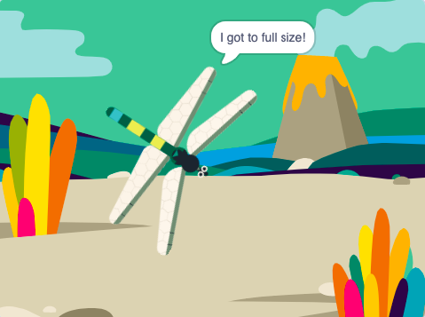

## पूर्ण आकार तक बढ़े

<div style="display: flex; flex-wrap: wrap">
<div style="flex-basis: 200px; flex-grow: 1; margin-right: 15px;">
जब वह एक मक्खी खाती है तो आप ड्रैगनफ्लाई को बड़ा कर देंगे, और जब यह पूर्ण आकार तक पहुंच जाएगी तो उसे बढ़ाना बंद कर देंगे।
</div>
<div>
{:width="300px"}
</div>
</div>

सबसे बड़ी जीवित ड्रैगनफलीज़ मध्य अमेरिका में पाई जा सकती हैं और उनके पंखों का फैलाव 19 सेमी (आपके हाथ से थोड़ा बड़ा) होता है। अब तक ज्ञात सबसे बड़ा कीट <span style="color: #0faeb0">**मेगन्यूरोप्सिस परमियाना**</span>था, एक ड्रैगनफ्लाई जिसका पंख लगभग 75 सेमी (एक बड़े कदम के आकार का) होता है।

जब आपको किसी अन्य स्प्राइट को यह बताने की आवश्यकता होती है कि कुछ हुआ है, तो आप `broadcast`{:class="block3events"} ब्लॉक का उपयोग कर सकते हैं जैसा कि आपने [Broadcasting spells](https://projects.raspberrypi.org/en/projects/broadcasting-spells){:target="_blank"} में किया था।

--- task ---

**Insect** स्प्राइट में नये संदेश `food`{:class="block3events"} के साथ एक `broadcast`{:class="block3events"} जोड़ें:


```blocks3
when flag clicked
show // show at the start
forever
move [3] steps
if on edge, bounce
if <touching [Dragonfly v] ?> then
+broadcast [food v]
hide
go to (random position v)
wait [1] seconds
show
end
end
```
--- /task ---

**Dragonfly** स्प्राइट को `food`{:class="block3events"} संदेश प्राप्त होने पर बढ़ने की आवश्यकता है।

--- task ---

**Dragonfly** स्प्राइट चुनें और इस स्क्रिप्ट को जोड़ें:


```blocks3 
when I receive [food v]
change size by [5]
```

--- /task ---

--- task ---

ड्रैगनफ्लाई में **Chomp** ध्वनि जोड़ें और इसे तब `start`{:class="block3sound"} करें जब कोई कीट खाया जाए:

```blocks3 
when I receive [food v]
+start sound [Chomp v]
change size by [5]
```
--- /task ---

--- task ---

**परीक्षण:** ड्रैगनफ्लाई के बढ़ने का परीक्षण करने के लिए अपना प्रोजेक्ट चलाएँ और जब वह मक्खी को खाए तो वह चॉम्प की आवाज़ करे।

--- /task ---

जब ड्रैगनफ्लाई अपने पूर्ण आकार में पहुँच जाती है, तो खेल आपको बधाई देगा और रुक जाएगा।

--- task ---

`if`{:class="block3control"} ब्लॉक जोड़ें।

```blocks3
when I receive [food v]
start sound [Chomp v]
change size by [5]
+if < > then
end
```

--- /task ---

जब `size`{:class="block3looks"} `=`{:class="block3operators"} `100%`हो तो ड्रैगनफ्लाई पूर्ण आकार की होती है।

--- task ---

First, add an `=`{:class="block3operators"} operator into the hexagon-shaped input:

```blocks3
when I receive [food v]
start sound [Chomp v]
change size by [5]
+if <[ ] = [ ]> then
end
```
--- /task ---

--- task ---

अंतर्निर्मित `size`{:class="block3looks"} वेरिएबल जोड़कर कंडीशन बनाना समाप्त करें और `100` मान टाइप करें:

```blocks3
when I receive [food v]
start sound [Chomp v]
change size by [5]
+if <(size) = [100]> then
end
```
--- /task ---

--- task ---

ब्लॉक जोड़ें ताकि `if`{:class="block3control"} कंडीशन सही हो `then`{:class="block3control"} ड्रैगनफ्लाई एक 'एंड' संदेश `broadcast`{:class="block3events"} करेगा और `say`{:class="block3looks"} `I got to full size!`

अंत में, अन्य ड्रैगनफ्लाई स्क्रिप्ट को रोकने के लिए `stop all`{:class="block3control"} ब्लॉक जोड़ें:

```blocks3
when I receive [food v]
start sound [Chomp v]
change size by [5]
if <(size) = [100]> then
+broadcast [end v]
+say [I got to full size!]
+stop [other scripts in sprite v] // change from 'all'
end
```
--- /task ---

--- task ---

फिलहाल, प्रोजेक्ट समाप्त होने के बाद भी मक्खी अभी भी चलती है। इस स्क्रिप्ट को **Insect** स्प्राइट में जोड़ें।


```blocks3
when I receive [end v]
stop [other scripts in sprite v]
```

--- /task ---

--- task ---

**परीक्षण:** हरी झंडी पर क्लिक करें और मक्खियों को तब तक खाते रहें जब तक कि आपका ड्रैगनफ्लाई पूर्ण आकार तक न पहुंच जाए।

--- /task ---

--- save ---
