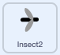

## अधिक भोजन

<div style="display: flex; flex-wrap: wrap">
<div style="flex-basis: 200px; flex-grow: 1; margin-right: 15px;">
ड्रैगनफ्लाई को कीड़ों के विकल्प की आवश्यकता होती है।
</div>
<div>
{:width="300px"}
</div>
</div>

--- task ---

Stage के तहत Sprite सूची में **Insect** स्प्राइट पर राइट-क्लिक करें और **duplicate** करें ।


--- /task ---

यह मददगार होगा अगर यह कीट मक्खी से अलग दिखता है।

--- task ---

**Costumes** टैब पर क्लिक करें।

**चयन करें:** एक उड़ने वाला अलग कीट बनाएं।
+ इस कीट का रंग बदलने के लिए **Fill**> टूल का उपयोग करें
+ अपनी खुद की कीट पोशाक **Paint** करें
+ Scratch से और बग पोशाक **Add** करें

--- /task ---

अगर कीट ड्रैगनफ्लाई के पंख या पूंछ को छूता भी है तो ड्रैगनफ्लाई उसे खा जाती है।

अपने ऐप को और अधिक यथार्थवादी बनाने के लिए, इसे ठीक करें ताकि ड्रैगनफ्लाई कीट को मूँह से खाए। आप `touching color`{:class="block3sensing"} ब्लॉक का उपयोग कर सकते हैं ताकि कीट केवल तभी खाए जब वह **Dragonfly**पर किसी विशेष रंग को छूता है।

--- task ---

**Dragonfly** स्प्राइट चुनें और **Costumes** टैब पर क्लिक करें।

**Dragonfly** का मुंह भरने के लिए fill tool का उपयोग करें। हमने बैंगनी का इस्तेमाल किया:


--- /task ---

आपको यह जांचना होगा कि **Insect2** स्प्राइट **Dragonfly** स्प्राइट `and`{:class="block3operators"} ड्रैगनफ्लाई के मुंह के रंग को छू रहा है।

--- task ---

**Insect2** स्प्राइट चुनें और **Code** टैब पर क्लिक करें।

`and`{:class="block3operators"} ब्लॉक को `if`{:class="block3control"} ब्लॉक में खीचें।

`<touching [Dragonfly v] ?>`{:class="block3sensing"} ब्लॉक पॉप आउट हो जाएगा, इसे `and`{:class="block3operators"} ब्लॉक के बाईं ओर खीचें:



```blocks3
when flag clicked
show
forever
move [3] steps 
if on edge, bounce
+if <<touching [Dragonfly v] ?> and <>> then
broadcast [food v]
hide
go to (random position v)
show
end
end
```

--- /task ---

--- task ---

`touching color`{:class="block3sensing"} ब्लॉक को `and`{:class="block3operators"} ब्लॉक के दाईं ओर खींचें:


```blocks3
when flag clicked
show
forever
move [3] steps
if on edge, bounce
+if <<touching [Dragonfly v] ?> and <touching color (#9966ff) ?>> then
broadcast [food v]
hide
go to (random position v)
show
end
end
```

अगर इसमें ड्रैगनफ्लाई के मुंह का रंग नहीं चुना गया है, तो रंग सर्कल पर क्लिक करें और फिर रंग चुनने के लिए **Eyedropper** टूल पर क्लिक करें।


रंग को मिलान के लिए सेट करने के लिए Stage पर ड्रैगनफ्लाई के मुंह पर क्लिक करें:


**सलाह:** यदि ऐसा करना मुश्किल है, तो **Dragonfly** स्प्राइट का आकार बदलें ताकि यह वास्तविक रूप से बड़ा हो जाए।

--- /task ---

--- task ---

**परीक्षण:** अब परीक्षण करें कि ड्रैगनफ्लाई केवल दूसरे कीट को अपने मुंह से खा सकती है।

आप चाहें तो पहले **Insect** को बदल सकते हैं ताकि इसे केवल ड्रैगनफ्लाई के मुंह से ही खाया जा सके।

--- /task ---

--- save ---

