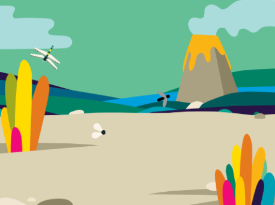

## Quello che farai

Crea un'app naturalistica con una libellula che cresce mangiando insetti.

Tu:
+ Utilizzerai i blocchi `se`{:class="block3control"} per prendere decisioni basate su **condizioni** prese con blocchi `operatori`{:class="block3operators"} e `sensori`{:class="block3sensing"}
+ Userai `numeri casuali`{:class="block3operators"} per controllare il movimento di uno sprite
+ Userai l'editor `Suoni`{:class="block3sound"} per modificare un suono

Usiamo sempre **condizioni** per prendere decisioni. Potremmo dire "se la matita è senza punta, allora devi temperarla". I blocchi e le condizioni `Se`{:class="block3control"} ci permettono di scrivere codice che fa qualcosa di diverso a seconda che una condizione sia vera o falsa.

--- no-print ---
--- task ---

### Gioca ▶️

  
Muovi il mouse (o il dito) sullo sfondo per mangiare gli insetti. Come si muovono gli insetti?

Quale parte della libellula deve toccare gli insetti per mangiarli? Cosa succede alla libellula quando mangia un insetto?

  <iframe allowtransparency="true" width="485" height="402" src="https://scratch.mit.edu/projects/embed/521688740/?autostart=false" frameborder="0"></iframe>

--- /task ---
--- /no-print ---

--- print-only ---

--- /print-only ---
