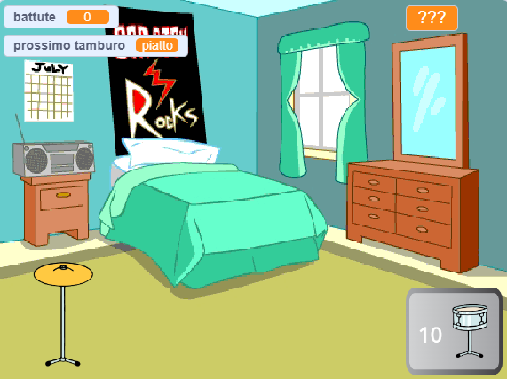

## E adesso?

Se stai seguendo il percorso [Più scratch](https://projects.raspberrypi.org/en/raspberrypi/more-scratch), puoi passare al progetto [Star dei tamburi](https://projects.raspberrypi.org/en/projects/drum-star). In questo progetto, realizzerai un gioco clicker in cui verrai premiato con nuovi tamburi per suonare in luoghi più grandi.

--- print-only ---

--- /print-only ---

--- no-print ---

  <iframe allowtransparency="true" width="485" height="402" src="https://scratch.mit.edu/projects/embed/522323676/?autostart=false" frameborder="0"></iframe>

--- /no-print ---

Se vuoi divertirti ancora di più esplorando Scratch, puoi provare uno qualsiasi di [questi progetti](https://projects.raspberrypi.org/en/projects?software%5B%5D=scratch&curriculum%5B%5D=%201).
