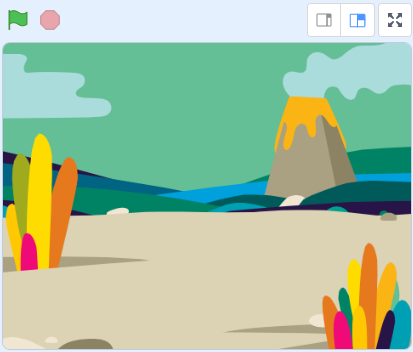
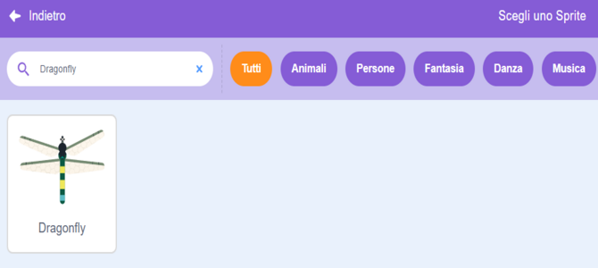
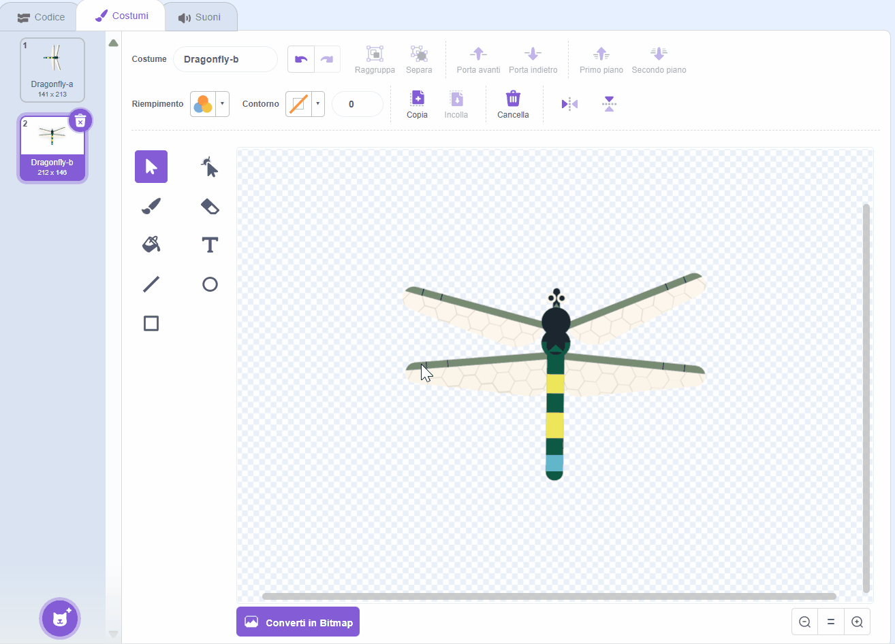
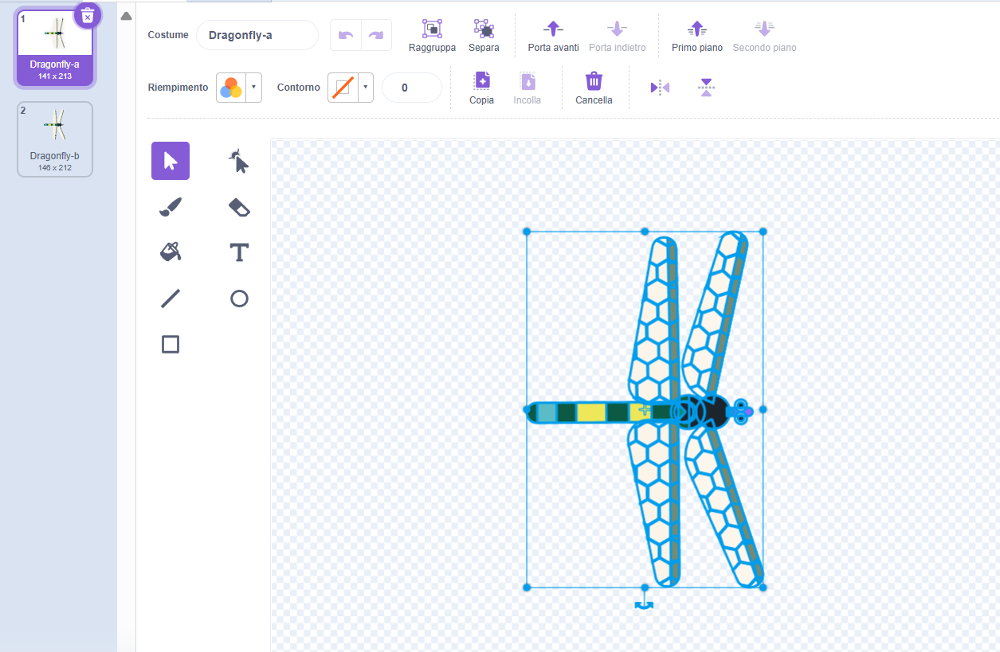
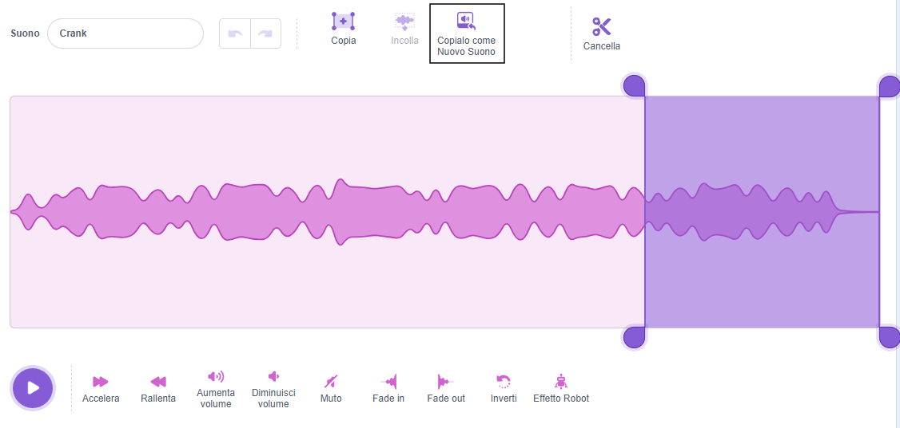
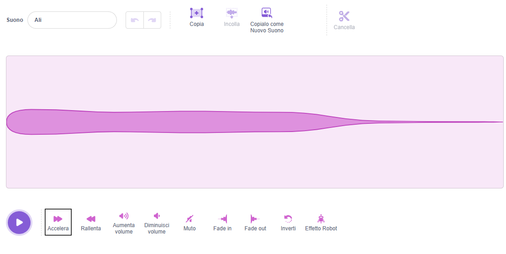
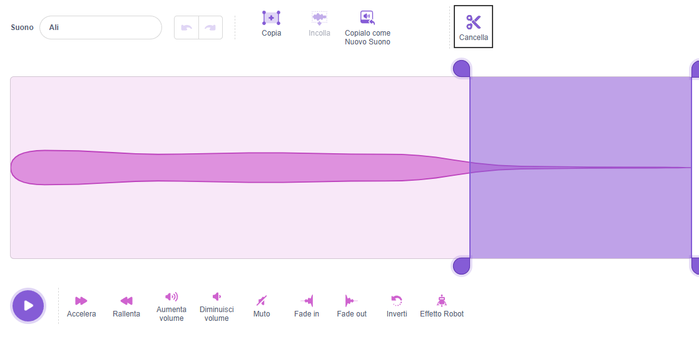

## Prepara la scena

<div style="display: flex; flex-wrap: wrap">
<div style="flex-basis: 200px; flex-grow: 1; margin-right: 15px;">
Preparerai la scena. Scegli lo sfondo e aggiungi una libellula che segue il puntatore del mouse sullo sfondo.
</div>
<div>
{:width="300px"}
</div>
</div>

--- task ---

Apri il progetto [Alleva una libellula](https://scratch.mit.edu/projects/535695413/editor){:target="_blank"}. Scratch si aprirà in una nuova scheda del browser.

[[[working-offline]]]

--- /task ---

<p style="border-left: solid; border-width:10px; border-color: #0faeb0; background-color: aliceblue; padding: 10px;">
<span style="color: #0faeb0">**Le libellule**</span> si trovano in tutto il mondo e esistono da oltre 300 milioni di anni!</p>

--- task ---

**Scegli:** Fai clic su **Scegli uno sfondo** e aggiungi uno sfondo a tua scelta. Abbiamo utilizzato lo sfondo **Giurassico**.




--- /task ---

--- task ---

Fai clic su **Scegli uno sprite** e cerca `dragonfly (libellula)`, quindi aggiungi lo sprite **libellula**.




--- /task ---

--- task ---

Aggiungi del codice per fare in modo che lo sprite **Libellula** segua il puntatore del mouse (o il tuo dito):


```blocks3
when flag clicked
set size to [25] % // dimensione iniziale piccola
forever
point towards (puntatore del mouse v)
move [5] steps
end
```
--- /task ---

--- task ---

**Test:** Clicca sulla bandiera verde e fai muovere lo sprite **libellula** sul palco. La libellula si muove come ti aspetteresti?

--- /task ---

Il costume della Libellula non è rivolto a destra, quindi la testa dello sprite **libellula** non punta verso il puntatore del mouse.

--- task ---

Clicca sulla scheda **Costumi** e usa lo strumento **Seleziona** (freccia) per selezionare il costume. Usa lo strumento **Ruota** nella parte inferiore del costume selezionato per girare la **libellula** verso destra.





--- /task ---

--- task ---

**Test:** Clicca sulla bandiera verde e guarda come si muove ora la libellula.

--- /task ---

Le ali della libellula emettono un suono mentre vibrano. Puoi modificare un suono in Scratch per creare il tuo suono.

--- task ---

Aggiungi il suono **Crank** allo sprite **libellula**.

[[[generic-scratch3-sound-from-library]]]


Fai clic sul pulsante **Riproduci** per poter ascoltare il suono.

--- /task ---

Il suono **Crank** è troppo lungo e troppo lento per le ali della libellula.

--- task ---

Seleziona la fine del suono utilizzando il cursore o il dito.

Fai clic su **Copialo come nuovo suono** per creare un nuovo suono solo con la parte selezionata:



Rinomina il tuo nuovo suono da **Crank2** ad `Ali`.


--- /task ---

--- task ---

Riproduci il nuovo suono. Fai clic sul pulsante **Accelera** alcune volte finché non ti piace il risultato:



--- /task ---

--- task ---

Se lo desideri, puoi selezionare la fine del suono di **Ali**, quindi fare clic su **Elimina** per rimuoverlo:



--- /task ---

--- task ---

Ora aggiungi un blocco per riprodurre il suono delle **Ali** quando la libellula si muove:


```blocks3
when flag clicked
set size to [25] %
forever
+start sound [Wings v]
point towards (puntatore del mouse v)
move [5] steps
end
```
--- /task ---

--- task ---

**Test:** Prova il movimento della libellula e l'effetto sonoro.

--- /task ---

--- save ---
