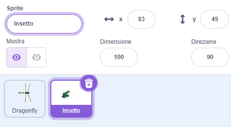
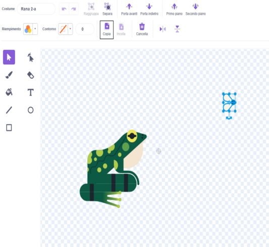
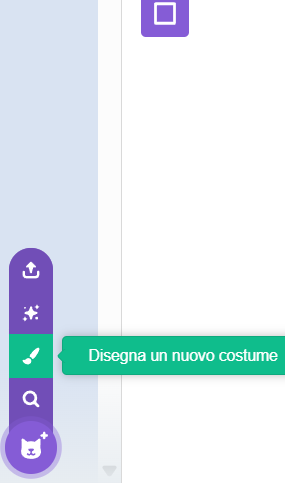
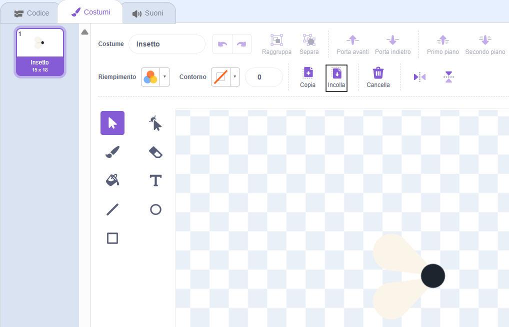
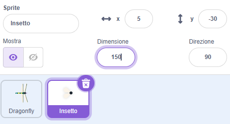

## Una mosca da mangiare

<div style="display: flex; flex-wrap: wrap">
<div style="flex-basis: 200px; flex-grow: 1; margin-right: 15px;">
Aggiungerai un insetto da mangiare per la libellula. 
</div>
<div>

</div>
</div>

<p style="border-left: solid; border-width:10px; border-color: #0faeb0; background-color: aliceblue; padding: 10px;">
I personaggi che si muovono da soli nei giochi sono talvolta chiamati <span style="color: #0faeb0">**mobs**</span>, abbreviazione di oggetti mobili. Riesci a pensare a un gioco che abbia oggetti mobili?</p>

C'è una mosca nello sprite **Rana 2** che puoi usare.

--- task ---

Aggiungi lo sprite **Rana 2** al tuo progetto. Rinomina lo sprite in `Insetto`:




--- /task ---

Ti serve solo la mosca, non la rana.

--- task ---

Clicca sulla scheda **Costumi**. Fai clic sulla mosca per selezionarla e fai clic sull'icona **Copia**.



--- /task ---

--- task ---

Aggiungi un nuovo costume allo sprite usando l'opzione **Disegna un nuovo costume**:



--- /task ---

--- task ---

Clicca sull'icona **Incolla** per incollare lo sprite nel nuovo costume. Trascina la mosca al **centro** in modo che si allinei con il mirino.

Puoi rinominare il tuo costume `Insetto` ed eliminare gli altri costumi, poiché non ti serviranno:



--- /task ---

--- task ---

Aumenta le dimensioni della mosca in modo che sia più facile da vedere e da catturare:



--- /task ---

--- task ---

Fai clic sulla scheda **Codice** e aggiungi uno script per far rimbalzare lo sprite **Insetto**:


```blocks3
when flag clicked
forever
move [3] steps
if on edge, bounce
end
```

Il blocco `rimbalza quando tocchi il bordo`{:class="block3motion"} controlla se lo sprite ha raggiunto il bordo dello sfondo e, se lo ha fatto, punta lo sprite in una direzione diversa.

--- /task ---

Vuoi che lo sprite **Insetto** si `nasconda`{:class="block3looks"} `se`{:class= "block3control"} viene mangiato dallo sprite **libellula**.

--- task ---

Aggiungi un blocco `se`{:class="block3control"} allo script di movimento dello sprite **insetto**:


```blocks3
when flag clicked
forever
move [3] steps
if on edge, bounce
+if < > then 
end
```
--- /task ---

Il blocco `se`{:class="block3control"}ha un input a forma esagonale. Ciò significa che puoi inserire una **condizione** qui.

Quando il blocco `se`{:class="block3control"} viene eseguito, Scratch controllerà la condizione. Se la condizione è 'vera' `allora`{:class="block3control"} il codice all'interno del blocco `se`{:class="block3control"} verrà eseguito.

Vuoi che l'insetto si `nasconda`{:class="block3looks"} `se`{:class="block3control"} esso `sta toccando`{:class="block3sensing"} lo sprite della **libellula**.

--- task ---

Trascina `sta toccando [libellula v]`{:class="block3sensing"} nel blocco `se`{:class="block3control"}. Aggiungi un blocco `nascondi`{:class="block3looks"} all'interno del blocco `se`{:class="block3control"}.


```blocks3
when flag clicked
forever
move [3] steps
if on edge, bounce
+if <touching [Dragonfly v] ?> then // change from 'mouse-pointer'
+hide // eaten
end
```

--- /task ---

--- task ---

**Test:** Metti alla prova il tuo codice e controlla se la libellula mangia la mosca. La mosca dovrebbe scomparire.

--- /task ---

La libellula non diventerà molto grande se può mangiare solo una mosca!

--- task ---

Aggiungi blocchi a `vai in una posizione casuale`{:class="block3motion"} sullo sfondo e fai aspettare il tuo sprite ``{:class=" block3control"} per un secondo, quindi `mostra`{:class="block3looks"}:


```blocks3
when flag clicked
+show // show at the start
forever
move [3] steps
if on edge, bounce
if <touching [Dragonfly v] ?> then
hide
+go to (random position v)
+wait [1] seconds
+show // to look like a new fly
end
end
```

--- /task ---

--- task ---

**Test:** Verifica che la tua libellula ora possa mangiare molte mosche.

Assicurati di aver aggiunto il blocco `show`{:class="block3looks"} da mostrare all'inizio.

--- /task ---

**Suggerimento:** Puoi fare clic sul pulsante rosso **Stop** sopra lo sfondo se vuoi che la libellula stia in silenzio mentre aggiungi altro codice.

--- save ---
