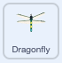

## Cresci a grandezza naturale

<div style="display: flex; flex-wrap: wrap">
<div style="flex-basis: 200px; flex-grow: 1; margin-right: 15px;">
Farai crescere la libellula quando mangia una mosca e la fermerai se raggiunge la grandezza naturale.
</div>
<div>
{:width="300px"}
</div>
</div>

<p style="border-left: solid; border-width:10px; border-color: #0faeb0; background-color: aliceblue; padding: 10px;">
Le libellule viventi più grandi si trovano in America Centrale e hanno un'apertura alare di 19 cm (un po' più grande di una mano). L'insetto più grande mai conosciuto era <span style="color: #0faeb0">**Meganeuropsis permiana**</span>, una libellula con un'apertura alare di circa 75 cm (le dimensioni di un grande passo).</p>

La mosca sa di essere stata mangiata e ora ha bisogno di saperlo anche la libellula per poter crescere.

Quando hai bisogno che uno sprite sappia che qualcosa è successo, puoi usare un blocco `invia a tutti`{:class="block3events"} come fatto in [Messaggi incantati](https://projects.raspberrypi.org/en/projects/broadcasting-spells){:target="_blank"}.

--- task ---

Aggiungi un blocco `invia a tutti`{:class="block3events"} allo sprite **insetto** con il nuovo messaggio `cibo`{:class="block3events"}:


```blocks3
when flag clicked
show // show at the start
forever
move [3] steps
if on edge, bounce
if <touching [Dragonfly v] ?> then
+broadcast [food v]
hide
go to (random position v)
wait [1] seconds
show
end
end
```
--- /task ---

Lo sprite della **libellula** deve crescere quando riceve il messaggio di `cibo`{:class="block3events"}.

--- task ---

Seleziona lo sprite **libellula** e aggiungi questo script:



```blocks3 
when I receive [food v]
change size by [5]
```

--- /task ---

--- task ---

Aggiungi il suono **Mastica** alla libellula e `avvialo`{:class="block3sound"} quando un insetto viene mangiato:


```blocks3 
when I receive [food v]
+start sound [Chomp v]
change size by [5]
```
--- /task ---

--- task ---

**Test:** Esegui il tuo progetto per testare la crescita della libellula e il suono del morso quando mangia una mosca.

--- /task ---

Quando la libellula raggiunge le sue dimensioni massime, il gioco si congratulerà con te e si fermerà.

--- task ---

Aggiungi un blocco `se`{:class="block3control"}.

La libellula è alla massima grandezza quando `size`{:class="block3looks"} `=`{:class="block3operators"} `100%`. Innanzitutto, aggiungi un operatore `=`{:class="block3operators"} nell'input a forma esagonale:


```blocks3
when I receive [food v]
start sound [Chomp v]
change size by [5]
+if <[ ] = [ ]> then
end
```
--- /task ---

--- task ---

Completa la creazione della condizione aggiungendo una variabile `size`{:class="block3looks"} incorporata e digita il valore `100`:


```blocks3
when I receive [food v]
start sound [Chomp v]
change size by [5]
+if <(size) = [100]> then
end
```
--- /task ---

--- task ---

Aggiungi blocchi così che la condizione `se`{:class="block3control"} sia vera `allora`{:class="block3control"} la libellula `invia`{:class="block3events"} un messaggio 'fine' e `afferma`{:class="block3looks"} `sono alla massima grandezza`

Infine, aggiungi un blocco `ferma tutto`{:class="block3control"} per fermare gli altri script della libellula:


```blocks3
when I receive [food v]
start sound [Chomp v]
change size by [5]
if <(size) = [100]> then
+broadcast [end v]
+say [I got to full size!]
+stop [other scripts in sprite v] // change from 'all'
end
```
--- /task ---

--- task ---

Al momento, la mosca si muove ancora dopo la conclusione del progetto. Aggiungi questo script allo sprite **insetto**.


```blocks3
when I receive [end v]
stop [other scripts in sprite v]
```

--- /task ---

--- task ---

**Test:** Clicca sulla bandiera verde e continua a mangiare mosche finché la libellula non raggiunge le dimensioni reali.

--- /task ---

--- save ---
