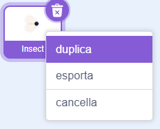
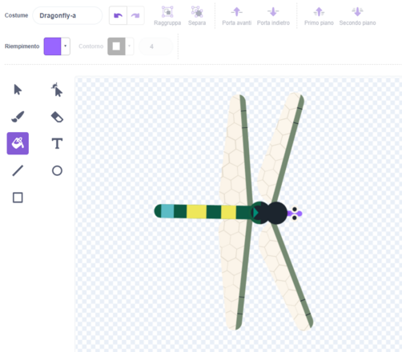
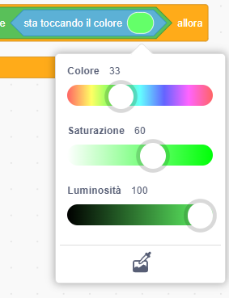

## Più cibo

<div style="display: flex; flex-wrap: wrap">
<div style="flex-basis: 200px; flex-grow: 1; margin-right: 15px;">
La libellula ha bisogno di una scelta di insetti.
</div>
<div>
{:width="300px"}
</div>
</div>

--- task ---

Fai clic con il pulsante destro del mouse sullo sprite **insetto** nell'elenco Sprite sotto lo Stage e **duplicalo**.



--- /task ---

È utile che questo insetto sembri diverso dalla mosca.

--- task ---

Clicca sulla scheda **Costumi**.

+ Usa lo strumento **Riempi** per cambiare il colore di questo insetto
+ **Disegna un nuovo** costume da insetto
+ **Aggiungi** un altro costume da insetto da Scratch

--- /task ---

L'insetto viene mangiato anche se tocca l'ala o la coda della libellula.

Per rendere la tua app più realistica, sistema questo problema in modo che l'insetto venga mangiato dalla bocca della libellula. Puoi usare il blocco `sta toccando`{:class="block3sensing"} così l'insetto viene mangiato solo se sta toccando un particolare colore della **libellula**.

--- task ---

Seleziona lo sprite **libellula** e fai clic sulla scheda **Costumi**.

Usa lo strumento di riempimento per riempire la bocca della **libellula**. Abbiamo usato il viola:



--- /task ---

Devi verificare che lo sprite **insetto2** tocchi lo sprite **libellula** `e`{:class="block3operators"} anche il colore della bocca della libellula.

--- task ---

Seleziona lo sprite **insect2** e fai clic sulla scheda **Codice**.

Trascina un blocco `e`{:class="block3operators"} nel blocco `se`{:class="block3control"}.

Trascina un blocco `e`{:class="block3operators"} nel blocco `se`{:class="block3control"}.


```blocks3
when flag clicked
show
forever
move [3] steps 
if on edge, bounce
+if <<touching [Dragonfly v] ?> and <>> then
broadcast [food v]
hide
go to (random position v)
show
end
end
```

--- /task ---

--- task ---

Trascina un blocco `sta toccando il colore`{:class="block3sensing"} a destra del blocco `e`{:class="block3operators"}:

```blocks3
when flag clicked
show
forever
move [3] steps
if on edge, bounce
+if <<touching [Dragonfly v] ?> and <touching color (#9966ff) ?>> then
broadcast [food v]
hide
go to (random position v)
show
end
end
```

Se non è selezionato il colore della bocca della libellula, fai clic sul cerchio dei colori, quindi fai clic sullo strumento **Contagocce** per selezionare un colore.



Fai clic sulla bocca della libellula sullo Stage per impostare il colore in modo che corrisponda:


**Scegli:** Crea un insetto volante diverso.

--- /task ---

--- task ---

**Test:** Ora verifica che la libellula possa mangiare solo il secondo insetto con la bocca.

--- /task ---

--- save ---

