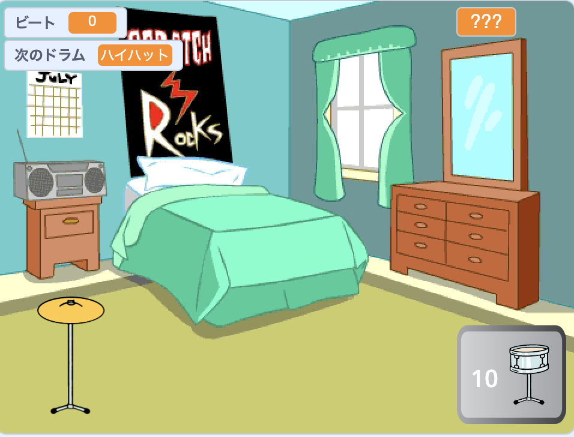

## 次は何をしましょうか？

[もっとスクラッチ](https://projects.raspberrypi.org/en/raspberrypi/more-scratch)の経路をたどっている場合は、[ドラムスター](https://projects.raspberrypi.org/en/projects/drum-star)のプロジェクトに進むことができます。 このプロジェクトでは、ビートを稼いで、大きな会場で新しいドラムを演奏するクリッカーゲームを作ります。

--- print-only ---

--- /print-only ---

--- no-print ---

  <iframe allowtransparency="true" width="485" height="402" src="https://scratch.mit.edu/projects/embed/522323676/?autostart=false" frameborder="0"></iframe>

--- /no-print ---

Scratchのさまざまな機能を触ってみたい場合は[これらのプロジェクト](https://projects.raspberrypi.org/en/projects?software%5B%5D=scratch&curriculum%5B%5D=%201)を試してみてください。
