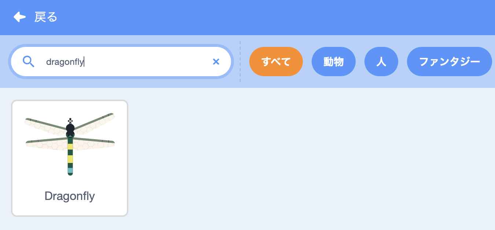
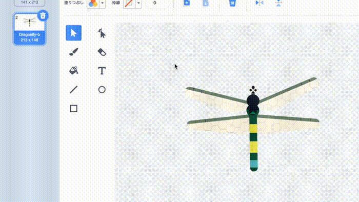
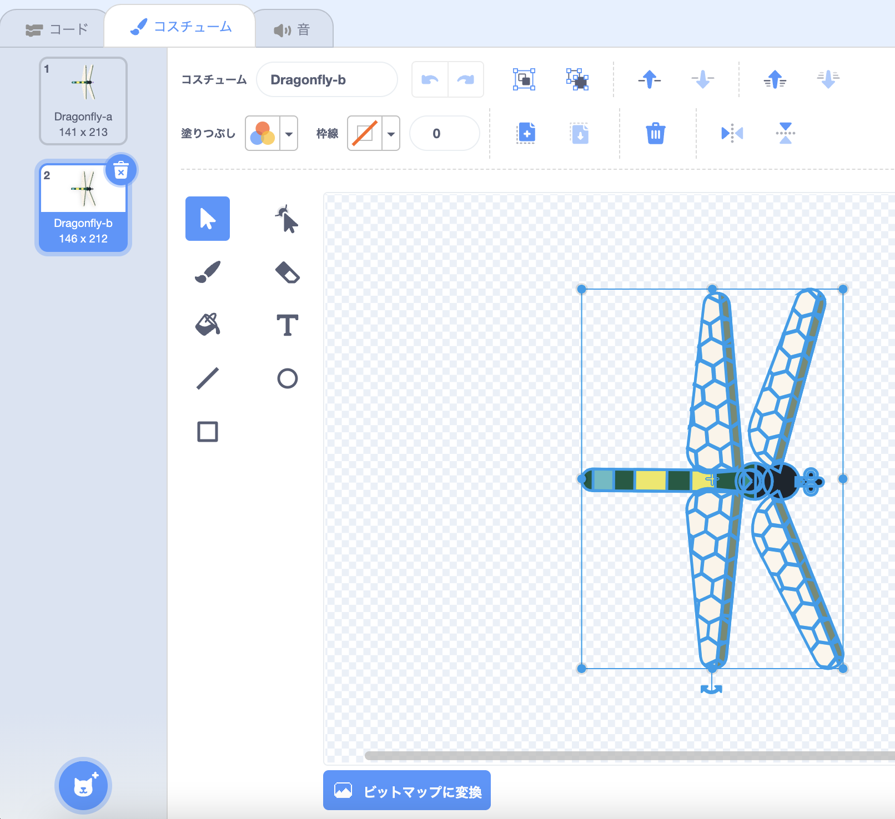
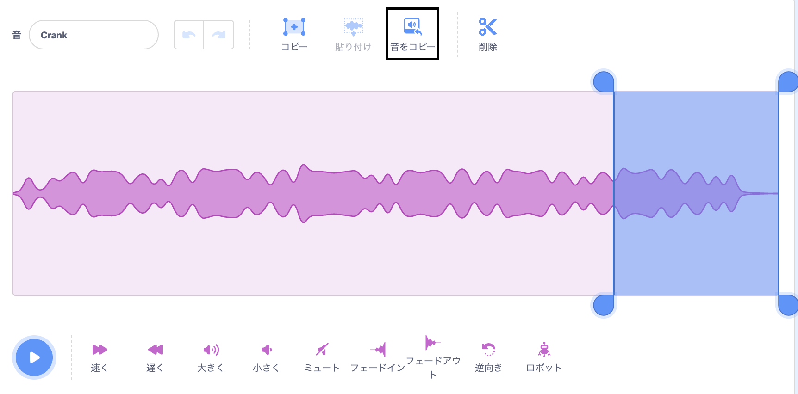
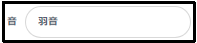
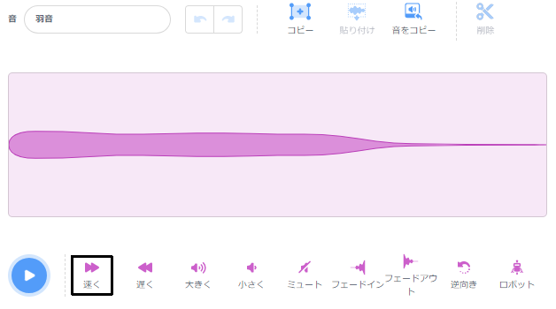
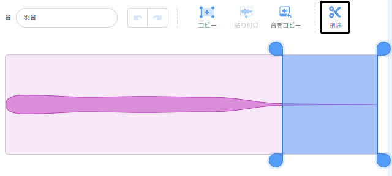

## シーンを設定する

<div style="display: flex; flex-wrap: wrap">
<div style="flex-basis: 200px; flex-grow: 1; margin-right: 15px;">
シーンを設定します。 背景を選び、マウスポインターを追ってステージを回るトンボを追加します。
</div>
<div>
{:width="300px"}
</div>
</div>

--- task ---

[成長するトンボスタータープロジェクト](https://scratch.mit.edu/projects/535695413/editor){:target="_blank"}を開きます。 スクラッチはブラウザの別のタブで開きます。

[[[working-offline]]]

--- /task ---

<p style="border-left: solid; border-width:10px; border-color: #0faeb0; background-color: aliceblue; padding: 10px;">
<span style="color: #0faeb0">**トンボ***</span>は世界中に生息しており、3億年以上前から生息しているそうです</p>

--- task ---

**選択：****背景を選ぶ**をクリックし、お好みの背景を追加します。 **Jurassic** の背景を使用しました。


--- /task ---

--- task ---

**スプライトを選ぶ**をクリックし、`dragonfly`を検索して、**Dragonfly**スプライトを追加します。




--- /task ---

--- task ---

**Dragonfly** スプライトをマウスポインタ(または指) に追従させるスクリプトを追加する。


```blocks3
when flag clicked
set size to [25] % // to start small
forever
point towards (mouse-pointer v)
move [5] steps
end
```
--- /task ---

--- task ---

**テスト：** 緑の旗をクリックし、**Dragonfly**のスプライトをステージ上で移動させます。 トンボは期待通りに動いていますか？

--- /task ---

トンボの衣装は右向きではないので、**Dragonfly**スプライトの頭はマウスポインタの方に向いていません。

--- task ---

**コスチューム**タブをクリックし、**選択**(矢印) ツールでコスチュームを選択します。 選択したコスチュームの下にある**回転**ツールを使って、**Dragonfly**コスチュームを右向きにします。





--- /task ---

--- task ---

**テスト：**緑の旗をクリックして、トンボの動きを見てください。

--- /task ---

トンボの羽は、振動するとヒラヒラと音がします。 Scratchで音を編集して、自分だけの音を作ることができます。

--- task ---

**Dragonfly** スプライトに**クランク**サウンドを追加します。

[[[generic-scratch3-sound-from-library]]]


**再生**ボタンをクリックすると、音が出ます。

--- /task ---

**クランク** の音は、トンボの羽音には長すぎて遅すぎます。

--- task ---

カーソルまたは指で音の終わりの部分を選択します。

**音をコピー**をクリックすると、選択した部分だけを使った新しいサウンドが作成されます。



新しいサウンドの名前を**Crank2**から`羽音`に変更します。



--- /task ---

--- task ---

新しいサウンドを再生します。 気に入った結果が得られるまで、**速く**ボタンを数回クリックしてください。



--- /task ---

--- task ---

お好みで、**羽音**の音の最後の部分を選択し、**削除**をクリックして削除することもできます。



--- /task ---

--- task ---

次に、トンボが動いたときに**羽音**という音を鳴らすブロックを追加します。


```blocks3
when flag clicked
set size to [25] %
forever
+start sound [Wings v]
point towards (mouse-pointer v)
move [5] steps
end
```
--- /task ---

--- task ---

**テスト：** トンボの動きと効果音を試してみる。

--- /task ---

--- save ---
